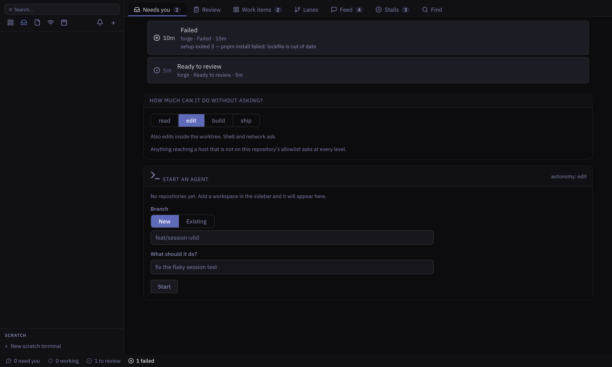
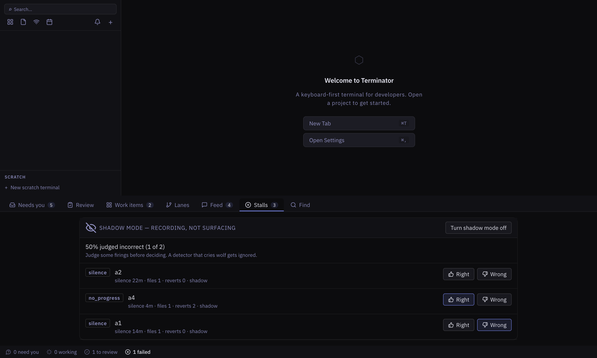
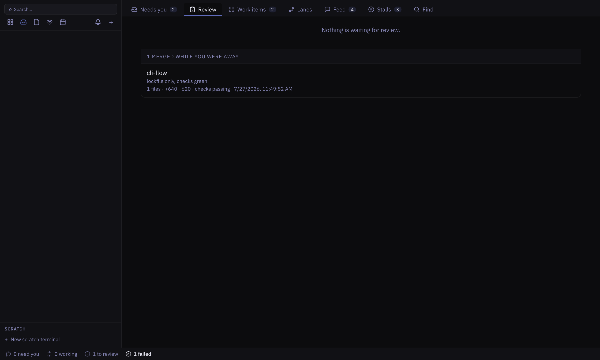
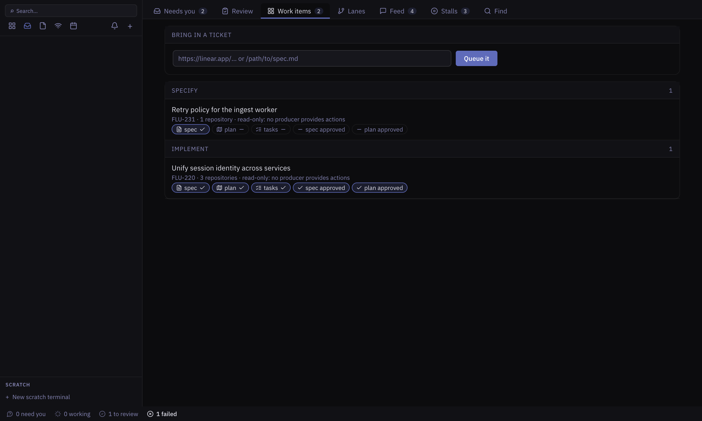
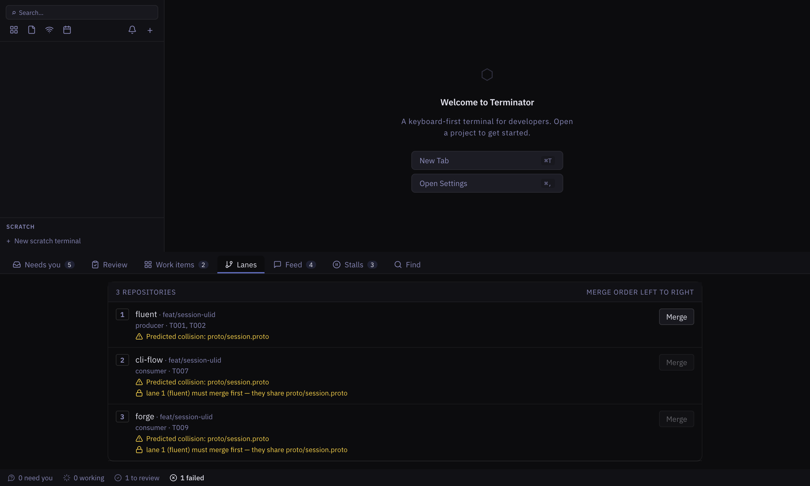
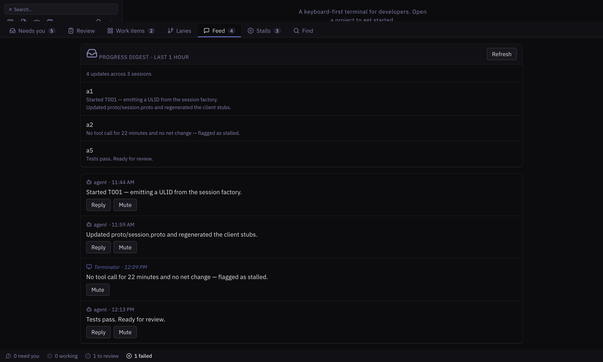
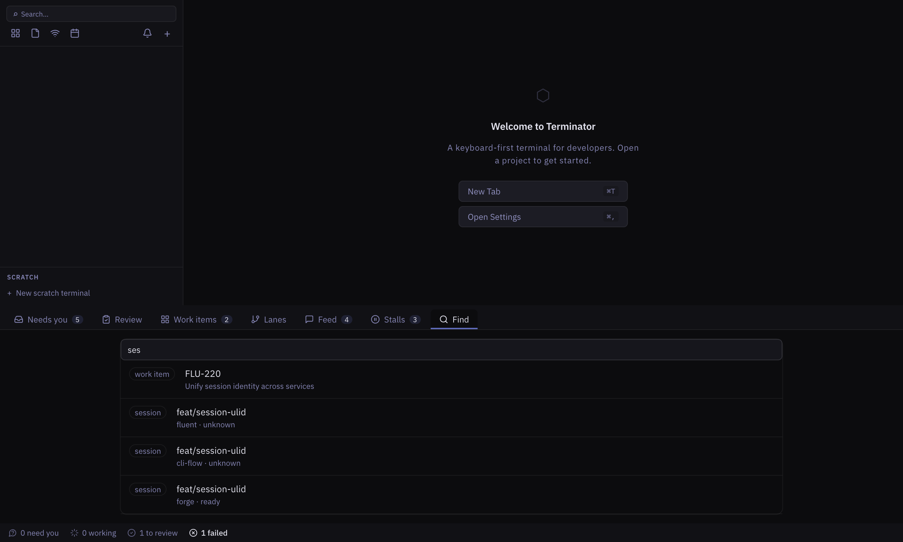

# Supervising agents in Terminator

A guide to the Agent Supervision Console — what it does, and how to use it end to
end.

> The screenshots are the real application. The sessions and work items in them
> are example data, seeded into the app's own store so everything on screen
> travels the production path. Nothing here is a mockup.

---

## Contents

1. [What this is for](#1-what-this-is-for)
2. [Opening it](#2-opening-it)
3. [The status bar](#3-the-status-bar)
4. [Starting an agent](#4-starting-an-agent)
5. [Needs you — the attention queue](#5-needs-you--the-attention-queue)
6. [Sessions — what is running, and how to stop it](#5a-sessions--what-is-running-and-how-to-stop-it)
7. [Stalls — the part nobody else has](#6-stalls--the-part-nobody-else-has)
8. [Review — worst first, and the backpressure gate](#7-review--worst-first-and-the-backpressure-gate)
9. [Work items — ticket to merged](#8-work-items--ticket-to-merged)
10. [Lanes — one work item, several repositories](#9-lanes--one-work-item-several-repositories)
11. [Feed — catching up after time away](#10-feed--catching-up-after-time-away)
12. [Find — one keystroke to anywhere](#11-find--one-keystroke-to-anywhere)
13. [Worktrees — reclaiming what is left behind](#11a-worktrees--reclaiming-what-is-left-behind)
14. [Configuring a repository](#12-configuring-a-repository)
15. [Settings](#13-settings)
16. [End-to-end walkthrough](#14-end-to-end-walkthrough)
17. [Keyboard reference](#15-keyboard-reference)

---

## 1. What this is for

Terminator is not a place to run twenty agents. It is a console for supervising a
small number of long-running agents whose output you cannot review fast enough.

Two facts drive every decision in it:

- **You cap out at 2–6 concurrent agents, because review is the bottleneck.**
  So the console counts unreviewed work and refuses to start more when you are
  behind.
- **The failure nobody instruments is an agent that is stuck without asking for
  help.** An agent that needs permission announces itself. An agent looping on
  the same file for twenty minutes does not. So the console derives that state
  rather than waiting to be told.

Everything else exists to make those two usable.

---

## 2. Opening it

The console is a **view**, listed in the sidebar as **Agents** alongside
Overview. Three ways in, all equivalent:

- click **Agents** in the sidebar,
- click the **status bar** along the bottom of the window,
- press **`Cmd+Shift+A`**.

**`Escape`** leaves it, as it does any full-screen view — except from a text
field, where Escape means "abandon what I'm typing", and from a terminal, where
it belongs to whatever is running in it.

Every tab occupies the same space; the tab strip stays where you left it. Your
terminals keep running behind it.

---

## 3. The status bar

Always visible, on every screen.


It answers _is everything OK_ without opening anything: how many sessions need
you, how many are working, how many are waiting for review, how many failed.

When nothing needs you it says so in words — **all clear** — rather than going
blank. A console that only speaks up when something is wrong teaches you that
silence means fine, and silence is also what a crashed console looks like.

---

## 4. Starting an agent

The **Needs you** tab carries the start panel.



1. **Choose how much rope.** The autonomy ladder is picked here, at assign time,
   and is not renegotiated at every interrupt:

   | Level   | Runs without asking                           | Still asks                             |
   | ------- | --------------------------------------------- | -------------------------------------- |
   | `read`  | Read, search, list                            | everything else                        |
   | `edit`  | + edits inside the worktree                   | shell, network                         |
   | `build` | + dependency installs, local builds and tests | pushing, anything outside the worktree |
   | `ship`  | + pushes branches, opens pull requests        | destructive operations                 |

   Anything reaching a host that is not on the repository's allowlist asks at
   **every** level, including `ship`.

2. **Pick the repository** from the workspaces you already have open in the
   sidebar. There is nothing to type, and nothing to mistype — the full path of
   what you picked is shown beneath the picker.

3. **Name the branch.** **New** is the default and is cut from the repository's
   current branch, which is named for you. Switch to **Existing** to choose from
   that repository's own branches instead — an agent working directly on a
   branch you already have is the case you want to have chosen deliberately.

4. **Say what it should do** — or leave it empty if the session is bound to a
   work item, in which case the lane's tasks and artefact paths are handed to the
   agent for you.

5. **Start.** Terminator provisions an isolated working copy first: a git
   worktree, heavy directories like `node_modules` symlinked rather than copied,
   declared files such as `.env.local` copied in, a port range allocated and
   exported, and your setup script run. If setup exits non-zero, no agent starts
   and the failure appears on the queue with its output.

Every refusal states its reason in place — an unapproved gate, a full review
queue, a setup script that failed.

---

## 5. Needs you — the attention queue

Sorted by how much you are needed, not by project and not by arrival:

1. **Needs input** — blocked on a permission request. An agent is stopped dead.
2. **Stalled** — burning time silently.
3. **Failed** — already over, and cheap to triage.
4. **Ready** — finished work that can wait a moment.

Within a band, whatever has waited longest comes first.

**A question is answered, not approved.** When the agent asks something with
options, the options appear as buttons — clicking one sends it back. There is
always a free-text box too, because the useful answer is often none of the ones
offered. Allow and Deny remain for requests that really are a yes or no, and
even those let you refuse _with a reason_, which is worth more to the agent than
a bare no.

A blocked session shows **the ask itself**, not the name of the tool making it —
and shows it _in full_. The tool is named, and every argument it was given is
printed verbatim: the whole command, the file path and the content about to be
written, the URL about to be fetched. The one-line title elides; the block below
never does.

The agent's own `description` is shown too, but beside the command rather than
instead of it. Approving on a description alone is taking the agent's word for
what its command does.
When the request reaches a host, the host is named too — so
`redis-cli -h prod-cache-01 FLUSHALL` is recognisable without opening anything.
Approve or deny inline.

You should never be asked to approve something you cannot read.

Every row is identified by its **branch**, and every row you can do something
about has a button. A session that failed, or that the console lost track of
when it last closed, carries **Discard** — it stops the agent, removes the
working copy, and takes the session off the console. Work that is merely
waiting to be reviewed does not: discarding it would throw the diff away.

A failed session carries its reason on the row itself:
`setup exited 3 — pnpm install failed: lockfile is out of date`. You should never
have to open a session to learn why it died.

---

## 5a. Sessions — what is running, and how to stop it

**Needs you** answers _what needs me_. **Sessions** answers _what is running_ —
every session whether or not it wants anything, running ones first.

Each row carries what the agent has spent and what it has changed: turns, cost,
context used, and the size of its diff. So a session quietly burning turns
against a 61%-full context is visible without opening it.

Three actions on every row:

- **Terminal** — opens a shell in the session's working copy and types
  `claude --resume <its session id>` for you. The console drives agents
  headlessly, so there is no terminal to attach to; this is as close as the
  runtime allows to looking over its shoulder, and it lets you take the
  conversation over by hand. The command is typed, not run — press Enter when
  you have read it.
- **Details** — expands the session in place: its working copy, autonomy level,
  what it has spent, what it changed, when it last did anything, its transcript
  path, and why it failed if it did.
- **Stop** — end the run **and keep the working copy**. You stop an agent to look
  at what it did, not to lose it; the diff stays and the session moves to
  review if it produced one. Stop asks _why_ first — optional, but coming back
  to a half-finished diff a day later, "stopped by the operator" tells you
  nothing and "wrong branch" tells you everything. The reason goes to the agent
  before the run closes, so its own transcript says why it stopped, and into
  the feed attributed to Terminator.
- **Discard** — end it, remove the working copy, take the session off the
  console, and clear its feed entries.

Stop appears only while an agent is still spending time — starting, working,
waiting on you, or stalled. There is nothing to stop in a session that has
already finished.

## 6. Stalls — the part nobody else has



Every 30 seconds, each working session is checked against two independent
signals:

- **Silence** — no tool call for longer than the threshold (8 minutes by
  default). Long-running shell commands are excluded, or every test run over the
  threshold would read as a stall.
- **No net progress** — no net change to the diff while the agent keeps touching
  the same file, or two or more reverts in the last ten edits.

Either one fires.

### Shadow mode is on by default

**Shadow mode records firings without acting on them.** It gates the
consequence, never the record.

This is deliberate. A stall detector with a 20% false-positive rate produces
alarm fatigue and gets switched off, which is worse than not shipping it. So:
run it in shadow for a week of your real work, judge the firings **Right** or
**Wrong** as they appear, and watch the precision figure at the top of the tab.
Turn shadow mode off when you believe it.

The panel lists firings **still awaiting a judgement**. Calling one right or
wrong answers it and takes it off the list; it goes on counting towards the
precision figure above, which is what SC-002 is measured against.

### When something is stalled

Every stalled session carries the four things you can do about it:

- **Ask what is wrong** — sends the question to the agent.
- **Show activity** — opens the session.
- **Interrupt and redirect** — stops the current turn _and_ tells it what to do
  instead. Interrupting without redirecting leaves it exactly as stuck as it was.
- **Discard session and worktree** — stops it, runs teardown, removes the
  working copy.

Anything Terminator writes to the feed is attributed to **Terminator**, never to
the agent. A stall notice you could mistake for the agent's own words would be
worthless.

---

## 7. Review — worst first, and the backpressure gate



When a session finishes with changes it is graded and queued **worst first**, not
by arrival:

| Grade | Trigger                                                                                | Handling              |
| ----- | -------------------------------------------------------------------------------------- | --------------------- |
| P0    | auth, payments, secrets, migrations, public API, or a path on the repo's critical list | full review           |
| P1    | schema change, shared contract file, more than 300 changed lines                       | full review           |
| P2    | ordinary feature work                                                                  | structural review     |
| P3    | formatting, lockfile-only, dependency bumps with green checks                          | auto-merge if enabled |

### The four-step review

**Intent → risk → structure → tests.**

Intent comes first because it is the step every diff viewer skips: it diffs what
you asked for against the agent's own account of what it did, and flags files
outside the expected scope. That is what catches _"also shortened the idle
timeout"_.

Then **per-hunk accept and reject** — the unit of decision is the hunk, not the
file, because one file routinely holds both the change you asked for and the one
you did not.

### Backpressure

When unreviewed finished sessions reach the limit (3 by default), Terminator
**refuses to start another agent and tells you why**, with the count. Override is
one click and is recorded with the queue depth at the moment you ignored it.

### Unattended merge

Off by default, and enabled **per repository** rather than globally — one bad
auto-merge kills the feature permanently, so the blast radius is capped by
construction. Only the lowest grade qualifies, and only with green checks.

Everything merged this way is recorded at merge time with its change summary,
grade trigger and check state, and listed under **merged while you were away** —
retrieval never depends on you having done something first.

---

## 8. Work items — ticket to merged



A work item is a ticket with structure: a phase, artefact paths, approval gates,
a shared contract, and lanes.

**Bringing one in:** paste a Linear or GitHub URL, or the path to a local
markdown spec, and press **Queue it**. What you queue _sits there_ until you
start it. Nothing auto-starts, because auto-start is what produces a backlog
nobody can review.

The board groups items by phase — `intake → specify → clarify → plan → tasks →
implement → review → merged` — and each card shows which artefacts exist and
which gates have passed.

### Gates

**Implementation cannot begin until you have approved both the specification and
the plan.** That friction is the point: an agent starting without an approved
spec has nothing bounding its scope.

Each card carries the actions for gates it has not passed. **Approve** is one
click. **Reject** asks for notes before it will do anything, then returns the
item to the phase that produced the artefact — rejecting a spec sends it back to
`specify`, carrying your notes.

### Who writes work items

Terminator **never writes a producer's files**. It reads contract files from a
directory it owns, and every action it takes goes through a command the producer
registered — the SpecKit Pilot extension, a script, or a JSON file you write by
hand. The board behaves identically for all of them.

In the screenshot above no producer is installed, so the cards say
`read-only: no producer provides actions` rather than offering buttons that
would do nothing. With a producer installed, the approve and reject controls
appear on each card.

Work items are entirely optional. With no producer installed, sessions still run
as ad-hoc work and every other surface behaves the same.

---

## 9. Lanes — one work item, several repositories



When a work item spans repositories, each repository is a **lane** with its own
session, branch and task list. Merge order runs left to right.

- A file appearing in more than one lane is flagged as a **predicted collision**
  on every lane that touches it — so each agent is warned before it starts,
  rather than after a conflict.
- **Out-of-order merges are refused** when a shared contract file is involved,
  and the blocking lane is named.
- After an upstream lane merges, a downstream lane that started earlier is
  flagged as needing a rebase or a re-run.

Single-repository work renders as one row with none of this ceremony.

---

## 10. Feed — catching up after time away



The feed is chronological, written summaries — not raw transcript.

At the top is the **progress digest**, covering the last hour. Routine progress
never interrupts you: it is batched here and read when you choose to. Anything
that actually needs you is in **Needs you** instead.

Below it, each entry shows **who wrote it**. An entry Terminator wrote (a stall
notice, an interruption) is labelled as Terminator; an agent's own summary is
labelled as the agent. You can **reply inline** to an agent entry, or **mute** a
session that is chattering.

### Notification discipline

- **Modal** — only a blocking permission request. Nothing else may interrupt.
- **Non-blocking indicator** — stalls, failures, work becoming ready.
- **Digest** — routine progress.

---

## 11. Find — one keystroke to anywhere



One search across everything the console knows: sessions, work items,
repositories, worktrees and commands. A prefix match beats a word-start match
beats a substring, so typing the start of a name puts it first regardless of what
kind of thing it is.

Choosing a session opens it; choosing a work item opens its lanes; choosing a
command runs it.

---

## 11a. Worktrees — reclaiming what is left behind

Working copies outlive the sessions that made them. A crash between creating one
and registering its session leaves a directory nothing knows about; a session
that finished still holds its checkout. Each costs a port range and however
large that repository's dependencies are, and neither is visible anywhere else —
so they accumulate silently.

The **Worktrees** tab lists what can go, and why:

- **no session references it** — an orphan; nothing can be harmed by removing it.
- **its session has finished** — merged or failed, with nothing left to do.
- **the console lost track of its session** — it was mid-flight when the app
  last closed, and it changed nothing. The agent process dies with the
  application, so nothing is using the copy.

Reclaiming runs the repository's teardown script, removes the working copy,
frees its port range, and clears that session's entries from the feed — with
nothing left to go back to, the feed has nothing left to be about. **Reclaim all** does them one at a time, because each runs
git against a repository and several at once is how you get lock errors.

A working copy still in use is never listed, and neither is one holding changes
nobody has reviewed. That includes a session that is `ready`, and one the
console lost track of that had already done work — losing track of a session is
not a reason to throw its work away.

## 12. Configuring a repository

Per-repository settings live in `.terminator/config.json` at the repository root.
Everything is optional and every section has defaults.

```json
{
  "worktree": {
    "symlink": ["node_modules", "target", ".venv"],
    "copy": [".env.local", "certs/dev.pem"],
    "portBase": 4000,
    "portSpan": 10
  },
  "scripts": {
    "setup": "pnpm install --frozen-lockfile && pnpm db:branch $TERMINATOR_WORKITEM",
    "teardown": "pnpm db:drop $TERMINATOR_WORKITEM",
    "verify": "pnpm test && pnpm lint"
  },
  "stall": {
    "silenceMs": 480000,
    "noProgressMs": 900000
  },
  "review": {
    "criticalPaths": ["src/auth/**", "src/billing/**"],
    "baseBranch": "main",
    "unattendedMergeLowestGrade": false
  },
  "network": {
    "allowedHosts": ["api.github.com", "registry.npmjs.org"]
  }
}
```

Your scripts receive `TERMINATOR_PORT_BASE`, `TERMINATOR_WORKTREE` and
`TERMINATOR_WORKITEM` in the environment.

**Raise `stall.silenceMs` for a repository whose test suite runs long.** A
12-minute suite under an 8-minute threshold would read as a stall on every run —
long-running shell commands are already excluded, but a slow non-shell step is
not.

**Databases:** no product in this category solves per-worktree databases, and
Terminator does not pretend to. The `setup` and `teardown` hooks are the
supported extension point; Neon/Supabase branching and per-worktree Docker are
the two patterns that work.

---

## 13. Settings

**Settings → Supervision** holds the external editor command — `code`, `zed`,
`cursor`, whatever you use. **Open in editor** runs it against a session's
working copy. Handing off to a real editor is a first-class action here, not a
gap; with nothing set the button tells you it is unconfigured rather than doing
nothing.

Shadow mode is toggled from the **Stalls** tab, and it is global.

---

## 14. End-to-end walkthrough

A three-repository change, start to finish.

1. **Bring the ticket in.** Work items → paste the Linear URL → **Queue it**. It
   sits in `intake`.
2. **Approve the spec and the plan.** The producer generates them; you read them
   and approve, or reject with notes and send them back. Until both gates pass,
   nothing can start.
3. **Check the lanes.** Lanes shows one row per repository, merge order left to
   right, with any shared file flagged as a predicted collision on every lane
   that touches it.
4. **Start the producer lane.** Needs you → the start panel is already bound to
   the next lane that nothing is blocking. Pick an autonomy level and **Start**.
   The worktree is provisioned and the agent begins.
5. **Go and do something else.** The status bar is on every screen.
   `Cmd+Shift+A` when you want the detail.
6. **Answer what it asks.** Permission requests appear in Needs you with the
   command and the target host. Approve or deny without opening the session.
7. **Deal with a stall.** If a session stops making progress without asking,
   it appears in Stalls with four things you can do about it. In shadow mode it
   is recorded for judgement but does not interrupt you.
8. **Review the result.** Review, worst first. Intent, then risk, then structure,
   then tests — accepting and rejecting hunk by hunk.
9. **Merge in order.** Lanes → **Merge** on lane 1. Lanes 2 and 3 unblock. A
   downstream lane that started before the merge is flagged for a rebase.
10. **Archive.** Teardown runs, the worktree is removed, the session is archived.
    A running session cannot be archived.

---

## 15. Keyboard reference

| Action                             | Shortcut      |
| ---------------------------------- | ------------- |
| Open / close the supervision panel | `Cmd+Shift+A` |
| Command palette                    | `Cmd+P`       |
| Settings                           | `Cmd+,`       |

Within the console, **Find** searches every entity it knows about.

---

## Where things are written

| What                       | Where                                                 |
| -------------------------- | ----------------------------------------------------- |
| Session registry           | `<userData>/supervision.json`                         |
| Feed                       | `<userData>/supervision/feed.jsonl`                   |
| Stall firings + judgements | `<userData>/supervision/stall-firings.jsonl`          |
| Unattended merges          | `<userData>/supervision/unattended-merges.jsonl`      |
| Backpressure overrides     | `<userData>/supervision/backpressure-overrides.jsonl` |
| Work items (console-owned) | `<userData>/supervision/workitems/<producer-id>/`     |
| Per-repository config      | `<repo>/.terminator/config.json`                      |

The append-only logs are JSONL so a crash can only ever cost the last line, and a
torn or unrecognised line is skipped rather than taking a surface down.

---

## Further reading

- [`docs/ARCHITECTURE.md`](docs/ARCHITECTURE.md) — the supervision subsystem, the
  agent-runtime seam, and why state is derived rather than parsed.
- [`docs/EXTENSION-DEVELOPMENT.md`](docs/EXTENSION-DEVELOPMENT.md) — publishing
  work items to the console as a producer.
- [`docs/adr/026-agent-sdk-over-pty-supervision.md`](docs/adr/026-agent-sdk-over-pty-supervision.md)
  — why state comes from the agent SDK and never from parsing terminal output.
