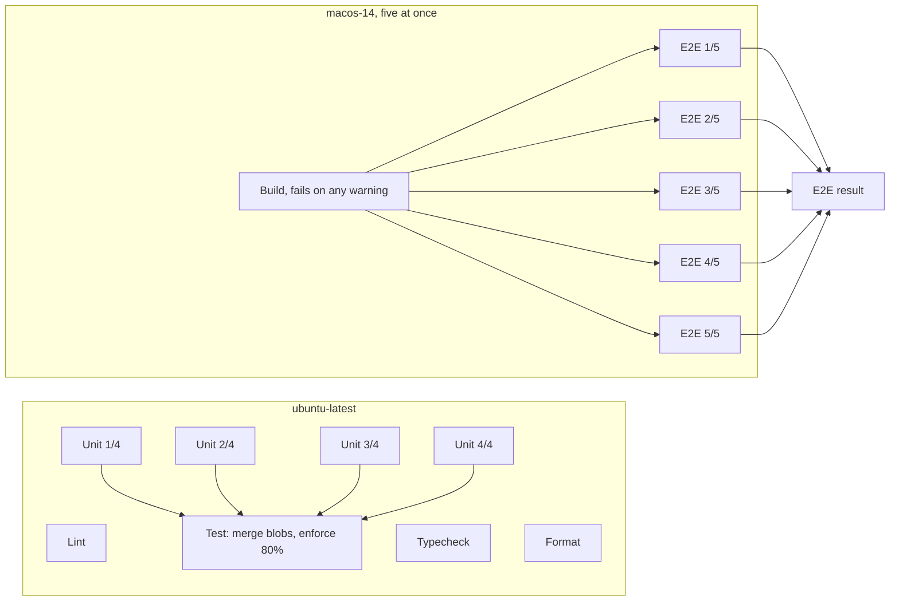

# ADR 071: CI is sharded by duration, and the build warns nothing

**Status**: Accepted

**Date**: 2026-09-27

## Context

[Run 36340574325](https://github.com/andytavares/terminator/actions/runs/36340574325) failed with every assertion passing. Three unit suites died with "Electron failed to install correctly": Electron 42 downloads its binary on the first `require('electron')`, and parallel vitest workers started that download together. The same run took 6m30s. The unit suite ran on one 3-core macOS runner for 5m49s. E2E shards were split by Playwright's test count, so one shard carried every session spec (106s against 37s). The build printed chunk-size warnings and a Foundry renderer bundle with `node:fs` stubbed out.

## Decision

- Unit tests never load the Electron binary: `vitest.config.ts` sets `ELECTRON_OVERRIDE_DIST_PATH`.
- Unit tests run on Linux in four shards. A tested macOS behaviour pins `process.platform`, so the result no longer depends on the host. The required `Test` job merges the blobs and enforces the coverage threshold once. It also fails if any shard did not succeed.
- macOS runs only the build and E2E. GitHub allows five macOS jobs at once.
- `scripts/e2e-shard.mjs` splits E2E across five shards by the durations in `tests/e2e/timings.json`. A file in `mode: 'parallel'` splits per test. Any other file stays whole on one shard. The burn-in uses the same split.
- The Build job fails when `npm run build` prints a warning. Each renderer has a `chunkSizeWarningLimit` just above its largest chunk. That limit is a size budget; Vite's 500 kB default is a download heuristic, and these renderers load from disk.
- PGlite specs boot one database per file and truncate between tests.

## Alternatives Considered

- **`fullyParallel: true`.** Shards stay count-balanced over contiguous ranges, so the adjacent slow tests still share a shard.
- **More unit shards on macOS.** They compete with E2E for the five runners. In run 36343286867 an E2E shard waited a minute for one.
- **Raise one global `chunkSizeWarningLimit`.** A per-renderer budget keeps each bundle's growth visible.

## Consequences

- `tests/e2e/timings.json` goes stale as tests change. A new test counts as the median until it is recorded. Refresh it with `node scripts/e2e-shard.mjs --record <merged report.json>`.
- A renderer that grows past its budget fails CI. The fix is to shrink the bundle, or to raise the budget in the same PR and say why.
- A unit test of platform-specific behaviour must pin the platform it describes.
