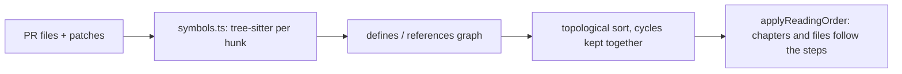

# ADR 072: A review reads definitions before their callers

**Status**: Accepted

**Date**: 2026-09-27

**Supersedes in part**: [ADR-010](010-heuristic-file-ordering-v1.md) (its file ordering; its tier table and chapter grouping stay)

## Context

`buildChapters` put implementation files first, sorted by `layerScore` descending (routes, then components, then hooks … then utils), and types after them. On a risk-score change, `ReviewDiffPane.tsx` came first and `computeRiskScore`'s own file third, so a reviewer read every call before the function it called. ADR-010 named Tree-sitter as the way out.

## Decision

- `web-tree-sitter` with the prebuilt grammars in `@vscode/tree-sitter-wasm` parses each patch's hunks in the main process. A file defines the symbols declared in its hunks and the symbol named in each hunk header; it references the identifiers in its added lines.
- File A comes before file B when B references something A defines. A test comes right after the last file it exercises. Lock and generated files stay last. A language with no grammar keeps its tier position.
- Each file's reason replaces the fixed `whyHere` string: "Uses RiskScore (step 1)", "Calls computeRiskScore (step 2)", "Renders HealthChips (step 5)".
- Chapters keep `buildChapters`' grouping; `applyReadingOrder` sorts chapters by their earliest step and files by step. A reviewer's drag-reorder still wins.
- Both packages are esbuild externals: `web-tree-sitter` finds its `.wasm` next to its own module, which bundling would move.

## Consequences

- Ordering is by file, not by hunk: a file is one step even when only one of its hunks is a definition.
- The same parse feeds complexity (branches per function, head against base), moved-block detection and the understandability measure.
- A snippet parse sees only the hunk, so a symbol defined outside every hunk of the PR has no step and is shown as not in this PR.
