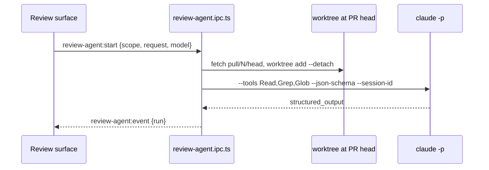

# ADR 073: The review agent reads, and never writes

**Status**: Accepted

**Date**: 2026-09-27

## Context

Reviewers wanted an agent's opinion on a PR, a chapter, a file, a hunk or a few lines, kept as private context. Nothing it says should reach GitHub unless the reviewer posts it. ADR-026 moved supervised runs into terminals and kept the headless spawn for self-review. Foundry's runner lives in another extension, which Principle II rules out.

## Decision

- The agent runs headless, `claude -p --output-format json --json-schema`, in a detached worktree at the PR head under `.git/terminator-review/`. At most five worktrees are kept.
- Its tools are `Read,Grep,Glob` and nothing else. With no Bash and no network tool it cannot run `gh`. It therefore cannot post, push or change the branch.
- Output is validated with Zod. A run that fails validation is a failed run, never a partial list of findings. Severities are rendered into the prompt from `FINDING_SEVERITIES`.
- Runs and dismissals are stored in electron-store on this machine only. A finding reaches GitHub only through the reviewer's own "Post as comment", which opens the composer. The composer then adds the comment to a pending review.
- The model defaults to Sonnet and can be switched to Opus per run. "Continue in terminal" resumes the same session with `claude --resume`.
- The child's environment drops inherited `CLAUDE_CODE_*` variables so a run never joins the parent's session.

## Consequences

- A run shows its elapsed time but not its tool calls, because `-p` reports only at the end.
- Reviewing an uncloned repository needs a clone first; the diff-only view has no worktree to read.
