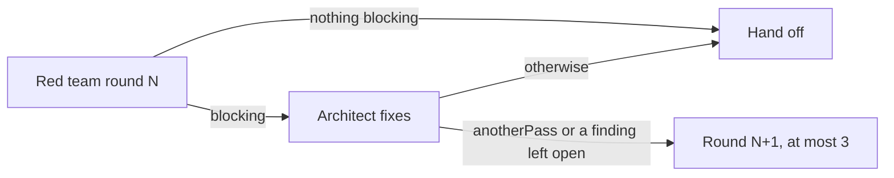

# ADR 075: One red-team pass unless the red team asks for another

**Status**: Accepted

**Date**: 2026-09-28

Amends ADR 069 (the red team argues before agreement): the loop still stops at
`MAX_REVIEW_ROUNDS` (3), but a fix is no longer reviewed by default.

## Context

On WO-0928-0bb (TAV-15) the Forge ran three red-team rounds and two architect
fix turns before hand-off, from 18:53:08 to 18:58:01 in the order's ledger.
Every round after the first attacked a fix that answered a finding the red team
had already stated precisely. Reviewing every fix made the loop's length the
cap rather than what the order needed.

## Decision

- The red team's output takes an optional `anotherPass` boolean
  (`src/line/rung-output.ts`). It is offered only to a role that writes
  `findings`, and it defaults to one pass.
- A round that asks for it records `review.another_pass` in the ledger, right
  after `review.round`. `anotherPassWanted` in `src/forge/intake-outcome.ts`
  reads it back, so the decision survives a restart.
- When the architect's fix turn lands, `afterFix` in `src/forge/review-loop.ts`
  decides: hand off, unless the red team asked for another pass or the
  architect left a blocking finding open. Either of those runs the next round.
- `reviewNext` is unchanged, so a third round that still finds something
  blocking goes to the operator as before.

## Consequences

- The common case is one round and one fix turn.
- A fix nobody reviewed can reach the Line. The Line's own inspection and final
  checks still run, and the red team can ask for a second look when a fix
  changes the plan materially.
- Releasing a hold still reviews a plan the red team has not seen
  (`afterRelease`), which can add one round the loop would have skipped.
