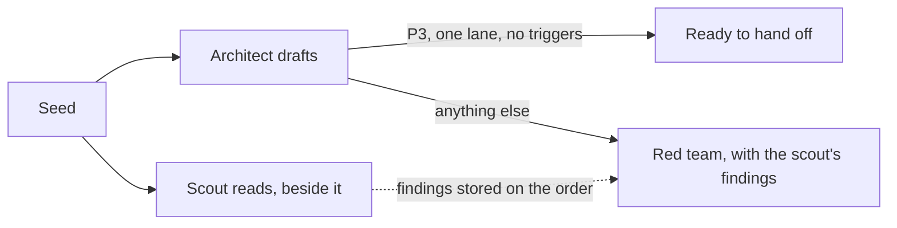

# ADR 084: Shaping starts with the architect; a small order skips the red team

**Status**: Accepted

**Date**: 2026-10-05

Amends ADR 075 (one red-team pass) and ADR 069 (the red team argues before
agreement).

## Context

Order WO-1006-6b5, a small one, took 267 seconds from seed to "ready to hand
off": worktree 13s, scout 80s, architect draft 46s, red team 66s, architect fix
turn 62s. Two of those were avoidable. The architect waited for the scout, which
only reads, and the red team ran on an order graded P3 with one lane and no risk
triggers, the same order the Direct shape would hand to a single builder.

## Decision

- The first draft starts at once. `convergeMaybeScouted`
  (`src/forge/scouted-converge.ts`) starts the scout and the architect together
  and answers with the architect's start. The architect never waits for the
  scout and never merges its output into the first draft: two writers to one
  draft is the failure this avoids.
- The scout's findings are stored on the order when it finishes. If the
  architect's save lands after them, `withScoutContext` keeps them. The red
  team's brief carries them as "What the scout found"
  (`scoutFindingsSection`).
- An order graded P3 with exactly one lane and no risk triggers skips the red
  team (`reviewSkipReason`, `src/forge/review-loop.ts`). The Forge records
  `review.skipped` with the reason, and readiness reads it as the red team step
  passed ("Skipped: graded P3, one lane, no risk triggers"). An open blocking
  finding is never skipped over.
- The setting `terminator.foundry.lighterRedTeam` (off by default) runs the red
  team on the balanced model tier instead of the deep one.

## Consequences

- The first draft is no longer ahead of the scout's reading; the architect
  works from the repository it reads itself, as it already did when the scout
  was refused.
- The red team may start before the scout has finished, and then does not see
  its findings. It is not made to wait.
- A small order's wrong plan reaches hand-off unreviewed; the six compile
  checks, the Line's inspection and the final checks still run.
