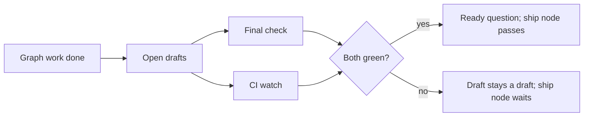

# ADR 085: The draft opens before the final check, and the check runs while CI does

**Status**: Accepted

**Date**: 2026-10-05

Amends ADR 080 (a final check asks whose failure it is) and ADR 053 (a stopped
run is a state) for what the ship node says.

## Context

Order WO-1006-6b5, one lane, took 972 seconds from hand-off to "mark it
ready?", all of it serial: scout 92, build 53, lint 7, verify 73, scribe 305,
final check 151 (format 12, lint 6, tests 26, repository gate 27, build 8,
end-to-end 66), then the draft, then CI 286. Four things in that list were
avoidable.

- The final check ran, then the draft opened, then CI started. The two
  slowest independent waits never overlapped.
- The repository gate and the unit tests were the same command,
  `vitest run --coverage`, run twice on the same commit.
- The scribe spent 305 seconds rebuilding the feature: it edited
  `linear.provider.ts`, read dependency types and ran the coverage suite three
  times. It is the one role whose product is documentation.
- The graph read "complete" at the scribe's end, because the recipe's terminal
  `ready-for-review` node was marked passed the moment the executor reached it,
  while 7.5 minutes of work remained.

## Decision

**The draft opens first.** When the graph's work is done, nothing has halted,
no gate is open and no inspection is owed, the tail opens the drafts (push,
draft, `pulls.json`, `onDraftOpened`) and then runs the final check beside the
CI watch. `shipOrder` is split into `openDrafts` and `watchAndFinish`; the
executor calls a new `beforeFinalCheck` dependency just before the climb, and
`createEarlyShip` (`src/line/early-ship.ts`) is what the tail passes it. The
ready question is raised only when the check passed and CI is green.

- A failed check raises the executor's gates exactly as before
  (`verify.repeat-fail`, `verify.base-fail`), records `ship.final_check_failed`
  with the failed step, raises no ready question, and leaves the draft a draft.
- A check that wrote tracked files (a format step) is committed
  (`commitWorktree`, `src/line/commit.ts`), pushed, and CI is watched again on
  that commit.
- The draft's body is rewritten once the check has run, so its verification
  table is not empty.
- A graded P0/P1 change, or one that owes an inspection, keeps the old order:
  check, decision, then push. Nothing reaches the remote before the operator
  decides.
- Re-entry (a send-back fix, a resumed run) reuses the lane's draft from
  `pulls.json`: it pushes, creates nothing, and does not call `onDraftOpened`
  again.

**A command runs once.** When two ladder steps resolve to the same command, the
later one reuses the earlier result and its log, and says so in its reason
("same command as ..."). Only a pass is reused; a failure stops the climb.

**The scribe documents.** A role whose `writes` is exactly `[docs]` may edit or
write only markdown files, `README*`, `CHANGELOG*`, `docs/**` and `specs/**`;
anything else is refused with a reason the agent reads (`docsOnly` on the tool
decision). Its prompt now says it does not change code and does not run tests,
builds or the suite. It runs beside the verifier (`after: [lint]`) in a fresh
session, never the builder's, because a resumed session keeps its old role's
identity. The standard shape also loses its Line scout: the Forge's scout
already read the repository and its findings are on the order.

**The ship node is honest.** The executor leaves the terminal
`ready-for-review` node `running`. The tail passes it when the ready question is
raised and returns it to `waiting` when shipping stopped short (red CI, a failed
check, drafts off). A running gate has no session, so reclaim no longer takes it
for a dead agent: on resume it means the tail is owed.

## Consequences

- On WO-1006-6b5 the draft opens about 150 seconds earlier and the CI watch
  overlaps the final check; the repeated coverage run, the scout and the
  scribe's rebuilding are gone.
- A red CI round waits for the final check before it sends work back, because
  both use the same checkout (`afterFinalCheck` in `line/ship-tail.ts`). When the
  final check failed, the round sends nothing: the check's own gate is the
  operator's next move.
- A draft now exists for a change whose final check then fails. It is a draft,
  and the ticket has already moved to In Review.
- The scribe can no longer fix a typo in a code comment. That is the builder's.
- The Floor and the hall see the ship node running for the whole tail.
