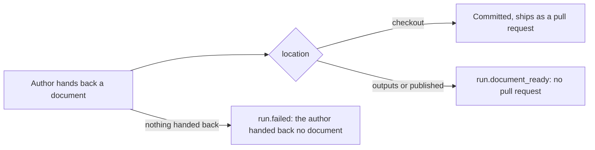

# ADR 086: Six shapes, a commit after every agent, and a document hand-back

**Status**: Accepted

**Date**: 2026-10-05

Amends ADR 050 (effort belongs to the shape), ADR 059 and ADR 064 (which named
the document and demonstration shapes) and ADR 069 (design-doc and the red team
before agreement). Those stay as history.

## Context

Ten shapes shipped, and four of them were another one with a word changed.
`design-doc` and `research` differed only in id, description and effort. `poc`
was `direct` without the inspector. `spike` was `research` that never opened a
pull request. `quick` was `direct` with the project's test command standing in
for the verifier. Choosing between them asked the operator a question the
repository could answer.

Research orders also could not finish. WO-0913-0bd ran research
(author, verify, integrate, ship): nothing in Foundry ever runs `git commit`,
the author's document was edited and never committed, the push carried the base
commit, and `gh pr create` failed with "No commits between". The ledger ended
on `run.failed`. The author could only write documentation inside the checkout,
so an answer the order wanted somewhere else had nowhere to go.

## Decision

**Six shapes.** `direct`, `standard`, `bugfix`, `refactor`, `speckit` and
`research`. `design-doc`, `poc`, `spike` and `quick` are deleted.

`direct` is one shape for one lane: build (by lane) → lint when the repository
has a lint command → either the test command as a `check` step when it has one
(`toolchain.test is set`, one rework round back to the build) or a fresh
`verify` agent when it has not → inspect when a risk trigger fired → document
unless the change is graded P3 → integrate → ship. Effort is medium. The
proposal is `direct` for one lane at P2 or P3, flagged or not, and `standard`
for more than one lane or above P2.

The recipe language gains `risk.grade is P3` and `risk.grade is not P3`, in
`evaluateWhen` and in the sentence a skipped step is recorded with. A step
that depends on a skipped step is satisfied, so `integrate` waits on `check`,
`verify`, `inspect` and `document`, and whichever did not apply is simply
absent.

**The line commits what agents write.** After an agent whose role may write the
checkout passes, the executor commits its lane's worktree with
`<step id>: <unit titles>` (`commitNode`, over `commitWorktree`). A builder or
author that passed and left nothing to commit fails with "made no change to the
checkout" and follows the existing failure and rework path. A scribe with
nothing to document passes, and so does an author whose document is outside the
checkout.

**The author hands back a document.** A new collectable,
`document: { path, url?, location: checkout | outputs | published }`, is
written to the author's rung file, collected onto the order like the other
artefacts, and recorded as `document.handed_back`. The author may now also write
under the order's `outputs/` directory, whose path is in its brief; the tool
policy allows that directory and the rung file by name, for a role whose
`writes` is documentation only. When the order names a target outside the
checkout, or in another repository, the author writes to `outputs/` and says so.

A run that ends on `outputs` or `published` records `run.document_ready`
instead of opening a pull request, and does not open an early draft.
`standingOf` reads the line as done, foundry's turn, "Finished · document
ready", never "Finished, but not shipped". A research order that ends without a
hand-back is `run.failed` with "the author handed back no document".

**A documentation-only change runs a short final check.** When every changed
path is documentation (`*.md`, `docs/`, `specs/`, `README*`, `CHANGELOG*`) the
ladder keeps Format and Lint and marks the other command steps not run, reason
"documentation only". An unknown change set, or one code file among the
documents, runs everything.

## Consequences

- Choosing a shape is a smaller question. Nothing is lost: the four deleted
  shapes are `direct` or `research` with a step removed, and a repository
  without a test command is no longer a reason to refuse a shape.
- `direct` at P3 skips the scribe, and `direct` runs at medium effort where it
  used to run at high. A risky change that is proposed `direct` still gets the
  inspector, and `standard` is one grade away.
- Every agent that writes now leaves a commit, so a branch has history to push.
  A builder that rewords nothing and changes nothing now stops the line instead
  of passing silently.
- An order whose document is outside the checkout stays `running` in the order
  record. Its standing, not its status, says it is finished.
- The ladder's check for documentation reuses the scribe's definition of a
  documentation path, so the two cannot disagree about what documentation is.
