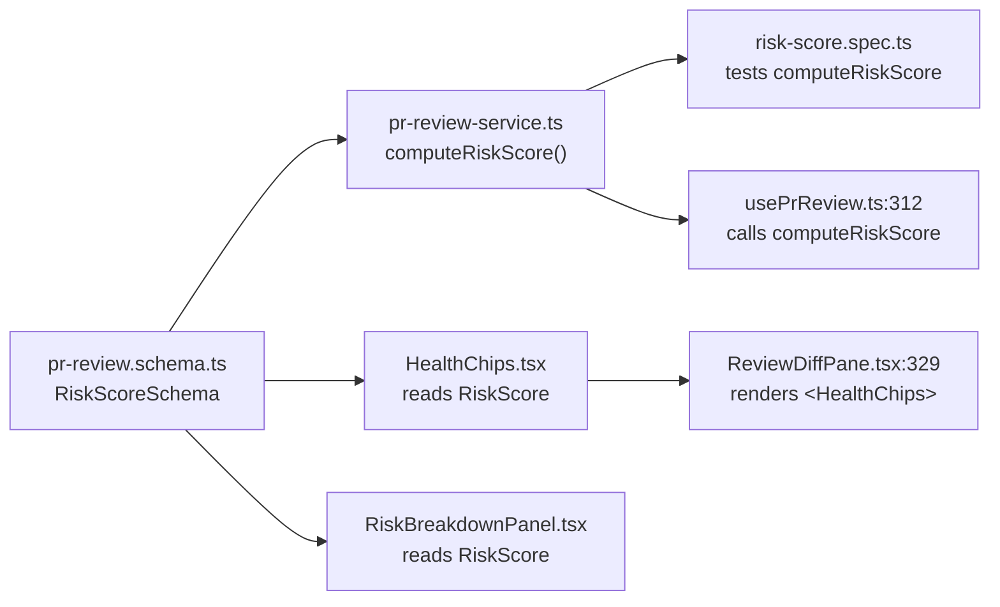
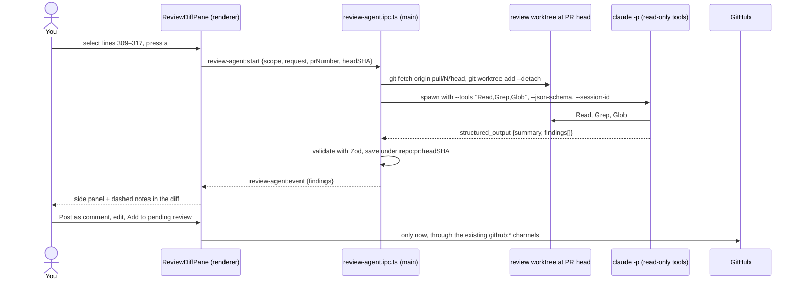
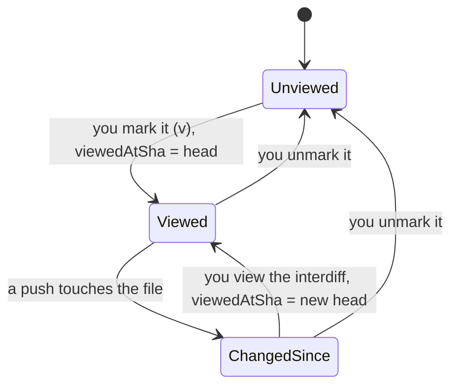
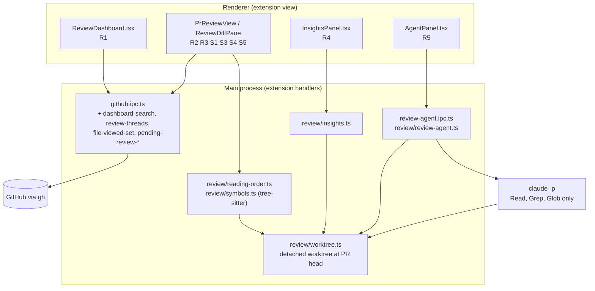

# Code Review Revamp

Design document · `extensions/git-integration` · Draft · 2026-09-27
Published with interactive renderings: https://claude.ai/artifact/QmQe8PHN4jx4NJQW9kAyEk

Five changes you asked for (R1–R5) and five drawn from current diff and review tools (S1–S5).

| ID  | Change               | One line                                      |
| --- | -------------------- | --------------------------------------------- |
| R1  | Review dashboard     | Every PR that needs you, across repos         |
| R2  | Comment visibility   | All, unresolved, hidden, one key              |
| R3  | Definitions first    | Read a function before its callers            |
| R4  | Insights             | Five measures, each names its source          |
| R5  | Agent review         | PR, file, hunk or lines; private until posted |
| S1  | Since your review    | A push no longer resets your progress         |
| S2  | Resume card, notes   | Where you left off, in one glance             |
| S3  | Keyboard-first       | Hunks, files, comments, agent                 |
| S4  | Moved code collapses | No red-green wall for a move                  |
| S5  | One review, not N    | Comments batch into a pending review          |

## Context

Code review takes a large share of your day. The Code Reviews tab already splits a PR into chapters, scores risk, and keeps your place. Four things still slow you down. It sees one repository at a time. It shows callers before the code they call. Its coverage and complexity numbers don't measure the PR's own code. It has no agent. And every push from the author wipes your viewed-file progress, which is the worst of these when you are interrupted mid-review.

## Goals and non-goals

- **G1** One dashboard of every open PR that needs you, across repositories, including requests made to your teams.
- **G2** Comments show or hide with one key, without losing track that they exist.
- **G3** A function's hunk is shown before any hunk that calls it.
- **G4** Complexity, risk, coverage, health and understandability, each stating where its number came from, or "not measured".
- **G5** An agent reviews a PR, chapter, file, hunk or line range on request. Results stay private. Nothing reaches GitHub until you click Post.
- **G6** A push, a restart or a two-hour meeting never costs you your place.

**Non-goals:** approving automatically; the agent editing the branch or writing to the PR; GitLab or Bitbucket; merge queues; replacing GitHub for PRs you author.

## Current state

Paths are under `extensions/git-integration/src/` unless noted.

| Area             | What it does                                                                                        | Evidence                                                                                    | Gap                                                                                                                                |
| ---------------- | --------------------------------------------------------------------------------------------------- | ------------------------------------------------------------------------------------------- | ---------------------------------------------------------------------------------------------------------------------------------- |
| Queue scope      | One repo. `repository.pullRequests(first:20, orderBy CREATED_AT DESC)`, then up to 10 more pages.   | `ipc/github.ipc.ts:122`; `MAX_AUTO_PAGES = 10` at `components/pr-review/PrReviewTab.tsx:23` | Other repos invisible. "Needs my review" computed from loaded pages, matches your login only, not teams (`ReviewQueue.tsx:83-92`). |
| Reading order    | Implementation files first, sorted by `layerScore` desc (route 9 … util 1), then types, then tests. | `github/pr-review-service.ts:538-541`, `:257-271`                                           | Callers before callees. Contradicts ADR-010's own tier table (types first).                                                        |
| Measured example | Ran the real `buildChapters` on seven paths of a risk-score change (esbuild bundle, node).          | Output below                                                                                | `computeRiskScore` is in the third chapter; its caller `usePrReview.ts:312` is in the second.                                      |
| Comments         | Each thread collapses on its own; threads from REST `pulls/{n}/comments`.                           | `components/pr-review/InlineCommentThread.tsx:11`                                           | No global hide. Resolved state never fetched.                                                                                      |
| Complexity       | Keyword count (`if`, `&&`, `??` …) in added lines; +5 per hunk is a hotspot.                        | ADR-010; `github/pr-review-service.ts:48`                                                   | Counts keywords in strings and comments; can't name the function.                                                                  |
| Coverage         | Reads `coverage/coverage-summary.json` or `coverage/lcov.info` from the local checkout.             | `ipc/github.ipc.ts:755-775`                                                                 | Measures your checked-out branch, not the PR head.                                                                                 |
| Session          | Keyed `repo:::pr:::headSHA`.                                                                        | `stores/pr-review.store.ts:99`; `PrReviewTab.tsx:109`                                       | Any push creates a new, empty session. Viewed marks lost.                                                                          |
| Diff controls    | Unified/split and Semantic filter are component `useState`.                                         | `components/pr-review/ReviewDiffPane.tsx:63-64`                                             | Not remembered.                                                                                                                    |
| Keyboard         | Only Enter (file list) and Cmd+Enter (comment).                                                     | `grep "e.key ===" components/pr-review`: 2 hits                                             | Mouse-only.                                                                                                                        |
| Posting          | Each inline comment POSTed on its own, immediately.                                                 | `ipc/github.ipc.ts:507-520`                                                                 | One notification per comment; no revising before sending.                                                                          |
| AI               | MergeFlow's suggestion channel returns `NOT_IMPLEMENTED`. Review has no agent.                      | `ipc/merge-flow.ipc.ts:320`                                                                 | No agent in the extension.                                                                                                         |

`buildChapters` output for the example (command: esbuild-bundled script calling `buildChapters` on the seven paths, run with node):

```
UI => ReviewDiffPane.tsx[t1] , HealthChips.tsx[t1] , RiskBreakdownPanel.tsx[t1]
hooks => usePrReview.ts[t1]
Data Layer => pr-review-service.ts[t1] , pr-review.schema.ts[t1]
Tests => risk-score.spec.ts[t2]
```

## Inspiration

**[UNVERIFIED]** I could not read the linked article. WebFetch got HTTP 403, curl got Cloudflare's "Sorry, you have been blocked", the r.jina.ai reader got a CAPTCHA page, it isn't in Stackademic's RSS feed, and the Wayback Machine has no copy. I did not try to get past the bot check. Tools in the same category, checked on 2026-09-27:

| Tool                                                                                        | What it does well                                                                                    | Taken into         |
| ------------------------------------------------------------------------------------------- | ---------------------------------------------------------------------------------------------------- | ------------------ |
| [difftastic](https://github.com/Wilfred/difftastic)                                         | Structural diff that "compares files based on their syntax"; reformatting shows as no change.        | S4, D1             |
| [gh-dash](https://github.com/dlvhdr/gh-dash)                                                | "User-defined, per-repo, PRs & issues sections", each a GitHub search filter.                        | R1                 |
| [revdiff](https://github.com/umputun/revdiff)                                               | Inline annotations; `??` marks a question; `[` `]` jump hunks across files; `t` hides the tree.      | S2, S3             |
| [diffity](https://github.com/nilbuild/diffity)                                              | Agent reviews the diff and leaves comments in the viewer tagged must-fix, suggestion, nit, question. | R5                 |
| [Linear Diffs](https://linear.app/changelog/2026-05-27-linear-diffs)                        | "The core of change first", glue code separated, each section explained: what, then consequences.    | R3, R5 walkthrough |
| [diffnav](https://github.com/dlvhdr/diffnav) / [delta](https://github.com/dandavison/delta) | Syntax-highlighted pager with a GitHub-style file tree.                                              | Already covered    |

## Decisions

### D1 · How to find definitions and their uses

- **A. Extend the import regex.** `IMPORT_RE` links files by relative imports. JS/TS only, file-level; can't see same-file calls or order hunks.
- **B. Tree-sitter in WASM (chosen).** `web-tree-sitter` 0.27.0 (published 2026-08-30) with prebuilt grammars from `@vscode/tree-sitter-wasm` 0.3.1: TypeScript, TSX, JavaScript, Python, Go, Rust, Java, C#, Ruby, PHP, C++, Bash, CSS. Parses base and head of each changed file; definitions and references per hunk. No native build. ADR-010 names Tree-sitter as its v2.
- **C. Language servers.** Precise, but a server per language and installed dependencies. Too slow to start.

Files without a grammar fall back to A, then to today's tiers.

### D2 · Where the review agent runs

- **A. Headless `claude -p`, JSON schema, read-only tools (chosen).** `claude -p --output-format json --json-schema … --tools "Read,Grep,Glob" --session-id <uuid>` in a detached worktree at the PR head. Structured, quiet, and without Bash it can't run `gh`. ADR-026 keeps headless spawn for self-review; this extension already uses `child_process` (`git/git-service.ts`, `ipc/merge-flow.ipc.ts`). Flags checked with `claude --help` and the [headless docs](https://code.claude.com/docs/en/headless).
- **B. Interactive agent in a terminal tab.** Foundry's pattern. Visible, but results must come back through a file, and a tab per question is noise.
- **C. Reuse Foundry's supervised runner.** Principle II forbids it.

Plus **Continue in terminal**: `claude --resume <session-id>` in a tab via `api.pty.openTerminalTab`.

### D3 · Where the dashboard gets its PRs

- **A. Per-repo query for every workspace project.** One query per repo; misses repos not open in Terminator.
- **B. GitHub search, one query per section (chosen).** Cross-repo, filtered server-side. [Documented qualifiers](https://docs.github.com/en/search-github/searching-on-github/searching-issues-and-pull-requests): `user-review-requested:@me`, `team-review-requested:`, `reviewed-by:`, `involves:`, `review:changes_requested`, `draft:`, `archived:`. `gh search prs --review-requested=@me` exists in gh 2.97.0.

### D4 · What a review session is keyed by

- **A. Keep `headSHA`, copy on push.** Smallest change; "viewed" still means "viewed at a SHA we threw away".
- **B. Key by repo and PR; store each file's viewed SHA (chosen).** Enables S1. Matches GitHub: `FileViewedState.DISMISSED` = "The file has new changes since last viewed" (GraphQL introspection).

## R1 · Review dashboard

A new global tab, **Reviews**, via `api.sidebar.registerGlobalTab`. Each section is a saved GitHub search. The waiting count shows on the tab. Opening a row goes to the existing per-repo Code Reviews tab.

```
┌ Reviews  [5 need you]                                     Updated 1 min ago  [Refresh] ┐
│ Needs you 5 │ My PRs 3 │ Involved 7                                                   │
│ 5 need you · 2 high risk · About 2 h 10 min of reading      Sorted by closest to merging │
│ RE-REVIEW · NEW COMMITS SINCE YOU REVIEWED                                             │
│ terminator  #211 E2E: deterministic, faster, and only the specs…  +4,043 −2,103  High   [Re-review] │
│             3 commits since your review · 4 of 56 files changed · you viewed 51        │
│ REQUESTED OF YOU                                                                       │
│ terminator  #210 Foundry: the red team argues before agreement    +3,699 −402    High   [Review]    │
│ terminator  #209 fix(foundry): architect amendments stop…  9/16    +577 −169      Medium [Resume]    │
│ REQUESTED OF YOUR TEAM                                                                 │
│ terminator  #212 ci: split the E2E burn-in across both shards     +3 −3          Low    [Review]    │
│ terminator  #207 fix: hall walks, Claude latest output…  CI failing +317 −34      Medium [Review]    │
└────────────────────────────────────────────────────────────────────────────────────────┘
```

Rows use real titles and sizes (`gh pr list --state all --limit 12`); sections, risk and estimates are illustrative.

Default section queries (editable):

- **Re-review:** `is:pr is:open archived:false reviewed-by:@me -author:@me`, kept only if a commit landed after your latest review.
- **Requested of you:** `is:pr is:open archived:false user-review-requested:@me`
- **Requested of your team:** `is:pr is:open archived:false team-review-requested-user:@me`, minus rows above.
- **My PRs:** `is:pr is:open author:@me`, labelled by blocker: changes asked, CI failing, approved.
- **Involved:** `is:pr is:open involves:@me -author:@me`

A row opens against the workspace project whose `origin` matches its `owner/repo`; with no match it offers **Clone and review**.

## R2 · Comment visibility

One toolbar control, three states, cycled by `c`: **All** (resolved dimmed), **Unresolved** (hides resolved and outdated), **Hidden** (threads leave the flow; a count stays in the gutter). Agent notes have their own switch, `shift+c`. The choice is remembered.

```
components/pr-review/HealthChips.tsx  Medium risk   Comments [All|Unresolved|Hidden]  Agent notes [On|Off]
@@ -56,10 +56,12 @@ export function HealthChips
 56     const covValue = covPct != null ? `${covPct}%` : null
 58 (2) const chips: Chip[] = [          ← in Hidden, the pip carries the count; click opens that thread
 60 -       label: 'Tests',
 60 +       label: 'Tests',
 61 +       tooltip: 'Whether a test file exists alongside this changed file.',
    ┆ Agent note · private · QUESTION: "Alongside" is decided by testsSignal's stem match, which only
    ┆ looks at files inside this PR. An untouched existing test reads as missing.
    ┌ andytavares · 1 h ago: Tooltip should say this is only files in the PR, not the repo.
```

Needs threads from GraphQL `reviewThreads` for `isResolved` (field exists on `PullRequestReviewThread`, checked by introspection); `ThreadSchema` gains `resolved: boolean`.

## R3 · Definitions first

Ordering moves from files to hunks. Tree-sitter records what each hunk defines and references; a topological sort gives the reading order; files that reference each other stay together as one step. Chapters group the ordered hunks.



Edges checked with `grep -rn "computeRiskScore(\|<HealthChips\|RiskScore"`. An arrow means "read this before".

```
TODAY (buildChapters)                     PROPOSED (definitions first)
1 ReviewDiffPane.tsx   ✗ HealthChips unread   1 pr-review.schema.ts       defines RiskScore
2 HealthChips.tsx      ✗ RiskScore unread     2 pr-review-service.ts      computeRiskScore, uses 1
3 RiskBreakdownPanel.tsx                      3 risk-score.spec.ts        tests 2, read right after
4 usePrReview.ts       ✗ computeRiskScore     4 usePrReview.ts            calls 2
5 pr-review-service.ts                        5 HealthChips.tsx           uses 1
6 pr-review.schema.ts                         6 RiskBreakdownPanel.tsx    uses 1
7 risk-score.spec.ts                          7 ReviewDiffPane.tsx        renders 5

hooks/usePrReview.ts  [Step 4 of 7]   Uses: computeRiskScore · read in step 2   [Peek definition]
```

Rules, in order:

1. A hunk that defines or changes a symbol comes before any hunk that references it.
2. A test comes right after the last hunk it exercises.
3. Among free hunks: same file as the last one, then higher risk, then larger.
4. Lock and generated files (tier 3) stay last and collapsed.
5. Manual drag-reorder (`fileOrderOverrides`) still wins.

Each step shows a one-line reason, replacing the fixed `whyHere` strings.

## R4 · Insights

A **Review brief** at the top of the Overview, a line per file, a gutter mark per function. Every figure names its source or says "not measured".

```
Review brief · #211                                                High risk
Complexity        +23 branches   Up in 6 functions; largest +9, +6, +4      tree-sitter · base vs head
Risk              78 / 100       Blast radius (playwright.config.ts, 41     computeRiskScore · at head
                                 importers), churn (scripts/, 14 in 90 d)
Test coverage     84% new lines  2 changed functions with no covered lines  CI check codecov/patch
Code health       3 flags        1 function >80 lines, 1 eslint-disable,    tree-sitter · detectDryViolations
                                 1 block duplicated in 2 files
Understandability Moderate       1,120 lines to read, 9 new exports,        reading-order graph
                                 longest definition chain 4

 88 [+6] + export function shardByDuration(timings: Timing[], shards: number) {
 89 [0%] +   if (shards < 1) throw new Error('shards must be ≥ 1')
```

Values for #211 are illustrative; function names are placeholders.

| Measure           | How it's computed                                                                                                                                                           | When it can't be measured                                      |
| ----------------- | --------------------------------------------------------------------------------------------------------------------------------------------------------------------------- | -------------------------------------------------------------- |
| Complexity        | Per-function cyclomatic count on base and head ASTs; head minus base.                                                                                                       | No grammar: keyword count, labelled "approximate".             |
| Risk              | Today's `computeRiskScore`, with churn and blast radius at the PR head in the review worktree, coverage from the row below.                                                 | Fewer than 2 signals: "not measured".                          |
| Test coverage     | 1. Patch-coverage status check (`COVERAGE_CHECK_NAMES` already lists codecov, coveralls, sonar…). 2. `coverage/` in the review worktree, only if its `HEAD` is the PR head. | "Not measured", plus changed source files with a changed test. |
| Code health       | In added code: functions >80 lines, nesting >4, >5 params, new `any`, `@ts-ignore`, `eslint-disable`, `TODO`; duplicates from `detectDryViolations`.                        | No grammar: text-based flags only.                             |
| Understandability | From the R3 graph: lines to read after Semantic filter and tier 3, new exports, longest definition chain, cross-chapter references. Easy / Moderate / Hard.                 | Always measurable.                                             |

## R5 · Agent review

Select lines, a hunk, a file, a chapter or the PR; press `a` or **Ask agent**; pick **Review**, **Explain** or a question. Results arrive in a side panel and as dashed private notes in the diff. **Post as comment** opens the composer filled in for you to edit.

```
1 SELECT                                   │ Ask about lines 309–317
309 │ for (const { file, metrics } of …) {  │ Scope: selection · PR head, private worktree
312 │   const riskScore = computeRiskScore( │ [Review | Explain | Ask…]
313 │   updateFileRiskScore(chapter.id, …)  │
317 │ const riskLevels = collected.map((c) =│
    [Ask agent a] [Explain] [Add note m] [Comment r]

2 RUNNING   ◌ Reviewing lines 309–317 · Read pr-review-service.ts · Grep updateFileRiskScore · 41 s
            [Cancel] [Continue in terminal]

3 FINDINGS  SUGGESTION  Risk scored twice per file         usePrReview.ts:317
                        [Post as comment] [Dismiss] [Ask follow-up]
            QUESTION    Coverage comes from your checkout  pr-review-service.ts:109
            ┆ Agent note · private: Line 317 calls computeRiskScore again for every file already
            ┆ scored on line 312. Keep the scores from the loop and read .level from them.

4 POST ONE  New comment · line 317 · edited from agent finding
            "Nit: computeRiskScore runs twice per file here (312 and 317)…"
            [Add to pending review] [Cancel]   Sent when you submit your review (S5)
```

Both findings are real: `usePrReview.ts` calls `computeRiskScore` at 312 and again at 317 on the same metrics; `ipc/github.ipc.ts:755` reads coverage from the local checkout.



- **Scopes:** line range, hunk, file, chapter, PR. PR scope adds a **walkthrough**: one paragraph per chapter, what changed then what it affects, at the top of the Overview, cached per head SHA.
- **Finding shape:** `{ severity: 'must-fix' | 'suggestion' | 'nit' | 'question', path, startLine, endLine, side, title, body, suggestedCode? }`; severities rendered into the prompt from the schema constant.
- **Controls:** `review.agentModel` (default `opus`) and effort in settings, 5-minute default timeout, one run per scope, Cancel kills the process.

## S1 · Since your review

Each file remembers the SHA you viewed it at. After a push, unchanged files stay ticked; changed ones show **Changed since you viewed** and open on the diff from your SHA to the new head. Viewed state is also written to GitHub (`markFileAsViewed`, input `pullRequestId, path`).

```
3 commits since you last looked · 2 h ago · 4 files changed · 51 still viewed   [Since my review s | Whole PR]
CHAPTER 2 · SHARDING               │ scripts/e2e-shard.ts  [Changed since you viewed]  9f0c76eb … head
✓ scripts/e2e-timings.ts  viewed   │ @@ -41,6 +41,9 @@
● scripts/e2e-shard.ts    changed  │ 42 -   return shards.map((s) => s.specs)
● playwright.config.ts    changed  │ 42 +   // hooks count toward a spec's time
+ scripts/e2e-burn-in.ts  new      │ 43 +   return shards.map((s) => s.specs.concat(s.hooks))
✓ .github/workflows/ci.yml viewed  │
```

Paths, commit `9f0c76eb` and PR are real; the hunk is invented.



`ChangedSince` is GitHub's `DISMISSED`. If a force-push removed your SHA, the interdiff falls back to the whole file with a "history rewritten" note; old heads are fetched into `refs/terminator/review/<pr>/<sha>` while you review.

## S2 · Resume card and private notes

Reopen a PR after 15+ minutes away and a card shows where you were and what moved. `m` leaves a private note on a line; a note containing `??` is a question the card offers to send to the agent. Notes stay on your machine.

```
Where you left off · #209   Yesterday 17:42 · 9 of 16 files viewed           [Continue ↵]
→  Chapter 2 · forge/amend.ts line 118                                  last position
2  2 notes, 1 is a question: "why does amendOrder skip the ledger here??"   [Ask agent]
1  1 agent finding you haven't opened                                   must-fix
3  3 draft comments not yet submitted                                   [Review drafts]
●  1 push since · 2 viewed files changed                                S1
```

`forge/amend.ts` and `amendOrder` are placeholders.

## S3 · Keyboard-first review

Renderer `keydown` only (never `globalShortcut`). Escape is left alone because double Escape exits the extension. `?` shows the sheet.

| Keys    | Action                     | Keys | Action                 | Keys  | Action          |
| ------- | -------------------------- | ---- | ---------------------- | ----- | --------------- |
| `j` `k` | Next / previous hunk       | `c`  | Cycle comments         | `m`   | Private note    |
| `]` `[` | Next / previous file       | `⇧C` | Agent notes on / off   | `g d` | Peek definition |
| `n`     | Next unviewed              | `a`  | Ask agent on selection | `t`   | Hide file list  |
| `v`     | Mark file viewed           | `e`  | Explain selection      | `i`   | Insights panel  |
| `s`     | Since my review / whole PR | `r`  | Comment on line        | `⌘↵`  | Submit review   |

`j`/`k` continue into the next file at a file's end (revdiff's `--cross-file-hunks`).

## S4 · Moved code collapses

A block deleted in one place and added unchanged elsewhere (3+ lines, whitespace normalised) collapses to one row linking both ends; a moved block with small edits shows only the edits. Same parse as R3. The Semantic filter (`classifyHunk`) stays.

```
review/reading-order.ts   new file
[Moved] UnionFind · 28 lines, unchanged, from github/pr-review-service.ts:360     [Show] [Go to origin]
41 + export function orderHunks(graph: HunkGraph): HunkRef[] {
```

Illustrative: how moving the existing `UnionFind` class would read.

## S5 · One review, not N comments

Comments go into a pending review instead of posting one by one: "To create a pending review for a pull request, leave the event parameter blank" ([REST docs](https://docs.github.com/en/rest/pulls/reviews#create-a-review-for-a-pull-request)). Drafts are editable until you submit; the author gets one notification.

```
(3) 3 draft comments on 2 files · 1 from an agent finding   [Review drafts]  [Comment|Approve|Request changes]  [Submit review]
```

## Architecture



All inside `extensions/git-integration`. Core APIs used already exist: `sidebar.registerGlobalTab`, `pty.openTerminalTab`, `settings`, `ipc.registerHandler`.

| Piece                          | Path (under `extensions/git-integration/src`)                                                                                      | Kind         |
| ------------------------------ | ---------------------------------------------------------------------------------------------------------------------------------- | ------------ |
| Dashboard search               | `github/dashboard-search.ts`, `components/pr-review/ReviewDashboard.tsx`                                                           | new          |
| Review threads with resolution | `ipc/github.ipc.ts` channel `github:review-threads`; `ThreadSchema.resolved`                                                       | change       |
| Symbols and reading order      | `review/symbols.ts` (tree-sitter), `review/reading-order.ts` (pure), replaces ordering inside `buildChapters`                      | new + change |
| Insights                       | `review/insights.ts` (pure), `components/pr-review/InsightsPanel.tsx`; `HealthChips`, `RiskBreakdownPanel` read from it            | new + change |
| Review worktree                | `review/worktree.ts`: fetch `pull/N/head`, `git worktree add --detach`, keep 5 most recent                                         | new          |
| Agent                          | `review/review-agent.ts`, `schemas/review-agent.schema.ts`, `ipc/review-agent.ipc.ts`, `components/pr-review/AgentPanel.tsx`       | new          |
| Session v2                     | `ReviewSessionSchema`: key `repo:::pr`, `files: Record<path, { viewedAtSha }>`, `notes[]`; migrates v1 keys once                   | change       |
| Keys, resume, moved, drafts    | `hooks/useReviewKeys.ts`, `components/pr-review/ResumeCard.tsx`, `review/moved-blocks.ts`, `github:pending-review-add` / `-submit` | new          |
| Dependencies                   | `web-tree-sitter` 0.27.0, `@vscode/tree-sitter-wasm` 0.3.1 in the extension's `package.json`                                       | new          |

New IPC channels get a contract file (as in `specs/006-mergeflow-conflict-resolver/contracts/ipc-channels.md`). Two ADRs: hunk-level reading order (superseding ADR-010's ordering) and the read-only headless review agent.

## Sequence of changes

| #   | Ships                                                    | Why this position                                        |
| --- | -------------------------------------------------------- | -------------------------------------------------------- |
| 1   | R2 comment visibility, resolved threads                  | Smallest; immediate relief.                              |
| 2   | S1 session v2, since-your-review, GitHub viewed sync     | Stops pushes wiping progress; R5 and S2 store data here. |
| 3   | R1 dashboard                                             | Independent of the diff surface.                         |
| 4   | Review worktree + R3 reading order + S4 moved code       | The parse lands once and feeds R3, S4, R4.               |
| 5   | R4 insights                                              | Needs the parse and the worktree.                        |
| 6   | R5 agent review                                          | Needs the worktree; posts through S5 if shipped.         |
| 7   | S3 keyboard, S2 resume card and notes, S5 pending review | Binds keys to everything above.                          |

## Testing and verification

Each PR is done when these exit 0 from the worktree:

```
npm run format
npm run lint
npx vitest run --coverage          # all pass, patch coverage ≥ 80%
npx playwright test tests/e2e/git-integration-smoke.spec.ts
```

Tests first, per unit:

- `reading-order.spec.ts`: the seven-file example yields the proposed order; a cycle stays together; no-grammar falls back to tiers; overrides win.
- `symbols.spec.ts`: definitions and references for TS, TSX, Python, Go fixtures shaped like real hunks.
- `insights.spec.ts`: coverage source order (check, worktree at head, else "not measured"); `&&` inside a string is not a branch.
- `review-agent.spec.ts`: argv contains `--tools Read,Grep,Glob` and no Bash; schema-failing output becomes an error, never a partial list; timeout and cancel kill the process.
- `pr-review.store.spec.ts`: a new head keeps viewed files whose content is unchanged; a v1 session migrates.
- E2E: toggle comments and assert the rendered DOM hides threads; reload and assert the choice held.

Then a live run on PR #213 (109 files): screenshot every surface in the running app and time one agent review per scope.

## Risks and mitigations

| Risk                             | Mitigation                                                                                                              |
| -------------------------------- | ----------------------------------------------------------------------------------------------------------------------- |
| Parsing 100+ files blocks main   | Worker thread; changed files only; cache by blob SHA.                                                                   |
| Grammar WASM weight              | Load a grammar on first use. **[UNVERIFIED]** total size not measured.                                                  |
| Agent cost and wait on large PRs | Default scope is the selection; PR scope shows file count first; one run per scope; cache per head SHA.                 |
| Agent findings are wrong         | Private, never auto-posted, dismissible; dismissals kept so the same finding isn't repeated.                            |
| Search rate limits               | One GraphQL request with aliases for all sections; refresh on focus, at most every 2 min; existing `RATE_LIMITED` path. |
| Worktrees pile up                | Keep 5 most recent; remove on PR close; `git worktree prune` at start.                                                  |
| Force-push removed your old SHA  | Old heads fetched into `refs/terminator/review/*`; if absent, whole file with a note.                                   |

## Open questions

1. Which five tools does the Stackademic article name? If it lists something not above, it may change S3 or S4.
2. **[UNVERIFIED]** Does `team-review-requested-user:@me` accept `@me`? The docs example uses a login; fallback is the login from `github:current-user`.
3. Agent model: `opus` for every scope, or `sonnet` for line and hunk scopes?
4. Repos whose CI publishes no patch-coverage check: is "not measured" acceptable, or should the worktree run tests on request?
5. Dashboard rows for repos not cloned locally: clone on demand, or a diff-only review without local metrics?
6. Should dismissed agent findings sync anywhere, or stay on this machine?

## Alternatives rejected

- Posting agent findings as GitHub comments by default: you asked for the opposite.
- LSP for reading order: per-language servers and installed dependencies.
- An interactive terminal agent per question: noise; kept only as "Continue in terminal".
- Reusing Foundry's runner or risk grader: Principle II.
- Octokit for the dashboard: ADR-009 keeps GitHub on `gh`.
- One composite "health score": hides which signal moved.
