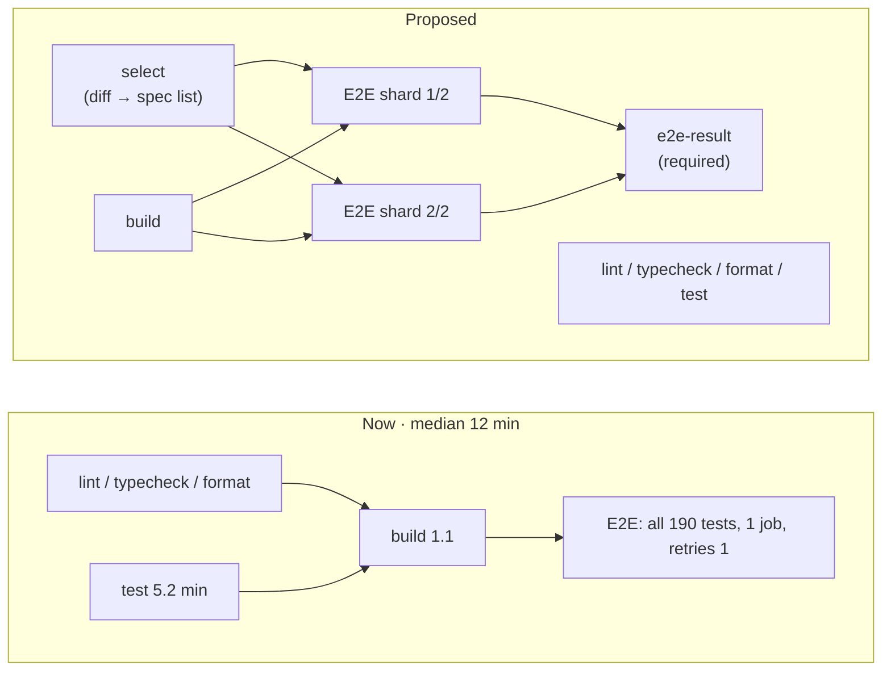
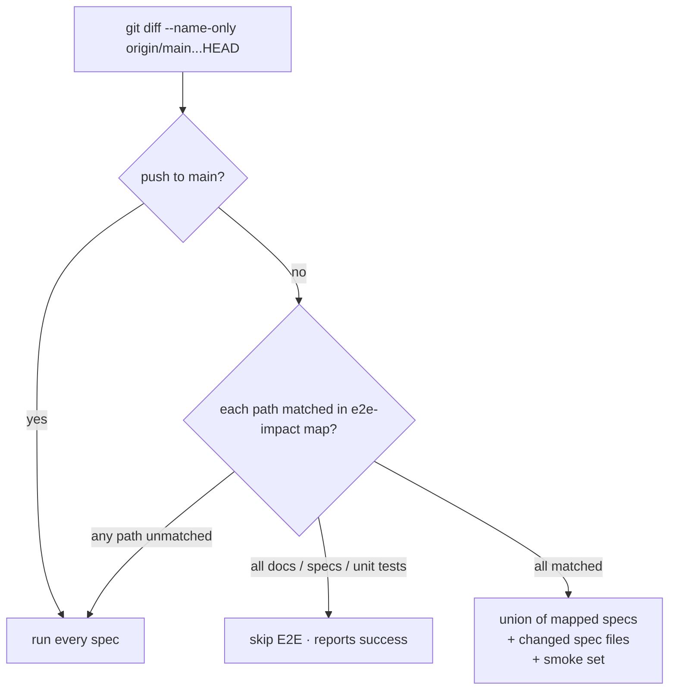

# Deterministic E2E Gate

Design document · 2026-09-27 · trigger: [CI run 36290488257](https://github.com/andytavares/terminator/actions/runs/36290488257) (merge of PR #210, E2E red)

## Context and problem

The merge of PR #210 went red in E2E: 2 failed, 188 passed, 9.0 min. Neither failure is a flake. Both fail every time, and both were already red on the PR before it merged, because E2E is not a required check. Around them sits a suite that is flaky in 36 of the last 98 CI runs, hides that behind `retries: 1`, runs all 190 tests on every PR regardless of what changed, and waits for the 5-minute unit-test job before it starts. The result is a gate nobody trusts, so red merges get through.

## Goals and non-goals

**Goals**

- G1. `main` E2E is green, and a red E2E blocks merge.
- G2. Zero tolerance for flakes. A test that fails once fails the build. No retries.
- G3. A PR runs only the E2E specs its diff can affect; a push to `main` runs everything.
- G4. PR critical path (push → all checks done) drops from a median of 12.0 min to ≤ 6 min for a full E2E run.
- G5. No E2E test ever launches a real agent, network service or user binary.

**Non-goals**

- Coverage-based test impact analysis (instrumenting Electron per spec). Rejected below.
- Moving E2E off macOS. The product is macOS-only and the PTY/codesign behaviour is what is under test.
- Rewriting the passing specs beyond removing sleeps and shared state.

## Current state

### The two failures in run 36290488257

| Spec                                                                                      | Cause                                                                                                                                                                                                                                                                                                                                                                                                                                                                                                                                                                                | Evidence                                                                                                               |
| ----------------------------------------------------------------------------------------- | ------------------------------------------------------------------------------------------------------------------------------------------------------------------------------------------------------------------------------------------------------------------------------------------------------------------------------------------------------------------------------------------------------------------------------------------------------------------------------------------------------------------------------------------------------------------------------------ | ---------------------------------------------------------------------------------------------------------------------- |
| `foundry-factory-view.spec.ts:422` "no station `architect, architect, passed, attempt 1`" | Commit `447eefdc` ("hall status reads at every station") changed the station `aria-label` to use `stateWord()`. The rendered labels are now `architect, architect, Done, attempt 1`, `builder, builder, no agent, attempt 1`, `verifier, verifier, Queued, attempt 0`. The spec still expects `passed` / `running` / `waiting`.                                                                                                                                                                                                                                                      | Local repro: rendered labels dumped from the view; `extensions/foundry/src/components/factory/FactoryHall.tsx:531-541` |
| same spec, retry #1: `TypeError: Cannot read properties of undefined (reading 'app')`     | The test relies on `handle`, which only the _previous_ test launches (`foundry-factory-view.spec.ts:405-408`). A retry runs in a fresh worker where `beforeAll` launches nothing.                                                                                                                                                                                                                                                                                                                                                                                                    | CI log, lines 295-300                                                                                                  |
| `foundry.spec.ts:393` "intake launches the architect…" times out at 180 s, both attempts  | PR #210 (`ac0b65e0`) wrapped `converge` in `convergeMaybeScouted` (`extensions/foundry/src/index.ts:2646-2695`). Its promise resolves only in `onFinished`, after the scout agent's **whole turn** ends. The `converge` seam's contract is to return when the turn has _started_ ("the redraft lands later, through the store", `extensions/foundry/src/ipc/forge-channels.ts:178-183`). On CI there is no `claude` binary, so the scout never finishes and `foundry:order.converge` never answers. This is a product regression: the Forge's send blocks for the scout's full turn. | CI log lines 326-340; code as cited                                                                                    |
| same spec, locally                                                                        | With `claude` on PATH, the test launched a **real** Claude Code agent. It ran for 35 s against the fixture repo, and its output scrolled `/launch/` off the xterm screen. With `claude` removed from PATH it fails differently: `/launch/` never shows within 60 s. Three environments, three outcomes.                                                                                                                                                                                                                                                                              | Local runs below                                                                                                       |

### Flake and failure history (last 100 CI runs, 98 with an E2E job)

Command: `gh run list --workflow ci.yml --limit 100`, then per-run job logs via `gh run view --job <id> --log`, parsed for Playwright's `N flaky` / `N failed` summary blocks.

- E2E is the only job that fails: 18 E2E failures, 1 Lint, 1 Test.
- 36 of 98 runs (37%) had at least one flaky test (failed, then passed on retry).
- 18 of 98 runs failed E2E outright.
- Only 52 of 98 runs passed clean, with no failure and no retry. 28 more passed only because a retry hid a failure.

Flaky occurrences by test and their first error line:

| Count | Test                                              | Error                                                         | Class                |
| ----- | ------------------------------------------------- | ------------------------------------------------------------- | -------------------- |
| 21    | `git-sidebar.spec.ts` (last test)                 | `ENOTEMPTY: directory not empty, rmdir …/terminator-e2e-XXXX` | C1 teardown          |
| 9     | `dismiss-surface-on-click.spec.ts:40` (last test) | `ENOTEMPTY … /Cache`                                          | C1 teardown          |
| 7     | `notepad-outline.spec.ts:94`                      | outline array empty                                           | C2 sleep-then-read   |
| 5     | `foundry.spec.ts:701/964` budgets                 | `Cannot read properties of undefined (reading 'budgets')`     | C2 / C4              |
| 3     | `quick-actions.spec.ts`                           | dialog still visible after `Escape` / key chord               | C3 keys before focus |
| 3     | `resume-session.spec.ts` ×3                       | Resume button not visible in 15 s                             | not diagnosed        |
| 1     | `merge-flow.spec.ts:118`                          | double-Escape closed the extension                            | C3                   |

Failures concentrated on feature branches (`foundry-resume.spec.ts:303` ×6 on 044/046, `resume-session` ×6 on 055) were real bugs in progress. `foundry-factory-view:422` has failed on the last 4 runs across 3 branches: a real regression, reported as noise.

Two-thirds of all flaky occurrences (30 of 45) are **C1**. `closeApp` (`tests/e2e/helpers.ts:41-77`) deletes the profile directory inside `afterAll` with 2 s of retries. When anything still writes there, the throw fails the file's last test. That test never flaked. Its cleanup did.

### Flake classes found in the code

- **C1 · cleanup is part of the verdict.** `rmSync(userDataDir)` inside `afterAll` (`helpers.ts:76`). Which process still writes after `SIGKILL` is `[UNVERIFIED]`; the leading candidate is Chromium helper processes that outlive the killed main process. 186 `terminator-e2e-*` profile dirs are still sitting in the local `$TMPDIR` (`ls -d $TMPDIR/terminator-e2e-* | wc -l`).
- **C2 · sleep, then read once.** 89 literal `waitForTimeout(n)` calls totalling 107 s, plus 10 `setTimeout` sleeps inside injected view scripts (`grep -rhoE "waitForTimeout\(([0-9_]+)\)" tests/e2e/*.spec.ts`). Example: `notepad-outline.spec.ts:83-88` sleeps 1500 ms, then reads the outline once with no poll.
- **C3 · keys before focus.** `quick-actions.spec.ts:128-133` presses `t` then `d` right after opening the panel. If focus has not moved off xterm yet, the keys go to the terminal. This matches the known "xterm swallows Escape" defect.
- **C4 · tests depend on the previous test.** 0 files use `describe.serial` (`grep -rn "describe.serial\|mode: 'serial'" tests/e2e`), yet `foundry-factory-view` test 2 needs test 1's `handle`, and `foundry.spec.ts:975` says "the Forge stays on whichever order an earlier test left open." A retry or `-g` run of one test sees a different world.
- **C5 · real external processes.** `foundry.spec.ts` intake/run tests start whatever `claude` resolves to on PATH (`extensions/foundry/src/runtime/claude-launch.ts:198`). That is a live model with the developer's quota locally, and a missing binary on CI.
- **Masking.** `retries: process.env.CI ? 1 : 0` (`playwright.config.ts:19`) turns every C1–C4 hit into a green "flaky". `trace: 'on-first-retry'` means a trace exists only when a retry happens.

### Speed

- CI run wall clock, median 12.0 min, max 32.8 min. E2E job median 5.4 min, p90 7.0, max 10.0 (98 runs, from `started_at`/`completed_at` of each job via `gh api …/actions/runs/<id>/jobs`).
- Critical path in run 36290488257: E2E started at 03:13:44, **6.5 min after the run began**, because `build` has `needs: [lint, typecheck, format, test]` (`.github/workflows/ci.yml`, `build:`) and `test` takes a median 5.2 min. Build itself is 1.1 min.
- In that run, 6 of the 9.0 E2E minutes were the intake test hitting its 180 s timeout twice.
- Local full run, 2 workers, `claude` hidden from PATH, retries 0: **3.9 min**, 2 failed, 188 passed, 0 flaky. Command: `PATH=<without ~/.local/bin> CI=1 npx playwright test --retries=0 --workers=2 --reporter=json,dot`.
- Per-file time from that JSON report: `foundry.spec.ts` alone is **164 s** of 450 s total test time (19 tests serialised in one worker, 10 × `openFoundry()` each sleeping 2.5 s). Next: `session-home` 28 s, `session-surfaces` 27 s, `extension-keyboard` 27 s. 25 of 35 files take under 10 s.
- Parallelism is per file (`fullyParallel` unset), 2 workers on a 3-core M1 runner ([GitHub runner specs](https://docs.github.com/en/actions/reference/runners/github-hosted-runners): macos-14 public = 3 CPU, 7 GB).

### What PRs actually touch (last 60 merged)

Command: `gh pr list --state merged --limit 60 --json number,files`, paths bucketed by top-level area.

- 32 of 60 touched only `extensions/foundry/**` (plus docs and its own specs). Each of them ran all 190 tests, of which 31 are Foundry's.
- 12 of 60 touched only core `src/**` and unit tests.
- The rest were mixed.

## Options considered

### Selecting what to run

| Option                                     | How                                                                                           | Tradeoffs                                                                                                                                                                                                                                                                                                                                                                   |
| ------------------------------------------ | --------------------------------------------------------------------------------------------- | --------------------------------------------------------------------------------------------------------------------------------------------------------------------------------------------------------------------------------------------------------------------------------------------------------------------------------------------------------------------------- |
| A. Playwright `--only-changed=origin/main` | Built-in since 1.46                                                                           | Follows the spec files' **import graph**. E2E specs import only `helpers.ts` and launch a built binary, so a change to `extensions/foundry/src/**` selects nothing. Playwright itself calls it "a heuristic [that] might miss tests" and says to always run the full suite after ([CI docs](https://playwright.dev/docs/ci#fail-fast)). Useful only for changed spec files. |
| B. Path → spec map, fail-safe to all       | A checked-in map from source globs to spec files. Any path not in the map selects everything. | Explicit, reviewable, cheap. Must be kept current, so a new spec with no map entry is caught by a unit test. Over-selects rather than under-selects.                                                                                                                                                                                                                        |
| C. Coverage-based impact                   | Record V8 coverage per spec in main and renderer, map changed lines to specs                  | Most precise. Needs coverage plumbing through Electron main, the renderer and five extension views. Weeks of work and itself a flake surface.                                                                                                                                                                                                                               |

### Handling flakes

| Option                                                                   | Tradeoffs                                                                                                                                                                                      |
| ------------------------------------------------------------------------ | ---------------------------------------------------------------------------------------------------------------------------------------------------------------------------------------------- |
| D. Keep retries, add `failOnFlakyTests`                                  | Playwright ≥1.52 ([TestConfig.failOnFlakyTests](https://playwright.dev/docs/api/class-testconfig#test-config-fail-on-flaky-tests)); we run 1.61.0. Still spends a retry's time before failing. |
| E. `retries: 0`, fix every class at its cause, lint against the patterns | Red on the first failure, no retry time spent. Requires fixing C1–C5 before turning it on.                                                                                                     |
| F. Quarantine list (`test.fixme`) for known flakes                       | Keeps the gate green, and loses the coverage exactly where the bugs are.                                                                                                                       |

### Making it faster

| Option                                    | Tradeoffs                                                                                                                                                                                                                                                              |
| ----------------------------------------- | ---------------------------------------------------------------------------------------------------------------------------------------------------------------------------------------------------------------------------------------------------------------------- |
| G. Start Build in parallel with lint/test | Saves ~5 min of critical path for free. Merge still requires every job.                                                                                                                                                                                                |
| H. Shard E2E across N macos-14 jobs       | Public repo, so standard runners are free. Shards are per file without `fullyParallel` ([sharding docs](https://playwright.dev/docs/test-sharding#balancing-shards)), so `foundry.spec.ts` (164 s) must be split or it sets the floor. Each shard pays ~50 s of setup. |
| I. `fullyParallel: true`                  | Test-level balance, but every file uses a `beforeAll` app shared across tests, so each worker would relaunch the app per file slice. It also breaks the C4 files outright.                                                                                             |

## Decision

**B + E + G + H**, in that order of value.

- **B** because A cannot see app-source changes and C costs more than the whole problem. Over-selection is safe; under-selection is prevented by the fail-safe default and a push-to-`main` full run.
- **E** because the goal is "100% deterministic", and a retry of any kind is a policy of accepting non-determinism. Every observed flake has a nameable cause (C1–C5), so they can be fixed rather than tolerated.
- **G** is free.
- **H** with 2 shards once `foundry.spec.ts` is split. Three shards only if measured shard time still exceeds 3 min.
- Make E2E a **required** check through one aggregator job, so a red can no longer merge. A job skipped by a condition reports Success and does not block ([GitHub docs](https://docs.github.com/en/actions/using-jobs/using-conditions-to-control-job-execution)), which is what lets a docs-only PR skip E2E and still merge.

## Design

### Pipeline

### Selection

**`tests/e2e/impact.ts`** exports the map. First cut, from the spec-by-extension grep:

| Source glob                                                                                                                                                            | Specs                                                                                                   |
| ---------------------------------------------------------------------------------------------------------------------------------------------------------------------- | ------------------------------------------------------------------------------------------------------- |
| `extensions/foundry/**`                                                                                                                                                | `foundry*.spec.ts`, `extension-smoke`, `extension-keyboard`, `extension-themes`, `extension-escape`     |
| `extensions/git-integration/**`                                                                                                                                        | `git-sidebar`, `git-integration-smoke`, `merge-flow`, extension trio                                    |
| `extensions/notepad/**`                                                                                                                                                | `notepad-outline`, `dismiss-surface-on-click`, `extension-escape-exit`, `quick-actions`, extension trio |
| `extensions/remote-control/**`, `src/renderer-remote/**`                                                                                                               | `remote-app`, extension trio                                                                            |
| `extensions/task-vault/**`                                                                                                                                             | extension trio                                                                                          |
| `docs/**`, `specs/**`, `.specify/**`, `**/*.md`, `tests/unit/**`, `tests/fixtures/**`                                                                                  | none                                                                                                    |
| `src/**`, `packages/**`, `tests/e2e/helpers.ts`, `playwright.config.ts`, `package*.json`, `electron.vite.config.*`, `.github/workflows/ci.yml`, **anything unmatched** | all                                                                                                     |

The smoke set is always added when anything runs: `extension-smoke`, `terminal`, `workspace`.

**`scripts/e2e-select.mjs`** reads the diff, applies the map and prints JSON: `{ "mode": "all" | "none" | "some", "specs": [...] }`. The E2E job passes the list as positional file filters to `npx playwright test`. Vitest unit spec `tests/unit/scripts/e2e-select.spec.ts` covers:

- an unmatched path selects all;
- docs-only selects none;
- foundry-only selects exactly the foundry set plus smoke;
- every `tests/e2e/*.spec.ts` file appears in at least one map entry or the smoke set, so a new spec cannot be orphaned.

Changed spec files also run with `--repeat-each=3` in the same job (a burn-in). A new or edited test must pass three times in a row to merge.

### Determinism fixes, by class

| Class   | Change                                                                                                                                                                                                                                                                                                                                                                                                                                                             | Files                                                                              |
| ------- | ------------------------------------------------------------------------------------------------------------------------------------------------------------------------------------------------------------------------------------------------------------------------------------------------------------------------------------------------------------------------------------------------------------------------------------------------------------------ | ---------------------------------------------------------------------------------- |
| C1      | `launchApp` creates profiles under one run root, `$TMPDIR/terminator-e2e-run-<ppid>/`. `closeApp` stops deleting them. A `globalTeardown` removes the run root after every worker has exited. Cleanup can no longer fail a test. `keepProfile` becomes unnecessary and is removed.                                                                                                                                                                                 | `tests/e2e/helpers.ts`, new `tests/e2e/global-teardown.ts`, `playwright.config.ts` |
| C2      | Every `waitForTimeout` / injected `setTimeout` sleep becomes a condition: `expect.poll(...)` on the value asserted, or a locator assertion. `openFoundry`'s 2.5 s sleep becomes a poll on a Foundry channel answering (already written at `foundry.spec.ts:94-98`). Then an ESLint `no-restricted-syntax` rule scoped to `tests/e2e/**` bans `waitForTimeout` and `setTimeout` inside `executeJavaScript` strings.                                                 | 20 spec files; `.eslintrc.json` override                                           |
| C3      | Helpers that open a keyboard surface wait for it to own focus (`await expect(dialog.getByRole(...)).toBeFocused()`) before sending keys. Where the app does not move focus on open, that is a product bug and gets fixed in the app, not in the test.                                                                                                                                                                                                              | `quick-actions.spec.ts`, `merge-flow.spec.ts`, `git-sidebar.spec.ts`               |
| C4      | Rule: every `test()` passes when run alone with `-g`. Shared setup lives in `beforeAll`. A sequence that really is one story (`foundry-factory-view` toggle → restart → hall) moves into `test.describe.serial` so a failure reruns the group ([serial mode](https://playwright.dev/docs/test-retries#serial-mode)). `foundry.spec.ts` splits into `foundry-channels`, `foundry-intake`, `foundry-forge`, `foundry-floor`, each with its own app and fixture repo. | `foundry*.spec.ts`                                                                 |
| C5      | `launchApp` prepends `tests/e2e/fixtures/bin` to `PATH`. That directory holds a `claude` stub that prints its argv and stays idle until killed. No real agent can start. `[UNVERIFIED]`: whether the PTY's login shell re-sorts PATH so `~/.local/bin/claude` wins. If it does, add a `foundry.claudePath` setting that `claude-launch.ts:198` already has an `options.claudePath` seam for, and set it from the harness.                                          | `tests/e2e/helpers.ts`, `tests/e2e/fixtures/bin/claude`                            |
| Masking | `retries: 0` in all environments; `trace: 'retain-on-failure'` so a failure still carries a trace.                                                                                                                                                                                                                                                                                                                                                                 | `playwright.config.ts`                                                             |

### Product fixes the two red tests exposed

1. **`convergeMaybeScouted` blocks `converge`** (`extensions/foundry/src/index.ts:2646`). Resolve with `ConvergeStarted` as soon as the scout session is launched. Start the architect from `onFinished` without holding the IPC reply. Failing unit test first: `converge` resolves while a scout's `readOnlyRound` has not finished. This alone ends the 180 s CI hang.
2. **Factory-view labels.** Update `foundry-factory-view.spec.ts:470-479` to the vocabulary `stateWord()` renders (`Done`, `Queued`, `Ready`, and `no agent` for the orphaned node). The orphan assertion now reads its label directly instead of the comment's claim that the label stays `running`.

### CI workflow (`.github/workflows/ci.yml`)

- `build`: remove `needs`. It runs in parallel with lint and test.
- New `e2e-select` job on `ubuntu-latest` (checkout with `fetch-depth: 0`, run `scripts/e2e-select.mjs`, output `mode` and `specs`).
- `e2e`: `needs: [build, e2e-select]`, `if: needs.e2e-select.outputs.mode != 'none'`, `strategy.matrix.shard: [1, 2]`, run `npx playwright test ${{ specs }} --shard=${{ matrix.shard }}/2`. Blob reporter.
- New `e2e-result` job: `needs: [e2e]`, `if: always()`, fails unless `e2e` is `success` or `skipped`. Merges blob reports into one HTML report.
- Branch protection: add `e2e-result` and `Build` to the required checks, currently `["codecov/patch","Format","Lint","Test","Typecheck"]` (`gh api repos/andytavares/terminator/branches/main/protection`).

### Sequence of changes (one commit each, on a feature branch)

1. Fix the `converge` block (unit test first). Fix the factory-view labels. `main`'s two failures go away.
2. C1 teardown: run root and `globalTeardown`.
3. C5 agent stub on PATH; confirm with the intake test that no real `claude` runs.
4. C2 sleeps → polls, file by file, then the ESLint ban.
5. C3 focus waits; C4 split of `foundry.spec.ts` and `describe.serial` where a story is sequential.
6. `retries: 0`, `trace: 'retain-on-failure'`.
7. `scripts/e2e-select.mjs` + `tests/e2e/impact.ts` + unit spec.
8. CI workflow: unblock Build, select job, 2 shards, aggregator; then branch protection.
9. Docs: `docs/CONTRIBUTING.md` testing section (the no-sleep rule, the `-g` independence rule, how to add a spec to the impact map); ADR `070-e2e-is-deterministic-and-selective.md`.

## Testing and verification

| Claim         | Command                                                                                                                 | Pass condition                                                                     |
| ------------- | ----------------------------------------------------------------------------------------------------------------------- | ---------------------------------------------------------------------------------- |
| Main is green | `npm run build && CI=1 npx playwright test --retries=0`                                                                 | exit 0                                                                             |
| Determinism   | `CI=1 npx playwright test --retries=0 --repeat-each=5` locally, and a `workflow_dispatch` run with the same flags on CI | exit 0; 0 failures across 950 test executions                                      |
| Independence  | a script over `npx playwright test --list --reporter=json` that runs each `file:line` alone with `--retries=0`          | every test passes alone                                                            |
| No sleeps     | `npx eslint tests/e2e`                                                                                                  | exit 0 with the ban on                                                             |
| No real agent | intake spec with `~/.local/bin` on PATH                                                                                 | stub argv log present; no `~/.claude/projects/*` transcript created during the run |
| Selection     | `npx vitest run tests/unit/scripts/e2e-select.spec.ts`                                                                  | exit 0                                                                             |
| Speed         | `gh run list --workflow ci.yml` → job timings for the first 10 PR runs after merge                                      | full-suite PR critical path ≤ 6 min; foundry-only PR E2E ≤ 3 min                   |
| Flake rate    | same 100-run log parse as above, 30 days after rollout                                                                  | 0 runs with a failure that passes on re-run of the same SHA                        |

## Risks and mitigations

- **The impact map goes stale and a regression slips through a PR.** A missing path falls back to _all_. The unit test rejects any spec absent from the map. Every push to `main` runs everything, so a miss is caught within one merge.
- **`retries: 0` turns the board red while unfixed flakes remain.** Land steps 1–5 before step 6. Run `--repeat-each=5` on CI via `workflow_dispatch` as the entry criterion.
- **Shards add ~50 s of setup each and double runner minutes.** The repo is public, so standard runners are free. Stay at 2 shards unless one exceeds 3 min.
- **The PATH stub is shadowed by the login shell.** Covered by the `foundry.claudePath` fallback in C5.
- **Burn-in (`--repeat-each=3`) on a large changed spec is slow.** Splitting `foundry.spec.ts` bounds any one file. Burn-in covers only changed spec files, not their dependents.

## Open questions

1. Which process writes into the profile after `SIGKILL` on CI (C1)? The fix does not depend on the answer, but a leaked helper process could affect the next test on the same runner. Check with `ps` in `globalTeardown` on CI.
2. The three `resume-session.spec.ts` flakes outside the 055 branch were not diagnosed. They need their traces, which only exist for retried runs today; `retain-on-failure` fixes that.
3. Does the Foundry UI also show the `converge` block? Check whether the Forge's Send stays disabled for the scout's whole turn in a live run.
4. Should the burn-in count be 3 or 5? 3 is proposed for time; 5 is what the determinism check uses.

## Alternatives rejected

- Playwright `--only-changed`: cannot see app-source changes; e2e specs import no app code.
- Coverage-based impact analysis: precise, but weeks of Electron coverage plumbing.
- Quarantine known flakes with `test.fixme`: removes coverage where the bugs are.
- Keep `retries: 1` + `failOnFlakyTests`: same verdict as `retries: 0`, but slower.
- `fullyParallel: true`: breaks every shared-`beforeAll` file and relaunches the app per slice.
- Ubuntu runners for E2E: the product and its PTY/codesign behaviour are macOS.

## Follow-up, 2026-09-28: two more causes

- **Unit suite, `ENOTEMPTY` in a spec's cleanup.** `git commit` and `git fetch` start `git maintenance run --auto --quiet --detach` (seen with `GIT_TRACE=1`, git 2.55). The detached process was still writing into the spec's temporary repository when `afterEach` deleted it. This happened only when the machine was busy: 1 in 5 full runs, and 0 in 40 runs of the spec alone. `tests/setup.ts` now turns automatic maintenance off through a test-only XDG git config that includes the operator's own. It can't be a `GIT_*` variable: the local ones are forbidden by `inherited-git-env.spec.ts`, and specs scrub the rest. Guarded by `tests/unit/git-test-env.spec.ts`. After the fix: 9 of 9 full runs passed.
- **E2E, launch timeouts in the first wave.** One local run had all eight first-wave `beforeAll` launches exceed 30 s. It didn't reproduce in 11 further full runs, including 16 workers and the unit suite running alongside. Locally at most 4 workers now run at once (`playwright.config.ts`); 5 of 5 full runs passed, about 62 s each. `launchApp` now fails at 25 s with the app's own startup output, so the next occurrence names its cause instead of a bare hook timeout.
