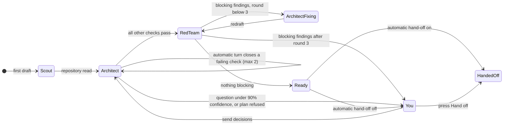
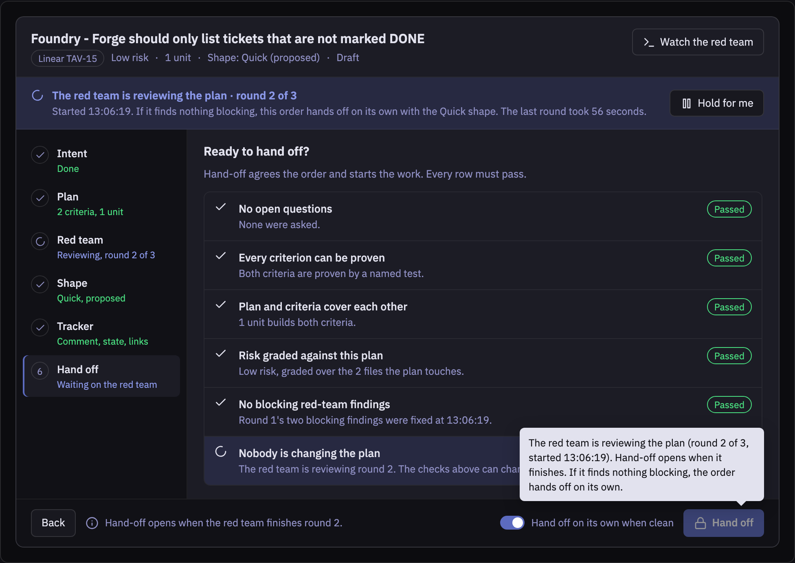
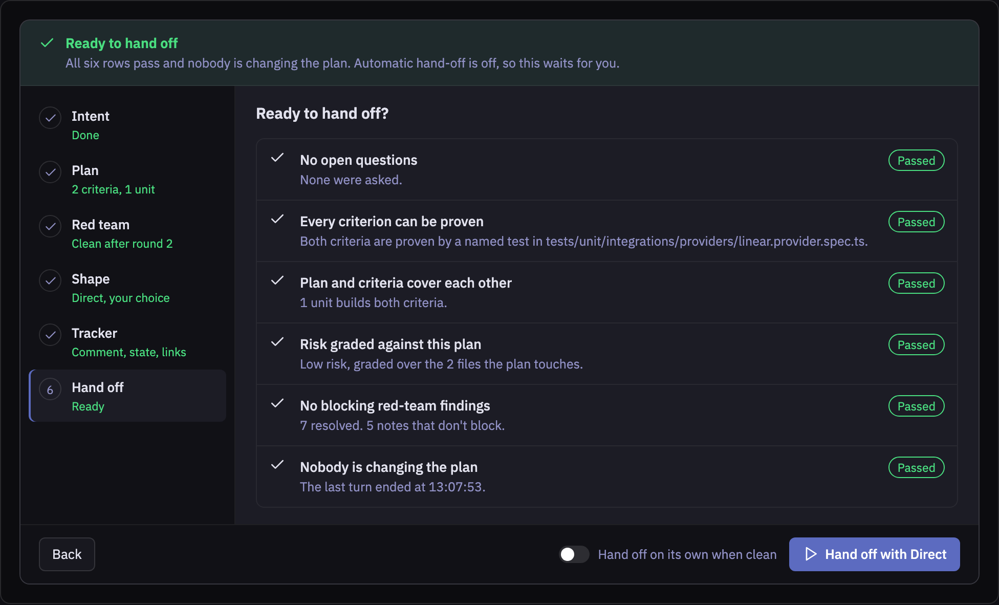
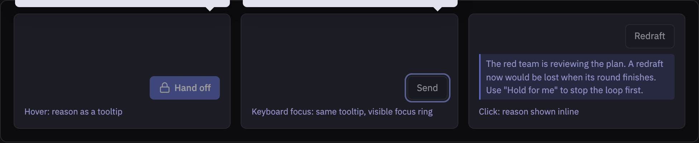
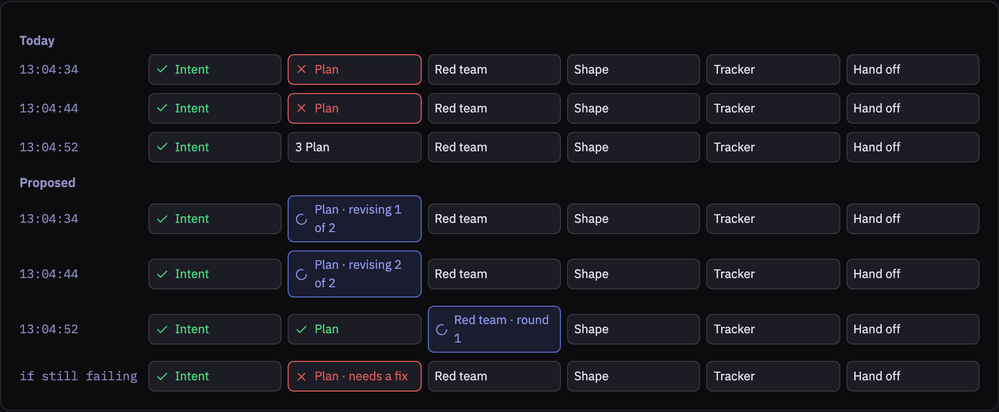
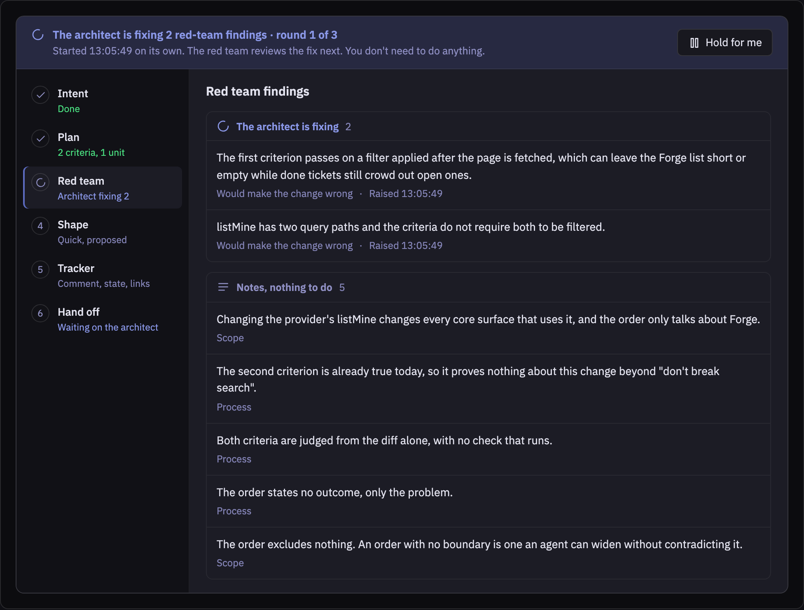
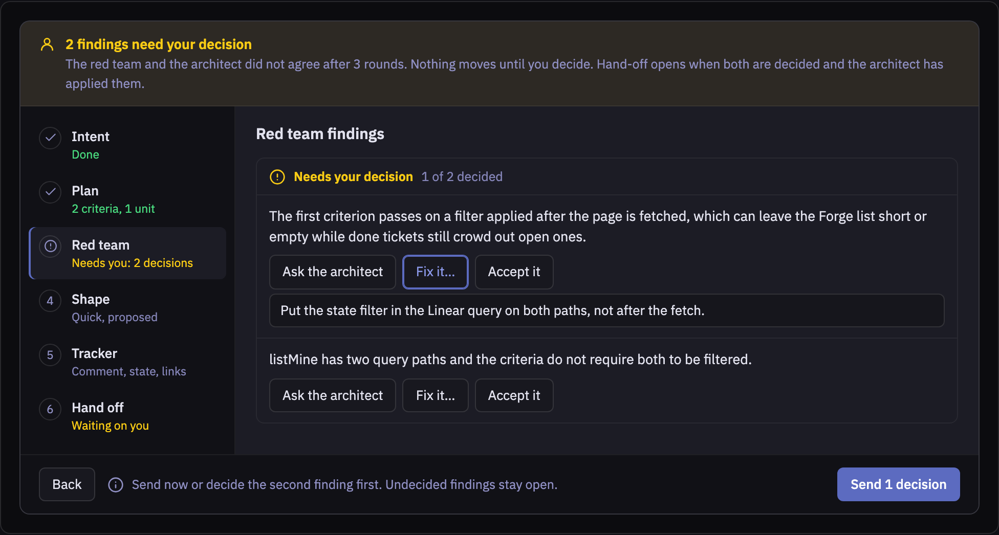
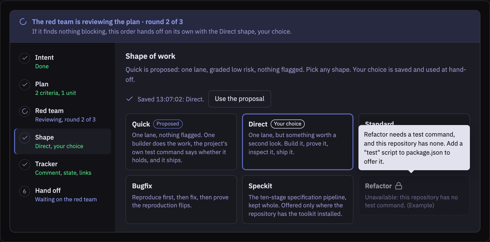
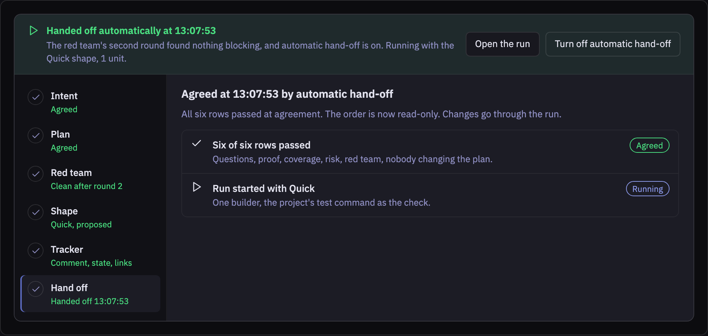
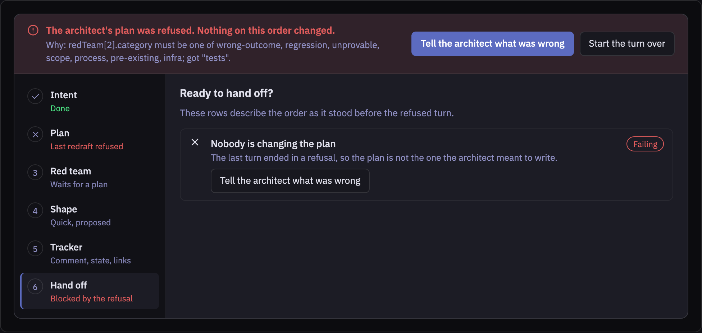

# Forge Shaping Redesign

Design document · Foundry · 2026-09-28. Evidence order **WO-0928-9c6** (Linear TAV-15), ledger at `~/repos/orders/WO-0928-9c6/ledger.jsonl`, component `extensions/foundry/src/components/Forge.tsx`.

Renderings are in `forge-shaping-redesign/` (dark and light for each). The published artifact has the same content with live theme switching.

## Problem

An operator shaping an order cannot tell what the Forge is doing or what it is waiting for. On WO-0928-9c6 every check was green and "Compile & hand off" was disabled with no reason. The red team was reviewing the plan, but the header said "The architect is working…". Twenty-four seconds later the order handed itself off using the proposed shape, and nothing on screen had said it would. Earlier in the same order, step marks turned red and cleared three times in eighteen seconds while automatic turns rewrote the plan. The orange "Needs you" band asked for decisions on findings that an automatic fix turn was already handling. A shape the operator picked could not take effect. The screen has become unusable because the machine does most of the shaping now (spec 062 autonomy, ADR 069 red-team loop) and the screen was never redesigned to show it.

## What happened on WO-0928-9c6

Every row is a ledger line, printed with `python3 -c "import json; [print(json.loads(l)['at'], json.loads(l)['action'], json.loads(l)['reason'][:80]) for l in open('ledger.jsonl')]"`. Times are local (UTC−4). The screenshot was taken at 13:07:29.

| Time         | What Foundry did (ledger)                                                                                                                    | What the screen showed                                                                                        |
| ------------ | -------------------------------------------------------------------------------------------------------------------------------------------- | ------------------------------------------------------------------------------------------------------------- |
| 13:02:39     | `scout.started`, then `converge.started`                                                                                                     | "The architect is working…" (it was the scout)                                                                |
| 13:04:34     | `order.redrafted`, then automatic `converge.followed_up` "closing the failing checks on its own"                                             | Plan step turns red: coverage, then risk                                                                      |
| 13:04:44     | `order.redrafted` (blast radius set), another automatic follow-up                                                                            | Risk mark clears, another turns red                                                                           |
| 13:04:52     | `order.redrafted` (test file added), then `review.started` "round 1"                                                                         | All clear. Header says the architect is working (it is the red team)                                          |
| **13:05:49** | `review.round` "2 blocking, 4 notes". The loop starts a fix turn and **writes no ledger line for it**                                        | Forge reads the order as idle. The orange "Needs you" band asks you to decide the two findings                |
| **13:05:57** | Your decision arrives as a second `converge.started`, into the session the loop's fix turn was using                                         | "Asked — the architect is working on it"                                                                      |
| 13:06:19     | `order.redrafted`, then `review.started` "round 1" again. Your ask reset the loop's round counter                                            | Findings clear, then the red team starts again                                                                |
| **13:07:29** | Red team still reviewing                                                                                                                     | **Your screenshot.** Five green checks, "Compile & hand off" disabled, no reason given                        |
| **13:07:53** | `review.round` "2 blocking, 9 notes", then `order.agreed` "all checks pass" recorded with actor `operator`, then `run.started` shape `quick` | Order handed off without anyone pressing hand-off. The "2 blocking" counted findings resolved a round earlier |

## Goals and non-goals

**Goals**

- At every moment the screen names who holds the order (you, the architect, the red team, the scout) and what happens when they finish.
- Every control that cannot be used says why, on hover and on keyboard focus, in the same words everywhere.
- Red means you have something to fix. Orange means only you can decide it. Work in progress by the machine gets its own neutral state and never shows as red or orange.
- You can always choose the shape of work before hand-off. The choice is saved, and automatic hand-off uses it too.
- Automatic hand-off is visible before it happens and confirmed after it happens, and it can be switched off from the Forge.

**Non-goals**

- Changing what the five compile checks test (`src/order/compile.ts`).
- Changing the red-team loop's policy: three rounds, the blocking categories, the 90% confidence bar (ADR 069, spec 062).
- The Line after hand-off, including the "outside blast radius" gate WO-0928-9c6 raised at 13:12:57. See open questions.

## Current state, from the code

**Hand-off is disabled with no reason.** The button is disabled when `!compile.ok || locked || !isDraft`. `locked` is `busy || drafting`. When the compile passes and a turn is running, the label stays "Compile & hand off" and nothing explains the lock. The checklist lists only the five compile checks, so "someone is changing the plan" is a hidden sixth condition. _Forge.tsx:492, 1451–1459, 99._

**Every running turn is called "the architect".** `lastIntake` maps `review.started` (the red team) and `scout.started` (the scout) to the same `running` kind as an architect turn. The header renders "The architect is working…" for all three. _src/forge/intake-outcome.ts:70–103, Forge.tsx:947–951._

**The loop's fix turn is invisible, so the Forge asks you to do work that is already running.** After a red-team round with blocking findings, `startReview` calls `convergeWithFollowUps(updated, next.message, 0, round + 1)` and writes no `converge.started` line. The last line is `review.round`, which `lastIntake` reads as a finished redraft. The Forge then shows the orange band with enabled controls for findings the architect is already fixing. A decision sent from there starts a second turn that competes with the first. This is the "orange warnings that do nothing". _src/index.ts:2623, src/forge/intake-outcome.ts:95–96, src/ipc/forge-channels.ts:558–571, foundry.css:577–579 and 652–661._

**Marks turn red, then clear themselves.** Automatic follow-up turns (`followUpFor`, up to `MAX_AUTO_TURNS = 2`) rewrite the plan every few seconds. The Forge polls every 3 s and re-derives the step marks from each intermediate compile. A check the machine is about to close is drawn with the same red X as one only you can close. _src/forge/autonomy.ts:15 and 88–100, Forge.tsx:50 and 963–977, src/forge/steps.ts:30–37._

**Automatic hand-off is silent and recorded as yours.** `terminator.foundry.autoHandOff` defaults to on. A clean round calls `handOff`, which commits the compile and starts the run. The Forge never says this will happen. The agreement is recorded with `actor: 'operator'` because it goes through the same channel as your button. _src/index.ts:259–264, 2599–2601 and 2635–2672, src/ipc/forge-channels.ts:622–631._

**Loop rounds reset and miscount.** A turn you start runs with `loopRound` undefined, so the next review starts at round 1 again and the three-round cap starts over. The round summary counts every finding tagged with that round number, including ones already resolved. WO-0928-9c6 logged "2 blocking" and then "all checks pass" two milliseconds later. _src/index.ts:2462–2467 and 2585–2587; in order.json, RT-red-team-2 and -3 are `resolved` with `round: 1`._

**You cannot override the proposed shape.** Yesterday's fix (`f1648190`, on `main`) removed `|| locked` from the shape cards. The app does not run that code. It loads the Foundry view from `extensions/foundry/dist/` in the registered checkout. That bundle (`index-cAczDuzK.js`) was built 2026-09-27 22:32, before the fix, and still contains `disabled:!y.available||ve` where `ve=l||ye` is `busy || drafting`. So every shape is disabled while any turn runs.

Rebuilding will not fully fix it, for two more reasons. The pick is local React state (`chosen`) that is never saved, and automatic hand-off calls `runs.start({ id })` with no shape. So on this order the loop started `quick` "resolved from built-in" regardless of any pick. Also, the Shape step disappears as soon as the order is no longer a draft. _Forge.tsx:340, 578, 621, 1282; src/index.ts:2650; src/ipc/run-channels.ts:271; `stat` of `extensions/foundry/dist/index.html` and `assets/index-cAczDuzK.js`._

**Disabled controls never explain themselves.** Forge.tsx has 22 `disabled=` props and 3 `title=` attributes, all three on the finding buttons (`rg -c "disabled=" / rg -c "title=" extensions/foundry/src/components/Forge.tsx`). The native `disabled` attribute also removes a button from the tab order, so a keyboard user can never reach an explanation ([MDN, aria-disabled](https://developer.mozilla.org/en-US/docs/Web/Accessibility/ARIA/Reference/Attributes/aria-disabled)).

## Options considered

| Option                                                                                                                                                          | For                                                                                                                          | Against                                                                                                                                                                               |
| --------------------------------------------------------------------------------------------------------------------------------------------------------------- | ---------------------------------------------------------------------------------------------------------------------------- | ------------------------------------------------------------------------------------------------------------------------------------------------------------------------------------- |
| **A. Patch the current wizard.** Add titles to disabled buttons, write the missing ledger line, rename the header by actor.                                     | Small. Fixes the three worst symptoms in a day.                                                                              | State stays spread across header, band, step list and footer, each deriving its own answer, which is how they came to disagree. Leaves the flicker and the silent automatic hand-off. |
| **B. One derivation, one walkthrough (chosen).** A pure function says who holds the order, what blocks hand-off, and what happens next. Every surface reads it. | Same pattern as `order/standing.ts` (ADR 045). Moderate size: one new module, a Forge.tsx layout change, four backend fixes. | Needs an ADR and user-guide update in the same PR.                                                                                                                                    |
| **C. Fully automatic, one approval screen.**                                                                                                                    | Simplest screen.                                                                                                             | Removes the control you asked for: shape override, striking assumptions, budgets. Still has to explain waiting and failure.                                                           |

## Decision

Option B. Every symptom has the same cause: several surfaces each work out the order's state on their own, from partial inputs, and one of those inputs (the ledger) is missing a line. Patching each surface keeps them drifting apart. Removing the surfaces removes control you need. A single pure derivation, fed by a ledger that records every turn, fixes the cause. Every surface then says the same thing.

## Design

### Who holds the order



### Components and interfaces

**Ledger (backend).** Every turn writes a start line that names its actor and round. The loop's fix turn writes `converge.started` with `actor: 'role:architect'` and reason `red team round N fix`. Automatic hand-off records `actor: 'rule:forge'`. Your turns keep the loop's current round instead of resetting it. The round summary counts only open blocking findings.

**`IntakeOutcome`** (`src/forge/intake-outcome.ts`) gains who and which round, read from lines already in the ledger:

```ts
| { kind: 'running'; at: string; sessionId: string; asked: string;
    actor: 'architect' | 'red team' | 'scout';
    trigger: 'you' | 'automatic';     // your ask, or a follow-up / loop fix
    round: number | null }            // red-team loop round, when in the loop
```

**`src/forge/readiness.ts`** (new, pure). This is the one answer every Forge surface reads. It sits next to `standingOf`, which keeps answering the order list's "whose move" question. The draft branch of `standingOf` calls `readiness` so the two can never disagree.

```ts
export type Holder = 'you' | 'architect' | 'red team' | 'scout' | 'nobody'

export interface Blocker {
  readonly id: CheckId | 'turn' | 'refused' | 'status'
  readonly state: 'being-fixed' | 'needs-you' | 'failing'
  readonly text: string // the reason, in the catalogue's words
  readonly step: StepId | null // where the move lives
  readonly move: Remedy | null // existing Remedy type from Forge.tsx
}

export interface Readiness {
  readonly holder: Holder
  readonly headline: string // status strip, first line
  readonly next: string // status strip, "what happens next"
  readonly canHandOff: boolean
  readonly blockers: readonly Blocker[] // empty exactly when canHandOff
  readonly steps: Record<StepId, StepState> // rail: done | being-revised | needs-you | failing | not-yet
}

export function readiness(input: {
  order: WorkOrder
  compile: CompileResult
  intake: IntakeOutcome
  autoHandOff: boolean
  now: string
}): Readiness
```

A failing check is `being-fixed` when a machine turn is running or queued to close it. It is `failing` only when nothing will close it without you. That rule removes the flicker without hiding a real failure: a check that is still failing after the automatic turns end turns red.

**`ReasonButton`** (`src/components/ReasonButton.tsx`, new). Every Forge control that can be unavailable uses it. When a `reason` is present it renders `aria-disabled="true"` instead of `disabled`, so it stays focusable. It links the reason with `aria-describedby`, shows a tooltip on hover and focus, and swallows clicks. It lives in Foundry rather than `packages/extension-ui` until a second extension needs it.

**Shape choice is saved.** A new channel `foundry:order.recipe` writes the pick to `order.recipe` while the order is a draft and records `recipe.chosen` with `actor: 'operator'`. `recipeLadder` already puts `order.recipe` first (`src/ipc/run-channels.ts:271`). As a result, both your hand-off and the automatic one run your pick with no change to `runs.start`. The channel is documented in `ipc-channels.md`. Shape cards are enabled during every turn. The only disabled card is one whose repository requirement is not met, and it gives the requirement as its reason.

**Automatic hand-off, visible.** The hand-off step shows the `terminator.foundry.autoHandOff` toggle (the same setting Settings shows). While the red team reviews, the status strip says what happens if it comes back clean. Once the order is handed off, the strip shows when and with which shape.

### Layout

Foundry's controls stay in one box: the status strip on top, a vertical step rail on the left, the open step on the right, and a bottom bar holding the way forward. The rail puts a state word under every step, so the reason is always in text as well as colour. The existing "Needs you" band moves into the status strip and the Red team step. It appears only when the holder is you.

## Renderings

Content is from WO-0928-9c6. Where a state did not occur on that order, the caption says so. Light-theme versions are next to each file (`NN-light.png`).

### 1. The moment in your screenshot: red team reviewing

- The status strip names the red team and the round. It also says what happens when the round finishes, including automatic hand-off and the shape it will use.
- The checklist has a sixth row, "Nobody is changing the plan". It shows as in progress, not failed.
- The bottom bar gives the reason next to the unavailable button, and the same reason appears as a tooltip.



### 2. Ready to hand off

- A green strip appears only when you can act. Each passed row says why it passed, so green is a claim you can check.
- The button names the shape it will run. "Compile &" is dropped because the compile is already shown above.
- Rendered for the case where automatic hand-off is off. With it on, this state goes straight to rendering 8.



### 3. Every unavailable control explains itself

- Hovering or focusing an unavailable control shows its reason. It stays in the tab order because it uses `aria-disabled`.
- Clicking it shows the same reason inline under the control, for touch and for people who click before they hover.
- A screen reader reads the reason through `aria-describedby`.



### 4. Automatic turns no longer flash red

- Today each 3-second poll redraws the rail from the latest intermediate compile, so marks turn red and clear while automatic turns run (13:04:34 to 13:04:52 on WO-0928-9c6).
- Proposed: while a machine turn is closing a check, the step shows "Being revised" in the neutral accent. Red appears only if the check is still failing after the automatic turns end.



### 5. Red team step: grouped by who acts

- Findings are grouped by owner: the architect is fixing, needs your decision, notes, resolved (collapsed, empty here). On WO-0928-9c6 at 13:05:49 the two blocking findings belong in the first group, with no controls.
- Notes are neutral grey and say "Nothing to do". Only the "Needs your decision" group uses orange, and it is absent here.
- Category codes show as plain words: "Process", "Setup", "Already true before this change".



### 6. When it really is your decision

- Orange appears only when the loop has stopped: three rounds without agreement, a question under 90% confidence, or "Hold for me" pressed.
- The strip says why it stopped. Each finding has the existing three choices. Send says how many decisions it carries.
- Illustrative: WO-0928-9c6 never reached this state. The text is its two round-1 blocking findings.



### 7. Shape of work: always your choice, saved

- Every shape is selectable in every draft state, including while a turn runs. Your pick is saved to the order right away and recorded in the ledger. Both your hand-off and automatic hand-off use it.
- "Proposed" and "Your choice" are separate marks, and "Use the proposal" goes back.
- A shape is unavailable only when the repository lacks something it needs, and the card names what. The last card is illustrative: this repository meets every shape's requirements.



### 8. Handed off automatically, and said so

- The strip records when and why the order handed itself off, with the shape it ran. The ledger records the actor as the Forge's rule, not as you.
- The steps stay readable after hand-off, including Shape, so you can see what was agreed.



### 9. The architect's plan was refused

- The existing refusal band moves into the status strip, so an error, a wait and your turn all appear in one place.
- The rail marks every step as waiting on the refusal. The checks show the plan as it stood, and say so.
- Illustrative: the reason is an example of a closed-set refusal, the kind WO-0909-6db hit.



## Reason catalogue

Each reason is written once in `readiness.ts` and used verbatim by the tooltip, the bottom bar and the status strip. Values in braces are filled from the order and the ledger.

| Condition                       | Controls affected       | Reason shown                                                                                                                                                                                | The move                           |
| ------------------------------- | ----------------------- | ------------------------------------------------------------------------------------------------------------------------------------------------------------------------------------------- | ---------------------------------- |
| Scout reading                   | Hand off, Redraft, Send | The scout is reading the repository before the first draft (started {time}). The architect drafts next.                                                                                     | Watch the scout                    |
| Architect drafting, your ask    | Hand off, Redraft, Send | The architect is working on your request (started {time}). Hand-off opens when it finishes.                                                                                                 | Watch the architect                |
| Architect, automatic turn       | Hand off, Redraft       | The architect is closing {check} on its own, automatic turn {n} of 2. Hand-off opens when it finishes.                                                                                      | Hold for me                        |
| Red team reviewing              | Hand off, Redraft       | The red team is reviewing the plan (round {n} of 3, started {time}). Hand-off opens when it finishes. {If auto: If it finds nothing blocking, the order hands off on its own with {shape}.} | Hold for me                        |
| Architect fixing findings       | Hand off, Redraft       | The architect is fixing {n} red-team findings (round {n} of 3, started {time}). Hand-off opens when it finishes.                                                                            | Hold for me                        |
| Question open                   | Hand off                | {n} questions need your answer. The architect was less than 90% sure.                                                                                                                       | Answer them                        |
| Criterion unprovable            | Hand off                | "{criterion}" has nothing that can prove it: no command, named test or rubric with evidence.                                                                                                | Ask for proof · Mark it unprovable |
| Screen change, no picture       | Hand off                | {unit} changes what a person sees, and no criterion asks for a screenshot of it.                                                                                                            | Ask for proof                      |
| Coverage gap                    | Hand off                | Nothing in the plan builds "{criterion}". / "{unit}" satisfies no criterion.                                                                                                                | Ask for the gap to be closed       |
| Risk not graded against plan    | Hand off                | The plan touches {files}, outside what the risk grade covered.                                                                                                                              | Ask for a regrade                  |
| Blocking findings, loop stopped | Hand off                | {n} red-team findings need your decision. {Why the loop stopped.}                                                                                                                           | Decide them                        |
| Plan refused                    | Hand off                | The architect's last plan was refused: {reason}. Nothing changed.                                                                                                                           | Tell the architect what was wrong  |
| Decisions queued                | Send decisions          | Your decisions are queued and go to the architect when the current turn ends.                                                                                                               | None                               |
| Nothing decided                 | Send decisions          | Choose an answer or a decision above first.                                                                                                                                                 | None                               |
| Empty message                   | Send                    | Type what's wrong or what you want instead, then send it to the architect.                                                                                                                  | None                               |
| Accept reason empty             | Accept it               | Say why it stands. The reason travels with the order.                                                                                                                                       | None                               |
| Saving                          | All                     | Saving your change…                                                                                                                                                                         | None                               |
| Shape requirement unmet         | That shape's card       | {Shape} needs {requirement}, and this repository has none.                                                                                                                                  | None                               |
| Already handed off              | Hand off and every edit | Handed off at {time} {by you \| automatically}. The order is read-only.                                                                                                                     | Open the run                       |
| Review queue full               | Hand off                | {n} pull requests are waiting for your review; the limit is {limit}.                                                                                                                        | Start anyway                       |

## Sequence of changes

One commit per step on a feature branch, each with its failing test first, in one draft PR.

1. **Deliver yesterday's fix now.** Run `npm run build:extensions` in `~/repos/terminator` and relaunch, so the app loads a bundle that contains `f1648190`. Find out why the Foundry view bundle was not rebuilt when `src/index.js` was (open question 1).
2. **Ledger records every turn.** `src/index.ts`: the loop's fix turn writes `converge.started`; automatic hand-off records `rule:forge` (`forge.compile` takes an `actor`); your turns keep `loopRound`; `review.round` counts open blocking findings only. Specs: review-loop specs, `tests/components/foundry-channels.spec.ts`.
3. **`IntakeOutcome` names actor, trigger and round.** `src/forge/intake-outcome.ts` and its spec.
4. **`readiness.ts`**, pure, with the reason catalogue. `standingOf`'s draft branch calls it. Spec: every row of the catalogue, plus "a check being fixed is never failing" and "blockers is empty exactly when canHandOff".
5. **Shape choice saved.** Channel `foundry:order.recipe` in `src/ipc/forge-channels.ts`, ledger `recipe.chosen`, `ipc-channels.md` entry. Forge sends it on click, shape cards stay enabled, the Shape step stays visible read-only after hand-off.
6. **`ReasonButton`** and the swap of all 22 `disabled=` controls in Forge.tsx.
7. **Walkthrough layout.** Status strip, vertical rail with state words, grouped red-team findings, neutral notes, sixth checklist row, bottom bar, "Hold for me" (pauses the loop through a new `review.held` ledger line), automatic hand-off toggle. `foundry.css`: orange only on "needs you".
8. **Docs.** ADR 074 "The Forge reads one readiness", `docs/user-guide/USER-GUIDE.md` Forge section, Foundry README, `docs/ARCHITECTURE.md`.

## Testing and verification

Unit and component tests assert what is rendered: reason text, `aria-disabled`, `aria-describedby`. A mocked call is not enough. The component spec must also check that every `button[aria-disabled="true"]` in the Forge has a description, across all states the harness can produce.

```sh
npm run format
npm run lint                       # 0 errors
npm run typecheck:extensions       # the only typecheck that covers Foundry
npx vitest run --coverage; echo "exit $?"   # must print exit 0, patch coverage ≥ 80%
npx playwright test tests/e2e/foundry-forge.spec.ts; echo "exit $?"
```

The e2e addresses controls by role and accessible name. It covers four cases: a ledger ending in `review.started` shows the red-team reason on Hand off; a shape picked during a running turn survives a reload and is the one `foundry:run.start` receives; an automatic hand-off shows rendering 8; a loop fix turn shows no orange.

A live run follows: seed an order in a temporary repository, let the loop run with automatic hand-off on and then off, and screenshot the running app at each strip state with `capturePage`. The view is a WebContentsView that Playwright's page cannot see.

## Risks and mitigations

| Risk                                                                                                                    | Mitigation                                                                                                                               |
| ----------------------------------------------------------------------------------------------------------------------- | ---------------------------------------------------------------------------------------------------------------------------------------- |
| "Being fixed" hides a check that never gets fixed.                                                                      | It lasts only while a turn is running or queued. When the last automatic turn ends, the check turns red. Covered by a readiness spec.    |
| `readiness` and `standingOf` drift apart.                                                                               | The draft branch of `standingOf` calls `readiness`. A spec asserts their headlines match for every draft fixture.                        |
| A new holder or blocker kind added without a label blanks the panel. A Record keyed by a union hands React `undefined`. | Labels are carried on the value, as `Standing.headline` does. `npm run typecheck:extensions` runs in the checklist.                      |
| Your shape pick races an automatic hand-off.                                                                            | The pick is saved before the click returns. Hand-off reads `order.recipe` at start, so the later of the two wins. The ledger shows both. |
| "Hold for me" is a new way for an order to stall.                                                                       | A held order's holder is "you". The strip says "Held by you since {time}" and offers "Let it continue".                                  |
| A stale view bundle ships this redesign invisibly, as happened yesterday.                                               | Open question 1. Verify from the packaged app, not the dev build.                                                                        |

## Open questions

1. **[UNVERIFIED]** Why was `extensions/foundry/dist/` not rebuilt? `src/index.js` was written 2026-09-28 13:01:15, but `dist/index.html` is from 2026-09-27 22:32:25. `scripts/build-extensions.cjs:62–65` builds both in one pass. Something wrote `src/index.js` without the renderer step, or the renderer build failed without failing the script.
2. Should "Hold for me" also stop a running red-team round, or only stop the next step? Stopping mid-round wastes the round. Waiting can take a minute and a half (13:06:19 to 13:07:53).
3. Should automatic hand-off stay on by default? This design makes it visible either way. The default is your call.
4. Out of scope but related: WO-0928-9c6's run raised "graded ordinary risk once it was done, planned as low risk", triggered by `outside_blast_radius`, and the ship was refused at 13:12:57. That may be the "orange warning" you saw after hand-off. It belongs to the Line's gates and needs its own look.

## Alternatives rejected

- Patching the current wizard: leaves four surfaces deriving state separately, which caused these bugs.
- One approval screen: removes shape override and the other controls you need.
- Freezing the screen during a turn: stops the flicker but hides progress, and you would still wait without a reason.
- Native `title` on `disabled` buttons: a disabled button cannot be focused, so keyboard users never get the reason.
- A new order field for the shape pick: `order.recipe` already heads the recipe ladder.
