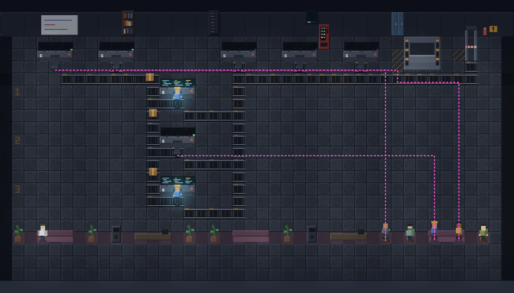
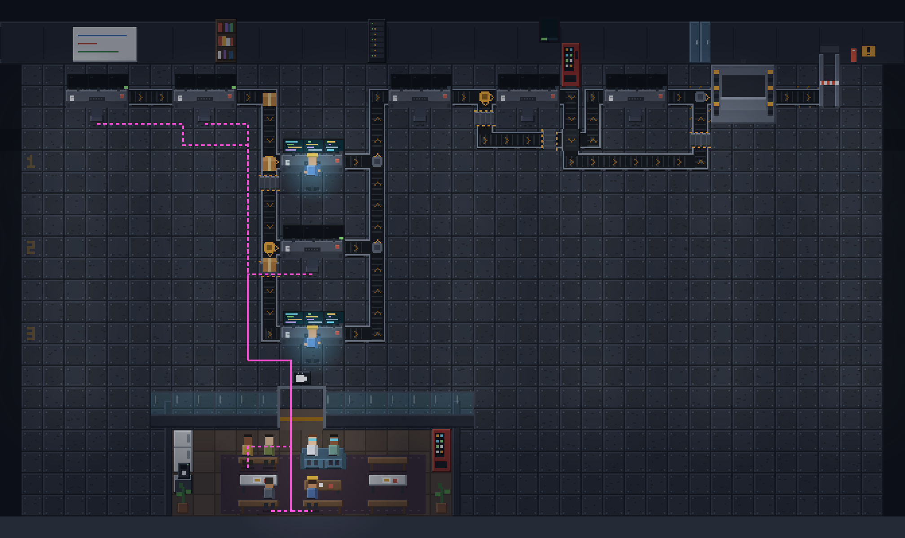
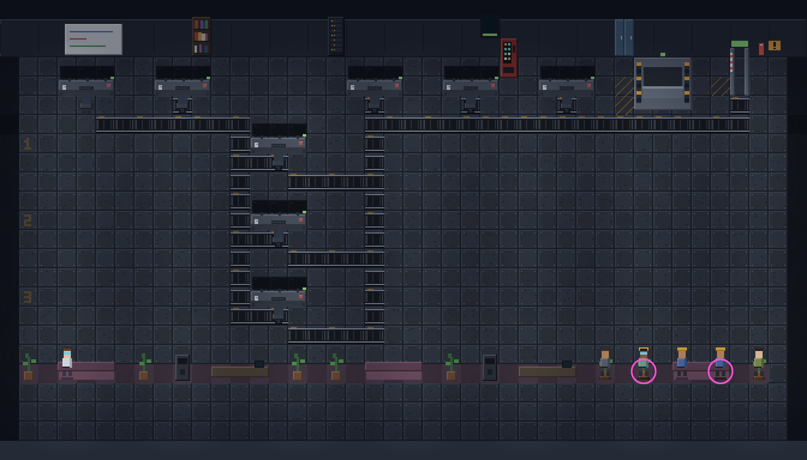
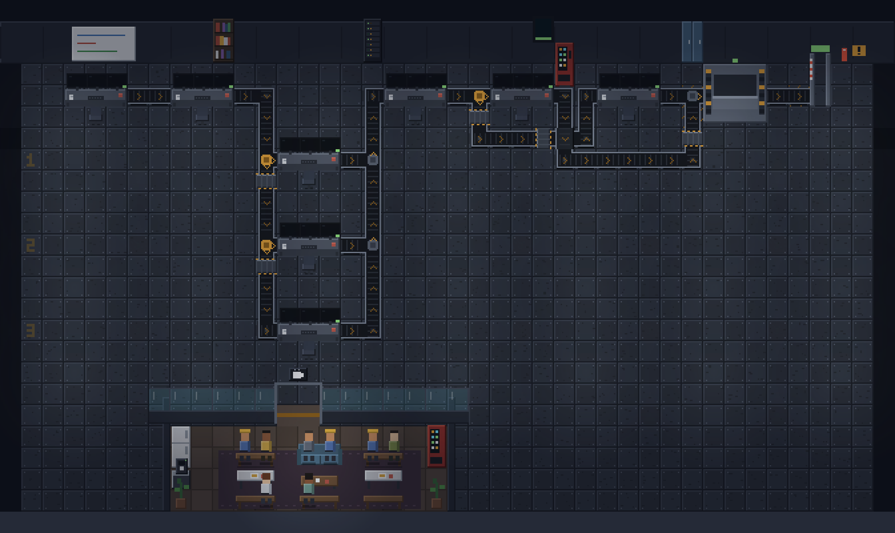
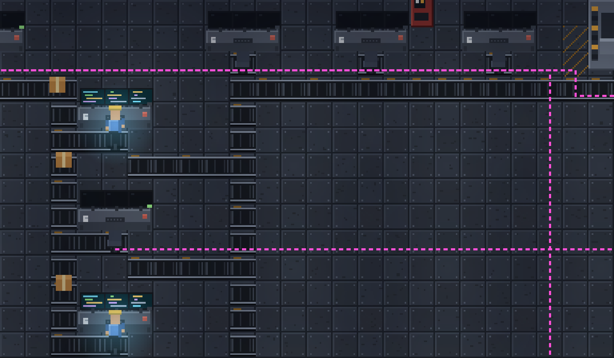
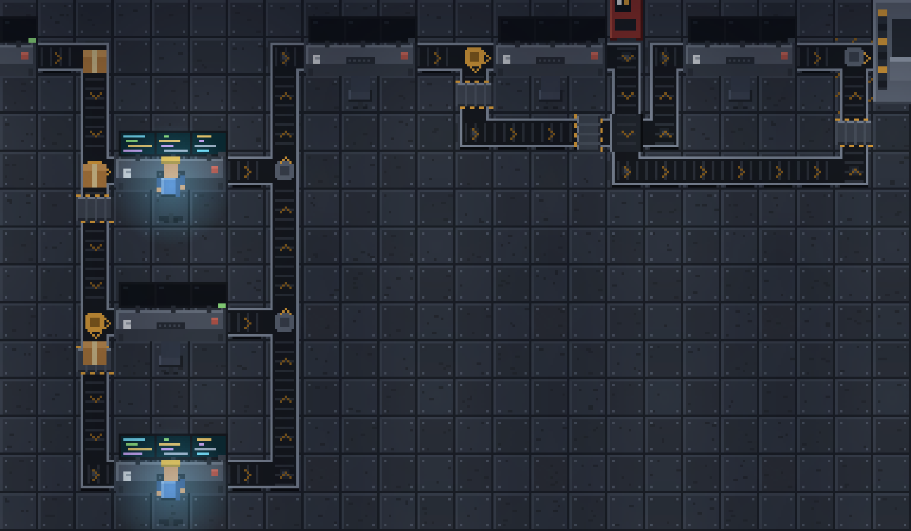
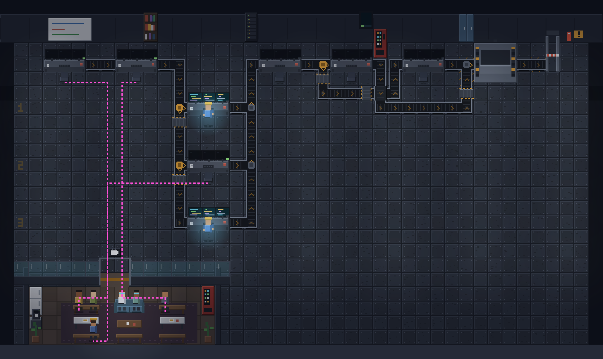

# Foundry hall: breakroom, seating and routed belts

**Status**: Accepted, implemented on feat/foundry-hall-breakroom · **Date**: 2026-09-26 · **Extends**: ADR 060, `docs/research/foundry-factory-view.md`

## Context and problem

In the Foundry factory view, idle crew sit on plants and coffee machines, and two crew can end up on the same tile. They walk the width of the hall to reach a lounge spot even when a free one is much closer, and they walk straight over conveyor belts. The belts themselves are drawn as horizontal track on every tile, including vertical runs and corners, and where several belts share tiles they are just drawn over each other. All four problems come from the same three places: how idle crew pick where to go (`sim.ts`), how the floor is laid out (`layout.ts`), and how belts are painted (`art/props.ts`).

## Goals and non-goals

**Goals**

1. Idle crew sit only on a seat (a bench, sofa or chair), and each seat holds at most one person.
2. An idle crew member walks to the nearest free seat, measured by the length of the walk.
3. Idle crew go to an enclosed **breakroom**, which replaces the full-width lounge strip along the bottom.
4. Crew never walk through stations, furniture or belts. They walk around, or cross a belt only at a drawn step-over plate.
5. Each belt tile is drawn for its real shape: straight (horizontal or vertical), corner, splitter, merger, or crossing, with the direction of flow shown.

**Non-goals**

- Changing what makes a crew member move. ADR 060's rule stands: every walk still has a `FactoryEvent` behind it.
- Changing where stations sit (depth columns, lane bands).
- Adding new animations. Sitting reuses the existing `couch` pose.
- The DOM overlays (nameplates, callouts, pinned cards) stay as they are.

## Renderings

Every frame below is drawn by the app's own art code (`art/props.ts`, `art/crew.ts`, and a copy of `HallScene.tsx`'s private `draw()`), running in headless Chromium at 3× scale. The scene is the `standard` recipe with three lanes, part-way through a run: `scout`, `challenge` and `build:lane-2` have passed, two builds are running, and `verify`, `inspect` and `document` are waiting. The _after_ frames come from a prototype of this design in the session scratchpad. The dashed magenta lines are annotations showing the walk each crew member took after going idle.

### Today, mid-run



Crew walk up to 47 tiles to the far end of the lounge and cross belts along the way. The lounge "seats" are plants, couches, coffee machines and booths, and none of them block walking.

### Proposed, mid-run



Each crew member walks to the nearest free seat in the breakroom, going around belts and crossing only at step-over plates. Belts leave from a station's east side and arrive at the next station's west side. Amber discs are splitters and steel discs are mergers.

### Today, run finished



The circled tiles each hold two crew members drawn on top of each other: `scout` with `build:lane-3`, and `build:lane-1` with `inspect`.

### Proposed, run finished



All eight crew sit on eight different seats. The room has 12 seats for 8 crew.

### Belts up close: today, then proposed




In the proposed version, `challenge` feeds all three lanes through one riser, with a splitter at each lane's desk. The lanes return through one riser that merges into `verify`. The one crossing tile is where `verify → document` passes under `inspect → integrate`.

### Rejected placement: breakroom as a wing by the intake door



## Current state (from the code)

| What                                                                                       | Where                                                                                                                     | Effect                                                                                                                                       |
| ------------------------------------------------------------------------------------------ | ------------------------------------------------------------------------------------------------------------------------- | -------------------------------------------------------------------------------------------------------------------------------------------- |
| The idle spot is a hash of the node id: `lounge[hash % lounge.length]`                     | `extensions/foundry/src/factory/sim.ts` `loungeSpot()`, called from `placementFor()` and `director.ts` `applyNodeState()` | No check for who else is there, and no idea of distance. Two crew can get the same tile, and the chosen tile can be anywhere along the band. |
| Lounge tiles include every 1-wide piece of furniture. `plant` and `coffee` count as seats  | `layout.ts`, the `LOUNGE_PATTERN` loop                                                                                    | Crew "sit" on plants and on the coffee machine                                                                                               |
| Lounge furniture is `solid: false`, and belts are never marked solid                       | `layout.ts`                                                                                                               | Crew walk straight through couches, plants and conveyors                                                                                     |
| A belt's path is a BFS path from the tile under the source's seat to the target's **seat** | `layout.ts`, belt loop                                                                                                    | Belts end under a chair, and belts from the same source overlap without forming a junction                                                   |
| `drawBelt` draws horizontal rails on every tile                                            | `art/props.ts` `drawBelt()`                                                                                               | Vertical runs and corners look like stacked horizontal track                                                                                 |

Measured on the scene above (`standard` recipe, three lanes):

| Measure                                                      | Today                                                   | Proposed (prototype)                                           |
| ------------------------------------------------------------ | ------------------------------------------------------- | -------------------------------------------------------------- |
| Idle tiles that are plants or the coffee machine             | 10 of 20 (plant 8, coffee 2)                            | 0. Seats are bench or sofa tiles only                          |
| Tiles holding two crew when all 8 are idle                   | 2                                                       | 0                                                              |
| Walk to the idle spot: scout / challenge / build:lane-2      | 47 / 36 / 28 tiles (nearest free spot was 15 / 14 / 10) | 27 / 23 / 17 tiles                                             |
| Total walk, all 8 crew from their station to their idle seat | 244 tiles, longest 47                                   | 189 tiles, longest 43                                          |
| Belt tiles stepped on by those three walks                   | 15                                                      | 0 (one step-over plate used)                                   |
| Belt tiles that are solid for walking                        | 0 of 72                                                 | All except 5 step-over plates                                  |
| Belt tiles drawn in the wrong direction                      | 43 vertical and 13 corners, all drawn horizontal        | 0. 56 tiles: 39 straight, 10 corner, 3 split, 3 merge, 1 cross |
| Hall size                                                    | 42 × 24                                                 | 42 × 25 (the breakroom band is one row taller)                 |

Commands that produced these numbers. The scripts live in the session scratchpad and are bundled with the repo's esbuild:

```sh
node_modules/.bin/esbuild <scratchpad>/hall/metrics-before.ts --bundle --platform=node --outfile=<scratchpad>/hall/mb.cjs && node <scratchpad>/hall/mb.cjs
node_modules/.bin/esbuild <scratchpad>/hall/m2.ts --bundle --platform=node --outfile=<scratchpad>/hall/m2.cjs && node <scratchpad>/hall/m2.cjs
node_modules/.bin/esbuild <scratchpad>/hall/m3.ts --bundle --platform=node --outfile=<scratchpad>/hall/m3.cjs && node <scratchpad>/hall/m3.cjs
node_modules/.bin/esbuild <scratchpad>/hall/after.ts --bundle --format=iife --outfile=<scratchpad>/hall/after.js && node <scratchpad>/hall/shot.cjs <scratchpad>/hall/after.js after-mid after-done alt-left
```

## Options considered

**Where the breakroom goes**

- **A. An enclosed room in the bottom band, centred on the median crewed station column.** Recommended. The median minimises the total walk. Total walk is 189 tiles against 244 today, with the longest at 43. The rest of the bottom band stays open floor.
- **B. A wing by the intake door, at the left end of the bottom band.** Early finishers walk less (scout 21 against 27), but later stations walk further. Total walk is 205 tiles, with the longest at 49. The late stations are the ones people watch most closely when a run is finishing.
- **C. Keep the full-width strip and only fix the seats.** This gives the shortest walks, but it does not give you a breakroom.

**How seats are chosen**

- **Nearest free seat, reserved on the crew member.** Recommended. When a crew member goes idle, one BFS from their tile gives the walk distance to every seat. They take the closest seat nobody holds. Ties go to the lower seat id, so the choice is deterministic.
- **A fixed seat per node, from a hash or slot order.** Rejected: this is the current bug. It ignores where the crew member is standing.

**How belts are laid out**

- **Route a belt network from port to port.** Recommended. Each belt leaves from the tile east of its source and arrives at the tile west of its target. A cost-based search penalises turns, which keeps runs straight. Belts share tiles only within a split group (same source) or a merge group (same target), so junctions come out as real splitters and mergers. Unrelated belts may cross only at a right angle on a straight tile, and a crossing costs more.
- **Keep today's paths and draw each tile by its neighbours.** Cheaper, but belts would still end under chairs, overlap without junctions, and never form a splitter.

**How crew get past belts**

- **Belts block walking, with step-over plates where needed.** Recommended. A plate goes on a straight belt tile in two cases: when the floor would otherwise be cut into unreachable parts, or when a station's walk to the breakroom door is more than 8 tiles longer than it would be with belts treated as open floor. Plates are drawn, so crew cross only where you can see a way across.
- **Belts cost more to walk on but stay walkable.** Rejected: crew would still visibly walk on belts, just less often.

## Decision

Take A for the breakroom, nearest free seat with a reservation, the routed belt network, and blocking belts with step-over plates. All of it stays a pure function of the run graph (`layoutHall`) plus the sim's own deterministic state, so ADR 060's "a factory is a projection" still holds.

## Design

### Data (`extensions/foundry/src/factory/layout.ts`)

```ts
export type Side = 'N' | 'S' | 'E' | 'W'

export interface RestSeat {
  readonly id: number // stable order: modules left to right, top row then bottom row
  readonly tile: Tile
  readonly facing: 'N' | 'S' // which way a seated crew member faces
  readonly propId: string // the bench or sofa it belongs to
}

export type BeltTileKind = 'straight' | 'corner' | 'split' | 'merge' | 'cross'

export interface BeltTile {
  readonly x: number
  readonly y: number
  readonly ins: readonly Side[] // sides flow enters from
  readonly outs: readonly Side[] // sides flow leaves by
  readonly kind: BeltTileKind
  /** Only on a `cross`: the belt that rides over, as its entry and exit sides. */
  readonly over: { readonly from: Side; readonly to: Side } | null
}

export interface HallMap {
  // unchanged: width, height, props, lanes, lights, anchors (minus `lounge`)
  readonly solid: Grid // physical footprint: walls, stations, furniture
  readonly walk: Grid // solid + belts + seats, minus crossovers; seats are enterable only as a goal
  readonly belts: readonly HallBelt[] // one per dependsOn edge, as today; the path now runs port to port
  readonly beltTiles: readonly BeltTile[] // the union of belts, one entry per tile
  readonly crossovers: readonly Tile[]
  readonly breakroom: {
    readonly x: number
    readonly y: number
    readonly w: number
    readonly h: number
    readonly door: readonly Tile[]
  }
  readonly restSeats: readonly RestSeat[]
}
```

`PropKind` loses `couch`, `coffee` and `booth`, and gains `partition`, `restbench` (named apart from the judge station's `bench`), `sofa`, `table`, `lowtable`, `fridge`, `coffeebar` and `vending`. `plant` stays and becomes solid. The union change reaches the exhaustive `drawProp` switch, which is ADR 060's own rule.

### Breakroom layout (`layout.ts`)

- The band below the last lane is `BREAKROOM_ROWS = 5` rows: the partition, an aisle, a seat row facing S, a row of tables, and a seat row facing N. The hall's bottom wall sits below it.
- The room is made of `modules = max(3, ceil((crewed + 2) / 4))` two-seat-wide modules, one walkable column between each pair, a kitchen column on the left (fridge, coffee bar, plant), and a vending machine and plant on the right. Room width is `3 × modules + 6`. There are always at least two more seats than crew, so nobody is ever left without a seat.
- Modules alternate between a table (benches on both sides) and a sofa (sofa, low table, bench). A seat tile is next to a walkable column, so every seat can be reached without walking through another seat.
- `x` is centred on the median centre column of the crewed stations and clamped inside the hall. There is a two-tile door in the middle of the partition.
- `LOUNGE_PATTERN`, `LOUNGE_ROWS` and `anchors.lounge` are deleted, and `docs/research/foundry-factory-view.md` §lounge is updated to match.

### Belt network (new `extensions/foundry/src/factory/belts.ts`)

`routeBelts(stations, solid, rowRoles, reserved) → { belts, beltTiles }`

- Ports: the out port is `(station.x + w, station.y)` and the in port is `(station.x − 1, station.y)`.
- The search is Dijkstra over `(tile, heading)`. A step costs 1 and a turn costs 2 more. A vertical pass through a seat row or aisle row costs 1 more.
- A belt may run horizontally only on a station row or a belt row. It never runs on the head row under the wall, on a seat, on an anchor, or inside the breakroom band.
- Reusing a tile of the same group costs 0.2. That pulls belts into a shared trunk and produces splitters and mergers.
- Entering another group's tile is allowed only straight across a perpendicular straight tile, costs 10 more, and yields a `cross`.
- Edges are routed in graph order, so the result is deterministic. If a route fails, the belt falls back to today's BFS path, and a test fails on that fallback.

### Walk grid and crossovers (`layout.ts`)

`walk` = `solid` ∪ belt tiles ∪ every seat (station seats and rest seats). Then `placeCrossovers()` runs two passes:

1. **Connectivity.** Flood from the intake. While any seat, anchor or the exit cannot be reached, open the first straight belt tile, in `(y, x)` order, whose two sides sit in a reached and an unreached region.
2. **Detour cap.** For each station seat, if the walk to the breakroom door is more than 8 tiles longer than the walk with belts treated as open floor, open the first straight belt tile on the open-floor route. Repeat up to 3 times per seat.

### Pathfinding (`extensions/foundry/src/factory/path.ts`)

`findPath` stays as it is. Its callers pass `map.walk` in place of `map.solid`. Add `distancesFrom(grid, from): Map<string, number>`, a BFS flood used for picking seats.

### Sim and director (`sim.ts`, `director.ts`)

- `Crew` gains `restSeat: number | null` and `settle: Facing | null`, the facing applied on arrival.
- `nearestRestSeat(map, from, taken): RestSeat` returns the lowest walk distance among free seats, with ties going to the lower id. `taken` is the set of other crew members' `restSeat`.
- `loungeSpot` is deleted. For `passed`, `waiting`, `skipped` and `blocked`, `director.ts` calls `sendToRest(world, nodeId)`, which picks from the crew member's current tile and sets the goal, then `couch`, then the seat's facing. Every other `sendTo` clears `restSeat`.
- `createWorld` places idle crew in graph order, each on the nearest free seat to its own station seat.
- `tickCrew` paths over `map.walk`, and on arrival sets `facing = settle ?? facing`.
- `cratePosition` uses the whole path, because the path now ends beside the station and not under its chair. It no longer needs to stop one tile short.

### Art (`extensions/foundry/src/factory/art/props.ts`, `components/factory/HallScene.tsx`)

- `drawBelt` is replaced by `drawBeltTile(paint, tile, moving, tMs)`. It draws the bed as a hub plus one arm for each connected side, and a rail on every closed edge. So a single function draws straight, corner, T and cross tiles.
- Every tile carries a baked amber flow chevron. The direction comes from the map, so baking it stays honest. Treads scroll only while a crate rides that belt, as today.
- A splitter hub is an amber diverter disc and a merger hub is a steel disc. A `cross` tile draws the over-belt on a raised deck. `drawCrossover` draws a steel step-over plate with hazard edges, set across the flow.
- `bakeHall` drops the belt-flank decals and the lounge rug, and adds the breakroom's wood floor, rug and door threshold. There are new draw functions for each new `PropKind`, and `drawCouch`, `drawCoffee` and `drawBooth` are deleted.
- In `HallScene.tsx`, `LOUNGE_FURNITURE` becomes `SEAT_FURNITURE = {bench, sofa}`, which sorts a seat's furniture behind the person on it. The belt pass loops over `map.beltTiles`, and a tile counts as moving when any belt through it has a crate.

### Sequence of changes (one commit each, on `feat/foundry-hall-breakroom`)

1. `path.ts` `distancesFrom`, with its spec.
2. Breakroom and rest seats: the `layout.ts` room, `restSeats` and `PropKind` changes, `sim.ts` and `director.ts` seat reservation, the new furniture art, and the `HallScene` sort set.
3. Belt network: `belts.ts`, `beltTiles`, the new `cratePosition`, and `drawBeltTile`.
4. Walk grid and crossovers: `walk`, `placeCrossovers`, sim pathing over `walk`, and `drawCrossover`.
5. Docs: an addendum to ADR 060 (the breakroom replaces the lounge, crew walk a grid that belts block, belts are a routed network), plus `docs/research/foundry-factory-view.md`.

## Testing and verification

Each test is written failing first. Specs live in `extensions/foundry/tests/factory/`.

- `layout.spec.ts`. The fixtures are every recipe in `extensions/foundry/recipes/` crossed with lanes `[1]`, `[1,2]`, `[1,2,3]` and `[1..5]`.
  - Every rest seat lies on a `restbench` or `sofa` prop, and no seat is on a `plant` or on solid decor.
  - `restSeats.length ≥ crewed + 2`.
  - The breakroom is closed except for its door tiles.
  - No tile that is walkable in `walk` is a belt tile, unless it is in `crossovers`.
  - Every seat, anchor and the exit can be reached on `walk` from the intake.
  - Every belt path is contiguous, starts east of its source and ends west of its target.
  - No belt tile has more than one input and more than one output at once.
  - A tile shared by several belts shares a source or a target, unless its kind is `cross`, and a `cross` is perpendicular.
  - No belt used the BFS fallback.
  - The 3-lane `standard` graph has at least one `split` and at least one `merge`.
- `sim.spec.ts` and `director.spec.ts`:
  - Two crew who go idle one after the other get different seats.
  - In a hand-built map where the nearest seat is known, the crew member takes it and not the lower-id seat that is further away.
  - A walk from any station seat to its rest seat contains no belt tile outside `crossovers`.
  - `createWorld` with every node `passed` puts each crew member on a distinct rest seat.
  - On arrival, facing equals the seat's facing.
  - A crew member who leaves releases their seat, so a later idle crew member can take it.
- `art/props.spec.ts`, using `paint-fake.ts`: a N–S straight tile paints two 1×12 rails at x+2 and x+13, an E–W straight paints them at y+2 and y+13, a `split` paints the amber disc, and a crossover paints across the flow.
- In the running app: drive a live run as in the `drive-foundry` notes, open the Factory view, and screenshot it. Compare it against the renderings above. The e2e is `tests/e2e/foundry-factory-view.spec.ts`.

Done means all of these exit 0, run from the worktree:

```sh
npm run format && npm run lint && npm run typecheck:extensions
npx vitest run --coverage
npx playwright test tests/e2e/foundry-factory-view.spec.ts
```

## Risks and mitigations

- **Routing can fail on larger graphs.** The fallback keeps the hall drawable, and the recipe × lane-count test fails loudly when it happens. The search runs over at most about 60 × 40 × 4 states per belt, once per map, and the map is already cached per graph.
- **Crossings may look busy.** There is one in the reference scene, where two sibling stations sit side by side in the yard. Stacking siblings vertically would remove it, but that changes station placement, which is out of scope.
- **Far stations still walk a long way.** `document` walks 43 tiles, against 47 today at worst. One room means one destination. See open question 5.
- **The patch-coverage gate measures the whole file.** `art/props.ts` is large. Check its coverage baseline before touching it.
- **Determinism.** A seat choice depends on where the crew member is standing when the event arrives. Replays with the same tick sizes stay identical, and no randomness is introduced.

## Decisions

1. Breakroom placement: centred (option A).
2. Crew who are `waiting` (never started) sit like crew who have `passed`.
3. Anchors (archive, rack, wait) are unchanged: one reservation, one tile.
4. The open bottom band on either side of the breakroom stays plain floor.
5. One breakroom, one door.

## Alternatives rejected

- Keeping the full-width lounge strip and only fixing seats: no breakroom, which is what was asked for.
- A hashed or slot-ordered seat per node: this is the current bug, because it ignores where the crew member is.
- Drawing today's belt paths by their neighbours: belts would still end under chairs, overlap, and have no splitters.
- Making belts expensive but walkable: crew would still visibly walk on belts.
- Vertical stacking of sibling stations to avoid crossings: it changes station layout, which is out of scope.
