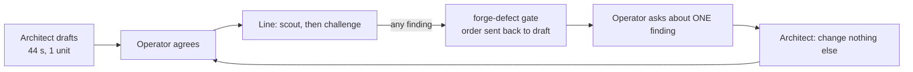
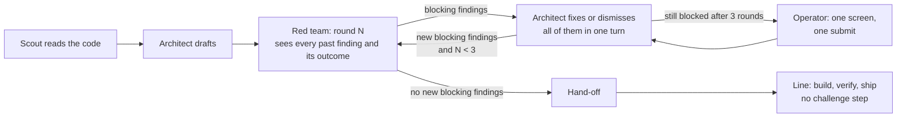

# Foundry: the red team argues before agreement

Design document · 2026-09-26 · evidence order `WO-0927-4fd` (TAV-15)

## Context

TAV-15 asks Forge's ticket picker to hide done tickets. In 26 minutes Foundry ran the red team five times and raised 30 findings, stopping the operator after each round. The order never reached a builder. It ended as a draft with 7 open findings, and its scope had grown from 2 files to 13, including a change to the core Extension API. The mechanics cause this, not only the prompts. The red team runs after the order is agreed. Every finding stops the run. The operator can clear only one finding at a time. Every clearance re-agrees the order and restarts the red team from scratch, and nothing tells the new pass what earlier passes settled. The "Answer" button on the gate does nothing.

## Goals

- A ticket like TAV-15 goes from seeded to draft PR with **at most one** operator stop and **no** `forge-defect` gate.
- The architect and the red team argue to a fixed point without the operator. The operator sees only what is left after that.
- When the operator does have to decide, they settle every remaining item in **one** submit.
- A finding blocks only if the change would be wrong. Missing docs, a naming convention or a bug that was already there never blocks.

## Non-goals

- Removing the red team. On TAV-15 its first finding was a real bug (RT-red-team-2, below).
- Changing gates that are live at every autonomy setting (`UNCONDITIONAL` in `extensions/foundry/src/gates/autonomy.ts`).
- Changing the builder, verifier or ship steps.

## Current state

### What happened on TAV-15

Source: `~/repos/orders/WO-0927-4fd/ledger.jsonl`, printed with `jq -r '"\(.at[11:19]) \(.actor) \(.action) :: \(.reason)"' ledger.jsonl`.

| Round | Agreed   | Red team raised                                                                        | Operator did                                                |
| ----- | -------- | -------------------------------------------------------------------------------------- | ----------------------------------------------------------- |
| 1     | 01:22:43 | RT-2..5 (the `completed` flag isn't on `IssueSummary`)                                 | Answered the gate, then asked about RT-2                    |
| 2     | 01:27:00 | RT-6..12 (IPC doc, 50-ticket cap, file naming, commit 807c33a0)                        | Asked about RT-6                                            |
| 3     | 01:31:48 | RT-13..18 (typecheck skips tests, 150 = 3× requests, empty-state copy, blank `status`) | Asked about RT-13                                           |
| 4     | 01:36:43 | RT-19..23 (150 is a guess, 3× requests, empty-state copy, blank `status`)              | Fix it…: "cant we just query for tickets that are not done" |
| 5     | 01:43:24 | RT-24..30 (no `node_modules`, API version and ADR, blank `status`, coverage gate)      | Stopped                                                     |

Counts come from `jq -r '.redTeam[].severity' order.json | sort | uniq -c`: 7 high, 11 medium and 12 low. Of the 30, 15 are resolved, 8 accepted and 7 still open. The ledger has 5 `gate.raised`, 5 `run.started` and 5 `order.agreed` entries (`grep -c`).

### Why it loops

1. **The red team runs after agreement.** In `extensions/foundry/recipes/standard.yaml`, `challenge` (the red-team role) is a Line step that comes after `scout`. At intake only the structural checks in `src/forge/red-team.ts` run, and those involve no model.
2. **Every finding stops the run.** `applyRungOutput` (`src/line/rung-output.ts:309-360`) turns any finding into a `defect`, whatever its severity. `executor.ts:870-877` then raises `forge-defect` on it. `amendOrder` (`src/order/amend.ts`) sets `status: 'draft'`.
3. **"Answer" is a no-op.** The gate says "Work resumes" (`src/gates/rules.ts:173-181`), and `act` calls `runs.resume` (`src/index.ts:2658`). But `resume` refuses any order that is not running (`src/ipc/run-channels.ts:617-619`), and `act` never checks what `resume` returned. Answering a stale gate while a new run is going starts a second executor. It finds nothing ready and records `run.halted: waiting on a gate`, which happened three times between 01:43:34 and 01:43:57.
4. **One finding at a time.** While a turn runs, `Forge.tsx:1010` hides "Ask the architect" and "Fix it…" on every finding. Each ask also says "change nothing else" (`Forge.tsx:186-194`). Seven findings therefore cost seven serial turns, and each one is followed by re-agreement and a full re-run.
5. **The red team doesn't remember what was settled.** The order it reads shows only open findings (`src/order/render.ts:122`), and new findings are de-duplicated on exact text only (`rung-output.ts:312-316`). Dismissed findings came back in new words: the blank `status` field in rounds 3, 4 and 5, the empty-state copy in rounds 3 and 4, and dropping canceled tickets in rounds 1 and 3.
6. **There is no bar for what blocks.** The red-team role looks for "anything that contradicts what the project says about itself" (`roles/red-team.yaml`). So process items count as defects: ADRs, API version bumps, test file names, coverage gates. The architect may not dismiss a **high** finding at any confidence (`dismissConfidentFindings`, `src/forge/autonomy.ts`), and the red team picks its own severity.
7. **Foundry's own problems are reported as the order's.** RT-24 says the lane worktree has no `node_modules`, and it's right: `ls ~/repos/orders/WO-0927-4fd/worktrees/*/node_modules` finds nothing. The round 3 note says "npm is blocked for this review" (`src/runtime/read-only-policy.ts`). Editing the order can't fix either one.
8. **The fixer is weaker than the attacker.** The red team is `modelTier: deep`. Asks are answered on `DEFAULT_ASK_MODEL = 'sonnet'` (`src/forge/converge.ts`).
9. **The first draft wasn't checked against the code.** The architect took 44 s and wrote one unit whose problem statement says the summary "already carries a completed flag". It doesn't: `IssueSummary` has no `completed` (`src/shared/types/index.ts:329-347`). The draft also missed commit `807c33a0`, which already makes this change in 3 files (`git show --stat 807c33a0`). The scout, which reads the code, runs only after agreement.
10. **ADR-062's automatic follow-ups don't reach this path.** `followUpFor` runs only after an operator turn in the Forge, and at most twice (`src/index.ts:2281`). It never runs for a finding raised on the Line.
11. **The operator's personal rules reach the agents.** Round 4 cites "the operator's rule is that a workaround needs their approval", which is a rule in `~/.claude/CLAUDE.md`. Whether that file can be kept out of a launched session is an open question, below.

## Options considered

**A. Prompt-only.** Soften `roles/red-team.yaml` and tell the architect to dismiss more.

- For: one file, no schema change.
- Against: it leaves causes 1-5 and 10 in place. It is still one finding per turn, the red team still reruns after every agreement, and "Answer" still does nothing. ADR-062 already found that prompt guidance alone doesn't hold ("questions still arrived").

**B. Review loop inside the Forge, with a blocking bar that is enforced when findings are read back.** Scout, architect and red team argue before agreement, for a bounded number of rounds, and only blocking findings survive.

- For: fixes every cause except 7 and 11 (those have their own steps below). The Line never stops for a review.
- Against: the Forge takes longer before hand-off (about three red-team rounds at most). It needs a schema change and an ADR.

**C. Drop the red team.**

- For: fastest.
- Against: loses the finding that mattered (RT-2: filtering on `!issue.completed` would drop nothing on real data).

## Decision

**B.** A red team with a bar and a memory is worth its minutes before agreement. After agreement it only produces interruptions.

## Design

### Data: `src/order/schema.ts`

`RedTeamFindingSchema` gains three fields:

- `category`: `'wrong-outcome' | 'regression' | 'unprovable' | 'scope' | 'process' | 'pre-existing' | 'infra'`
- `round`: a number
- `blocking`: a boolean derived from `category`, never set by the agent. Only `wrong-outcome`, `regression` and `unprovable` block.

`compileOrder`'s `redTeam` check (`src/order/compile.ts:235`) fails only on **open blocking** findings. Non-blocking findings become a "Notes for the builder" section in the brief, and `pre-existing` and `infra` findings can also be offered as follow-up tickets.

### Red team: `roles/red-team.yaml` and `src/line/rung-output.ts`

- The prompt gives the blocking bar as a rule: _a finding blocks when the order's criteria could pass while the ticket's outcome is false, or when the change breaks something that works today._ The category list is rendered from the schema constant, following the memory rule "show the agent the enum".
- The red team's brief shows every past finding with its status and reason (a change to `render.ts:122` for this reader). A settled finding may be reopened only with evidence the earlier reason didn't answer. Otherwise it is dropped when read back.
- Round 2 and later may raise only findings about parts of the order that changed in the last redraft.

### Loop: new `src/forge/review-loop.ts`, called from `convergeWithFollowUps` (`src/index.ts:2240`)

- After an architect proposal compiles, run one red-team round. That is a read-only session in the repository, like the architect's.
- Send the architect every open blocking finding in **one** turn, on the same model tier as the red team. `dismissConfidentFindings` then allows dismissing any severity at ≥0.9 confidence with a reason, because the bar has moved into `category`.
- Stop when a round raises no new blocking finding, or after `MAX_REVIEW_ROUNDS = 3`. Hand-off happens without a click only when the operator turned on automatic hand-off for the order. Otherwise the order shows "Ready".
- Before the first draft, run the scout in the Forge so the architect starts from code it has read (cause 9).

### Operator surface: `src/components/Forge.tsx`

- The questions and the findings that survived the loop go in one band at the top ("input surfaces go front and centre"). Each has an answer, a "Fix it…" text box or an accept-with-reason. **One** "Send" button collects them all into a single architect turn.
- Controls are never hidden while a turn runs. What the operator types during a turn waits in a queue and goes with the next turn.

### Line: `recipes/*.yaml`, `src/index.ts`, `src/ipc/run-channels.ts`

- Remove the `challenge` step from `standard.yaml`, and from any other recipe that has it.
- A `forge-defect` raised on the Line (by a builder that finds a contradiction) sends "Answer" to the Forge as a converge turn carrying every open finding. `act` must treat an `{ error }` result as a failure (`gate.action_failed`).
- `resume` refuses when `deps.executing(order.id)` is already true, so there is never a second executor.

### Infrastructure, kept out of findings

- A lane worktree gets its dependencies before any step that runs a check (see the open question on how).
- Check commands the order names are allowed in the read-only policy for the review, or else `infra` findings are recorded as a Foundry health problem and never block an order.

### Sequence (one commit each)

1. Schema, compile and brief changes, with specs, including red-team findings that are open but non-blocking.
2. Red-team role prompt and memory: `render.ts` and `rung-output.ts` read-back filtering.
3. `review-loop.ts`, wired into `convergeWithFollowUps`, with the scout moved to the Forge.
4. Batch operator surface in `Forge.tsx`.
5. Remove `challenge` from the recipes, fix `act` and `resume`.
6. Lane toolchain provisioning.
7. ADR "The red team argues before agreement" (it supersedes part of ADR-062). Update `ARCHITECTURE.md` and the Foundry contracts.

## Testing and verification

- Unit specs for each step, written as failing tests first. Examples: a `resume` against a draft returns an error and `act` records `gate.action_failed`; a reopened finding with no new evidence is dropped; the loop stops at round 3; one Send carries N answers.
- Project gates, run from the worktree: `npm run format && npm run lint && npm run typecheck:extensions && npx vitest run --coverage`. The exit status must be 0.
- Live acceptance: re-seed TAV-15 and run it to a draft PR. The result is measured from its ledger:
  - `grep -c '"action":"gate.raised"' ledger.jsonl` → 0 `forge-defect`
  - `grep -c '"actor":"operator"' ledger.jsonl` → at most 2 (agree, plus ship)
  - Time from `order.seeded` to `ship.draft_opened` → under 15 minutes (target, not measured yet)

## Risks and mitigations

| Risk                                                                    | Mitigation                                                                                                                                                                              |
| ----------------------------------------------------------------------- | --------------------------------------------------------------------------------------------------------------------------------------------------------------------------------------- |
| The red team labels a real defect `process` to get past the bar         | The category list is short and defined. The verifier and inspector still run on the Line. Blocking and non-blocking findings are logged by category, so the calibration can be audited. |
| Three rounds make the Forge slow                                        | Rounds 2+ are delta-only and short. Compare with the 26 minutes TAV-15 spent without a result.                                                                                          |
| Automatic hand-off ships something the operator wouldn't have agreed to | It is opt-in per order. `ready-for-review` stays unconditional, so nothing merges without the operator.                                                                                 |
| Moving the scout forward adds a session before every draft              | The scout is `modelTier: fast`, and its output replaces the scout step on the Line.                                                                                                     |

## Open questions

1. How should a lane worktree get `node_modules`: `npm ci`, a symlink to the main checkout's, or `--prefer-offline`? CLAUDE.md rule 1 forbids writing into the target repo. A worktree is Foundry's own checkout, but the operator should confirm this counts as allowed.
2. Should automatic hand-off be the default for orders graded P2/P3?
3. Can a launched agent be kept from loading `~/.claude/CLAUDE.md` (cause 11)? According to the [memory docs](https://code.claude.com/docs/en/memory.md), the user file loads in every session. `--bare` skips _all_ CLAUDE.md files, project ones included. `claudeMdExcludes` excludes files by path pattern. **[UNVERIFIED]** whether a `claudeMdExcludes` entry in Foundry's `--settings` file can exclude the user-level file. A spike should confirm this before we rely on it.
4. Should `pre-existing` findings be filed as Linear tickets automatically, or only offered?

## Alternatives rejected

- Prompt-only tuning: leaves the one-at-a-time loop and the no-op "Answer" in place.
- Letting the architect dismiss high findings with no bar: moves the strictness problem into its confidence number.
- Keeping `challenge` on the Line as a non-blocking note: it costs a deep-model session with nobody left to act on what it says.
- No red team: loses RT-2.
