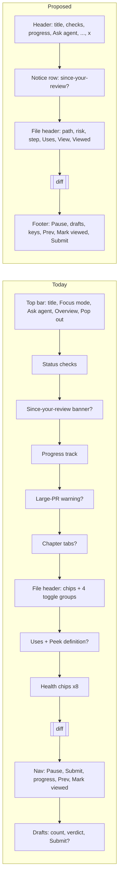
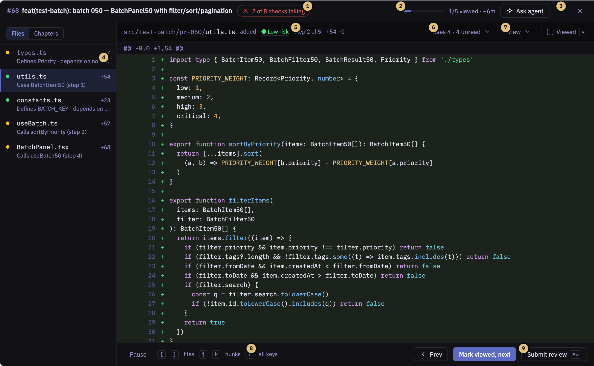
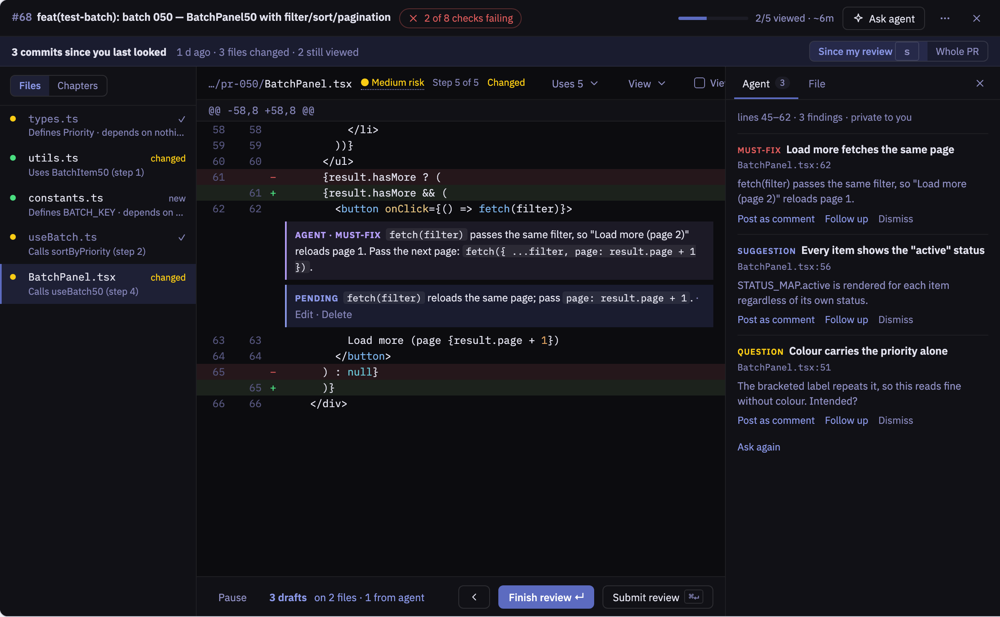
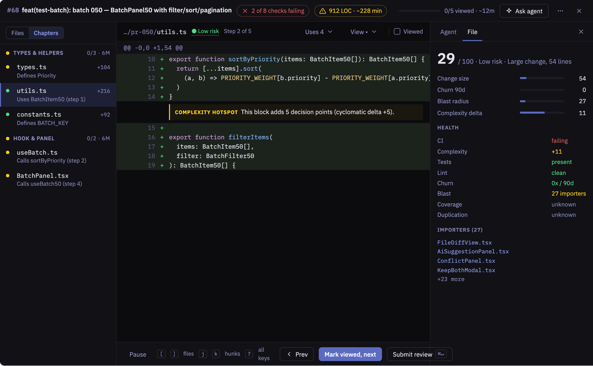
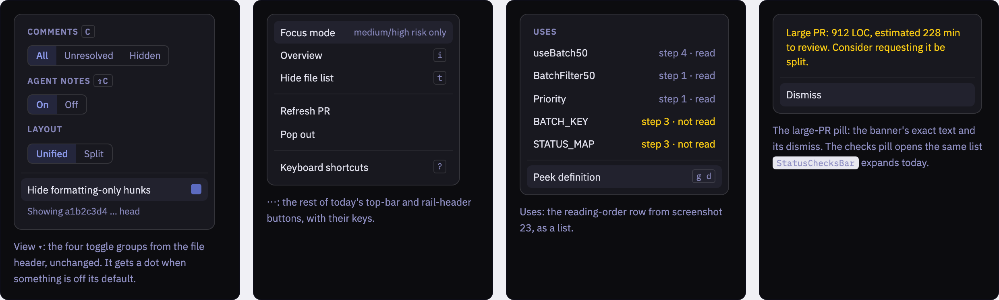

# Review Screen Declutter

Design document · `extensions/git-integration` · Draft · 2026-09-27

The review screen stacks up to eleven horizontal bands around the diff and repeats several controls. This design keeps every piece of content and moves it into two bars, one footer, a right-hand inspector and three small menus.

## Context

The screen is `PrReviewView` with `ReviewDiffPane` in the middle. Features were added one band at a time, and the diff now sits under six bands from the view and three from the file header, with two more below it. On a 900px-tall window the code starts about a third of the way down. Some things appear more than once. **Submit review** is in the nav bar and in the drafts bar. Review progress shows up in four places. Risk shows up in three. Every file header also carries four view toggles, even though three of them are global settings.

| Measure               | Before → after |
| --------------------- | -------------- |
| Bands around the diff | 11 → 3         |
| Submit review buttons | 2 → 1          |
| Progress displays     | 4 → 1          |
| Content removed       | 0              |

These were counted from the JSX: bands in `PrReviewView.tsx` at lines 346, 403, 407, 417, 425 and 443; in `ReviewDiffPane.tsx` at 863, 959, 979 and 1386; and `SubmitBar` at `PrReviewView.tsx:529`. The "after" count is the header, the file header and the footer. The notice row appears only after a push, and one of the eleven "before" bands is conditional too.

## Goals and non-goals

- **Goal:** at most three bands around the diff, plus one notice row after a push.
- **Goal:** every control and signal that exists today stays reachable, and every keyboard shortcut keeps its behaviour.
- **Goal:** one place for each thing: submit, progress, risk, and view settings.
- **Non-goal:** new features. That includes agent review scoped to a file or to selected files, which was set aside in this session.
- **Non-goal:** the Overview screen (`PrOverviewPanel`), the review queue and the dashboard.

## Current state

| After a push                                                                                         | With the agent panel open                                                                   |
| ---------------------------------------------------------------------------------------------------- | ------------------------------------------------------------------------------------------- |
|                     |  |
| The diff starts at about y=300 of 900, and there are two footer bars that each have a Submit button. | The narrower centre wraps the file header onto two rows and the Uses row onto two more.     |

### Where each piece of content goes

| Today                                                                                             | Source                                                                   | Proposed home                                                                                                                                                                                                 |
| ------------------------------------------------------------------------------------------------- | ------------------------------------------------------------------------ | ------------------------------------------------------------------------------------------------------------------------------------------------------------------------------------------------------------- |
| PR number, Draft badge, title                                                                     | `PrReviewView.tsx:346`                                                   | Header, left                                                                                                                                                                                                  |
| Status checks bar and its list                                                                    | `StatusChecksBar.tsx`                                                    | Header pill "2 of 8 checks failing". It opens a popover with the same list and links.                                                                                                                         |
| Progress track, "0 / 5 files reviewed ~6m", "1 of 5 files", chapter n/m                           | `PrReviewView.tsx:417`, `FullFileList.tsx:80`, `ReviewDiffPane.tsx:1396` | One header meter, "2/5 viewed · ~6m". Chapter n/m stays on the rail group headers.                                                                                                                            |
| Large-PR warning                                                                                  | `PrReviewView.tsx:425`                                                   | Header pill "912 LOC · ~228 min". Its popover has the full sentence and Dismiss.                                                                                                                              |
| Focus mode, Overview, Pop out, Refresh, keyboard sheet                                            | top bar, rail header                                                     | The ⋯ menu, each with its shortcut shown. The Focus mode state also shows as a pill while it is on.                                                                                                           |
| Ask agent about this PR                                                                           | `PrReviewView.tsx:359`                                                   | Header "Ask agent" button. Same behaviour.                                                                                                                                                                    |
| Since-your-review banner, Since my review / Whole PR                                              | `SinceBanner.tsx`                                                        | The one notice row. Unchanged, because it is the only band that asks you to choose something.                                                                                                                 |
| Guided chapter tabs, All ↗ / Guided ↩                                                           | `ChapterNav.tsx`, rail header                                            | A rail switch, "Files \| Chapters". In Chapters mode, chapters are rail groups with risk dot, n/m and minutes.                                                                                                |
| Change type, risk + Why?, Step n of m, Changed since you viewed, +/−                              | `ReviewDiffPane.tsx:864–887`                                             | File header, in plain muted text instead of eight outlined chips. Clicking risk opens the inspector's File tab (the Why panel).                                                                               |
| Comments All/Unresolved/Hidden, Agent notes On/Off, Unified/Split, Semantic, "Showing a1b2… head" | `ReviewDiffPane.tsx:889–950`                                             | The View ▾ menu. A dot on the button means something is not at its default. The keys `c` and `⇧C` still work.                                                                                                 |
| Viewed chip                                                                                       | `ReviewDiffPane.tsx:951`                                                 | A Viewed checkbox at the right of the file header, as GitHub places it. Toggles with `v`.                                                                                                                     |
| Uses row, Peek definition                                                                         | `ReviewDiffPane.tsx:959`                                                 | A "Uses 5 · 3 unread" button in the file header. Its popover has the same list and Peek definition (`g d`).                                                                                                   |
| Health chips ×8                                                                                   | `HealthChips.tsx`                                                        | Inspector File tab, next to the risk breakdown, because both answer "why is this risky". Each chip has a value and a tooltip in the code (`HealthChips.tsx:13,163`); the tooltip becomes a line of text.      |
| Risk breakdown panel, importers                                                                   | `RiskBreakdownPanel.tsx`                                                 | Inspector File tab                                                                                                                                                                                            |
| Agent panel                                                                                       | `AgentPanel.tsx`                                                         | Inspector Agent tab, with a count. Finding actions become one line of text buttons.                                                                                                                           |
| Pause review, Submit review, Prev, Mark viewed / Finish                                           | `ReviewDiffPane.tsx:1386`                                                | Footer, with one Submit                                                                                                                                                                                       |
| Drafts count, "from an agent finding", Review drafts, verdict, Submit                             | `SubmitBar.tsx`                                                          | Footer link "3 drafts on 2 files · 1 from agent". It opens the Submit dialog. The verdict is chosen in the Submit dialog, which already has Approve / Request changes / Comment (`ReviewSubmitPanel.tsx:73`). |
| Complexity hotspot, agent notes, drafts, notes, selection bar                                     | inside the diff                                                          | Unchanged. The hotspot keeps its border and background tint but loses the big icon row.                                                                                                                       |

GitHub places things the same way: view settings are under a gear ("click ⚙ and choose the unified or split view"; whitespace is in the same menu), and Viewed is "on the right of the header of the file". Source: [Reviewing proposed changes in a pull request](https://docs.github.com/en/pull-requests/collaborating-with-pull-requests/reviewing-changes-in-pull-requests/reviewing-proposed-changes-in-a-pull-request).

## The design

The approach is two thin bars, one footer, one inspector and three menus. The diff owns the rest of the screen. Colour is only used for state that needs you: failing checks, risk, agent findings and drafts. Values that are fine go quiet.

### 1 · Reading a file

1. The status checks shrink to one pill. Its popover has the same list `StatusChecksBar` renders.
2. One progress meter replaces the track, the rail summary and the nav text.
3. ⋯ holds Focus mode, Overview, Pop out, Refresh and Keyboard shortcuts.
4. Rail rows: the reason line is muted instead of green, and a ✓ marks viewed files.
5. Risk, step and size are plain text. Click the risk to open the File inspector.
6. Uses and Peek definition move into a popover.
7. Comments, Agent notes, Unified/Split and Semantic move into the View menu.
8. The key hint is fixed. Today it reads "1 mark viewed", but the key is `v` (`ReviewDiffPane.tsx:1397`).
9. There is one Submit. Choosing the verdict moves into the dialog.

### 2 · After a push, with agent findings and drafts

This is the same state as screenshots 23 and 15. The notice row is the only extra band, and the drafts bar becomes one footer link that opens the Submit dialog. With the inspector open the centre is narrow, so the file header shortens its labels ("Changed", "Uses 5") instead of wrapping. The full text stays in a tooltip and in the popover.

### 3 · Chapters, and the File inspector

Chapters mode puts the old chapter tabs into the rail as groups. The large-PR banner becomes a header pill. Clicking "Low risk" opens the File tab, which holds the eight health signals, the risk breakdown and the importers. Problems are listed first. The numbers are the ones screenshot 08 shows for `utils.ts`.

### 4 · The menus

- **View ▾:** the four toggle groups from the file header, unchanged. It gets a dot when something is off its default.
- **⋯:** the rest of today's top-bar and rail-header buttons, with their keys.
- **Uses:** the reading-order row as a list.
- **Large-PR pill:** the banner's exact text and its dismiss.
- **Checks pill:** opens the same list `StatusChecksBar` expands today.

## Options considered

| Option                   | What it does                                                                          | Tradeoffs                                                                                                                                                                   |
| ------------------------ | ------------------------------------------------------------------------------------- | --------------------------------------------------------------------------------------------------------------------------------------------------------------------------- |
| **A · Consolidate**      | Two bars, one footer, a tabbed inspector and three menus, as drawn above.             | Removes 8 bands and every duplicate. It costs one extra click for view toggles and health signals. The view toggles have keys, and the risk label is one click from health. |
| **B · Restyle in place** | Keep every band but make chips smaller, drop outlines and mute colours.               | Least code and least risk. The bands, the duplicate Submit and the four progress displays all stay, and the header still wraps when the agent panel opens.                  |
| **C · Zen mode**         | Hide everything except the diff and reach controls through ⌘P Quick Actions and keys. | Cleanest look. Checks, risk and drafts disappear until you ask for them, which hides state that is waiting on you.                                                          |

**Decision: A,** with B's quieter styling on what remains. It is the only option that removes duplicates and bands while keeping failing checks, risk and drafts visible without a click.

## Changes, in order

All paths are under `extensions/git-integration/src/components/pr-review/`. Each step is one commit and leaves the screen working.

1. **Footer.** Merge the nav bar (`ReviewDiffPane.tsx:1386`) and `SubmitBar.tsx` into a new `ReviewFooter.tsx` rendered by `PrReviewView`. Drop SubmitBar's verdict control, because `ReviewSubmitPanel` already has one. Fix the key hint.
2. **Header.** Add `ReviewHeader.tsx`: title, checks pill with a `Popover` from `@terminator/extension-ui` around today's `StatusChecksBar` list, the progress meter, a large-PR pill, Ask agent, and a ⋯ menu. Remove the progress track, the large-PR banner and the rail's refresh button from `PrReviewView`.
3. **Rail.** Replace the rail header buttons and `ChapterNav` with a Files | Chapters switch. `FullFileList` already renders chapter groups (`FullFileList.tsx:102`), so Chapters mode reuses them. Remove its summary row and mute the reason text.
4. **File header.** Collapse `ReviewDiffPane.tsx:863–976` to one row. Add `ViewMenu.tsx` and `UsesPopover.tsx`, and a Viewed checkbox wired to `markFileViewed`. Move `diffViewMode` and `hideFormattingHunks` from local state (`ReviewDiffPane.tsx:81–82`) into `review-ui.store.ts` so the menu drives them like the other two.
5. **Inspector.** Add `ReviewInspector.tsx` with Agent and File tabs. File renders `RiskBreakdownPanel` and `HealthChips` (restyled as a list, problems first). This replaces the two-way `agentPanelScope` / `showRiskFor` choice at `PrReviewView.tsx:490`.
6. **Docs.** Update the review section of the extension README and `ARCHITECTURE.md` (Constitution VIII).

## Testing and verification

- Write the failing tests first, in `tests/unit/PrReviewView.spec.tsx`. At most three bars render around the diff, and exactly one control is named "Submit review". Every former control is reachable by role and name: open ⋯, then View, then the inspector tabs, and assert each option. The same file covers `ViewMenu` and `ReviewInspector`.
- Keys: extend the `useReviewKeys` coverage so `c`, `⇧C`, `s`, `v`, `t`, `i` and `⌘↵` still work with the menus closed.
- Checks: `npm run format`, `npm run lint`, `npx vitest run --coverage`, all exit 0.
- Render: re-shoot screenshots 06, 08, 15, 23 and 32 against the live app in both themes and compare them with the renderings above.

## Risks

- **A narrow centre wraps the header again.** The file header never wraps. Below about 700px of centre width it shortens labels ("Changed since you viewed" becomes "Changed", "Uses 5 · 3 unread" becomes "Uses 5") and puts the full text in a tooltip. A container query on the header decides this.
- **Health signals are one click away.** Failing CI is already in the header pill. A missing test file and low patch coverage feed the risk score (`MISSING_TEST_PENALTY` and a 0.05 weight in `github/pr-review-service.ts:111–128`), so they move the risk label. Lint and duplication do not, so show a small count beside the risk label ("· 2 warnings") whenever any signal fails.
- **Hidden toggles get forgotten.** A comment filter left on "Hidden" hides threads. The View button's dot and the existing keys cover this. Also show "Comments hidden" next to View whenever that state is on.
- **e2e selectors.** Specs that address `.pr-review-ask-agent-btn` or other old classes will break. Address controls by role and accessible name.

## Open questions

- Should the File inspector open by itself on high-risk files, or only when you click the risk label?
- Screenshots 06–32 have no capture script in the repo (`rg -i playwright docs/research/code-review-guide.md` finds none). How were they taken? The answer decides whether the "Render" step can be automated.
- Should Focus mode stay a menu item, or keep a header pill while it is on so a filtered file list is never a surprise? The drawing assumes a pill while it is on.

## Alternatives rejected

- Collapsible bands: they keep the stack and add a toggle to each band.
- Moving health chips to the rail: that repeats eight signals per row.
- A second tab strip for chapters: the rail already groups by chapter.
