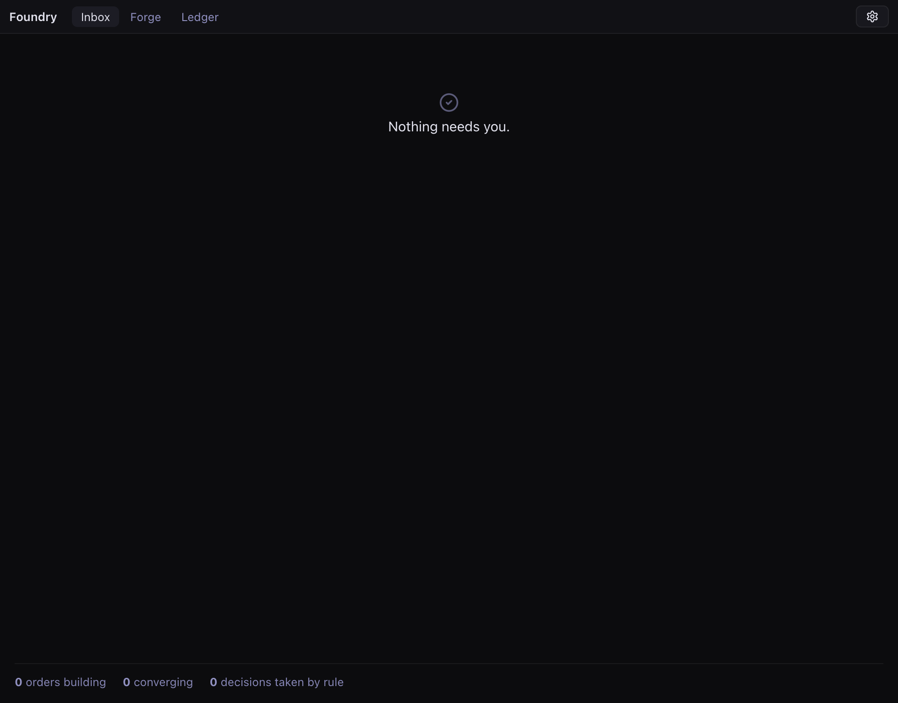
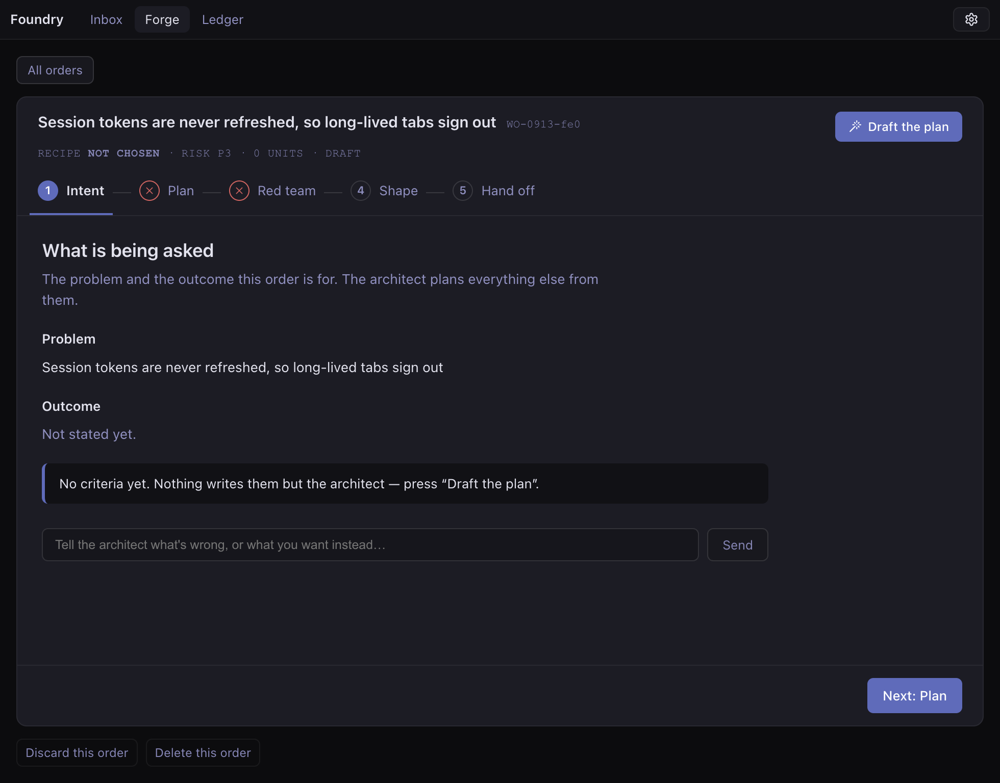
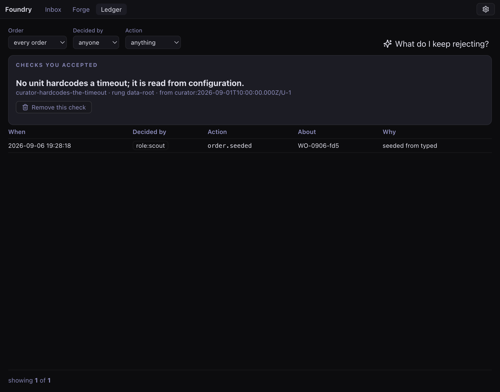

# Terminator User Guide

An end-to-end reference for every feature and extension in Terminator — an extension-first, AI-focused terminal emulator built on Electron.

---

## Table of Contents

1. [What is Terminator?](#1-what-is-terminator)
2. [Installation](#2-installation)
3. [The Interface at a Glance](#3-the-interface-at-a-glance)
4. [Repos & Branches](#4-repos--branches)
5. [Terminal Sessions](#5-terminal-sessions)
6. [Split Panes](#6-split-panes)
7. [Scratch Terminals](#7-scratch-terminals)
8. [Command Palette](#8-command-palette)
9. [Settings](#9-settings)
10. [Issue Tracking](#10-issue-tracking)
11. [Overview Screen](#11-overview-screen)
12. [Notification Center & Activity Indicators](#12-notification-center--activity-indicators)
13. [Keyboard Shortcuts](#13-keyboard-shortcuts)
14. [Extensions Overview](#14-extensions-overview)
15. [Extension: Git Integration](#15-extension-git-integration)
16. [Extension: Foundry](#16-extension-foundry)
17. [Extension: Notepad](#17-extension-notepad)
18. [Extension: Task Vault](#18-extension-task-vault)
19. [Extension: Remote Control](#19-extension-remote-control)

---

## 1. What is Terminator?

Terminator is a developer-focused terminal emulator that organises work into a two-level hierarchy — **Workspaces** (repository-level) and **Projects** (task-level) — with persistent terminal sessions that stay alive as you navigate between them. Extensions add capabilities such as Git integration, spec-driven AI coding pipelines, markdown notes, task management, and remote terminal access, all without modifying the core application.

---

## 2. Installation

### From a packaged release (macOS)

1. Download the `.dmg` from the [latest release](../../releases/latest).
2. Mount the `.dmg` and drag **Terminator** to your Applications folder.
3. Because the app is not notarized, run the following once before opening:

```bash
xattr -cr /Applications/Terminator.app
```

4. Open Terminator normally from your Applications folder.

### From source

```bash
git clone <repo-url>
cd terminator
npm install
npm run dev
```

**Prerequisites:** Node.js 20 LTS+, Python setuptools (`pip3 install setuptools --break-system-packages` on macOS with Python 3.12+), and `git` on your `PATH`. The `gh` CLI is optional but required for GitHub PR features.

---

## 3. The Interface at a Glance


The window is divided into three zones:

| Zone             | Description                                                                                                                                                                                                                                                                                              |
| ---------------- | -------------------------------------------------------------------------------------------------------------------------------------------------------------------------------------------------------------------------------------------------------------------------------------------------------- |
| **Left rail**    | Collapsed workspace group names. Click to expand a workspace in the main sidebar.                                                                                                                                                                                                                        |
| **Main sidebar** | A compact row of app icons at the top (Overview, Notes, Remote Control, Task Vault, Git Changes, and the notification bell), then search with the Filter and Display menus, then every repo with its branches. Terminals are not listed here — they are tabs above the terminal, and cards on the board. |
| **Content area** | Tabbed area on the right showing the active terminal session and extension tabs (Terminal, Foundry, Git).                                                                                                                                                                                                |

The **status bar** at the bottom of the window shows live CPU, Memory, and Network figures when the global metrics bar is enabled in Settings.

---

## 4. Repos & Branches


### Workspaces

A workspace maps to a directory on disk — typically a git repository. Each workspace appears as a named, colour-coded card in the left rail. Click a workspace name to expand it in the main sidebar.

- **Create a workspace:** Click `+` in the sidebar header and choose a directory.
- **Color coding:** Each repo has a distinct accent colour, and it appears in exactly two places: a thin rail down the left edge of that repo's branches, and a small swatch beside the repo's name. Everything else in the column is neutral — hovering and selecting a row look the same whichever repo it belongs to, so what draws your eye is a branch's state rather than its colour. Scratch terminals belong to no repo and draw no rail.
- **Keyboard access:** `Cmd+1`–`Cmd+9` focuses and expands the corresponding workspace; `Cmd++` / `Cmd+-` cycles through them.
- **Toggle sidebar:** `Cmd+B`.

### Projects

Projects live inside a workspace and hold one or more terminal sessions scoped to a task or branch.

- **Create a branch:** Hover a repo's header and click `+`. A branch is usually its own git worktree; the sidebar marks the exception — a plain checkout gets a small branch glyph, and a worktree is left unmarked.
- **Naming:** A branch is named by its branch — there is nothing else to name and nothing to rename. Check out a different branch in a plain checkout's own terminal and its card follows within a moment. A worktree's branch is fixed when you create it. (A workspace whose folder is not a git repository has no branch to take a name from, so there you are asked for one and can rename it.)
- **Terminals per branch:** A branch can hold several named terminal tabs. They are listed in the tab bar above the terminal, not in the sidebar — each tab carries its own state glyph and unread bell count, and its note on hover. The tab bar states which branch's terminals it is showing.

- **What a branch row tells you:** its state, folded from its terminals — waiting on you beats working, working beats idle, idle beats exited — plus its name, any linked issue key, how much has changed on it, and either how many terminals share that state or how long since it was last active. A branch with no terminals is still listed, and reads as idle.

- **Ordering the list:** **Display → Sort** orders the whole column — the repo headers as well as the branches under each one. **Name** is alphabetical, **Recent** and **Oldest** go by when a branch last did something (a repo takes the most recent of its branches), **Status** puts what is waiting on you at the top, and **Manual** is whatever order you dragged things into. Drag a repo header to move a repo, or a branch row to move it within its repo; dropping switches the view to **Manual**, since any other sort would recompute the order and discard the drag. Your order is saved and survives a restart. Branches cannot be dragged under **Display → Group → None**, where one list spans every repo and there is no per-repo order to write.

- **Collapsing a repo:** click its header. A collapsed repo still shows a marker if a branch inside is waiting on you, so hiding a repo cannot hide the one thing you needed to see.

- **Open in your editor:** right-click a branch and choose **Open in ‹editor›** to open that branch's working copy — its own worktree when it has one, otherwise the repo it was checked out from. The same item is on a repo's header, and opens the repo folder. Terminator finds your editor itself: it looks for Cursor, VS Code, Windsurf, Zed, Sublime Text, WebStorm, IntelliJ and Xcode, preferring one whose command-line launcher is installed, since that opens the folder in a window you already have. To pin a particular one, set `ui.editor` in settings to its id (`cursor`, `vscode`, `windsurf`, `zed`, `sublime`, `webstorm`, `intellij`, `xcode`); leave it empty to keep detecting. The menu item is hidden when no editor is found, and in the browser remote, which has no local editor to launch.
- **Per-workspace settings:** Theme, scrollback limit, and default shell can be overridden per workspace via Settings.

---

## 5. Terminal Sessions


Terminal sessions are powered by **xterm.js** backed by **node-pty** in the main process. Sessions are **never destroyed** when you switch tabs or navigate the sidebar — the buffer, scroll position, and running process survive intact.

### Opening sessions

- **New tab on this branch:** Click `+` in the tab bar or press `Cmd+T`.
- **New scratch terminal:** Press `Cmd+Shift+T` or click the `~` button in the workspace rail (see [Scratch Terminals](#7-scratch-terminals)).

### Navigating tabs

- `Cmd+Left` / `Cmd+Right` — cycle through tabs.
- Click any tab to switch to it.
- Drag tabs left or right to reorder them; order persists for the lifetime of the app session.

### Clickable links

URLs and absolute file paths in terminal output are **underlined on hover**. `Cmd+click` a URL to open it in your system browser; `Cmd+click` a file path (e.g. `/Users/foo/bar.ts` or `~/project/file.go`) to open it with the default application. Line:col suffixes like `file.go:42:5` are stripped before opening.

### Useful shortcuts

| Action                                                        | Shortcut      |
| ------------------------------------------------------------- | ------------- |
| New tab                                                       | `Cmd+T`       |
| Close focused pane / active tab                               | `Cmd+W`       |
| Clear terminal                                                | `Cmd+K`       |
| Send newline (always)                                         | `Cmd+Enter`   |
| Send newline (bracketed paste mode, e.g. inside `claude` CLI) | `Shift+Enter` |

---

## 6. Split Panes

Split panes let you view multiple terminals side by side without leaving the current branch.

- **Split vertically (side by side):** `Cmd+D`
- **Split horizontally (top / bottom):** `Cmd+Shift+D`

Splits are **recursive** — each pane can be split again. Drag the divider bar to resize. Click a pane to focus it; a blue border marks the focused pane. `Cmd+W` closes the focused pane (collapsing the split) or the active tab when there is no split.

> **Note:** Split panes require an active branch session. Scratch sessions do not support splits.

---

## 7. Scratch Terminals


Scratch terminals give you an instant shell without selecting any repo or branch first.

- **Open a scratch terminal:** Click the `~` button in the workspace rail or press `Cmd+Shift+T`.
- Scratch sessions appear as a **Scratch** group at the bottom of the sidebar, with a count like any other group.
- **Promote a scratch session:** Right-click its tab and choose **Move to branch…** to attach it to an existing branch or create a new one.

---

## 8. Command Palette


Press **`Cmd+P`** to open the command palette. Type to filter available actions — create sessions, navigate workspaces, toggle panels, and trigger extension commands. Press `Enter` to execute or `Esc` to close.

---

## 9. Settings


Open Settings with **`Cmd+,`** or via **View → Open Settings**.

### Global settings

| Section            | Options                                                   |
| ------------------ | --------------------------------------------------------- |
| **Interface**      | Theme (dark/light), show CPU/Memory/Network bar           |
| **Terminal**       | Default shell, scrollback limit                           |
| **Integrations**   | Connect Linear and Jira — see below                       |
| **Extensions**     | Enable/disable individual extensions                      |
| **Remote Control** | Enable local server, port, ngrok tunnel, session password |

### Integrations — connecting an issue tracker

**Settings → Integrations** is the only place Terminator asks for a tracker credential, and every
part of the app reads that one connection. Linear and Jira can both be connected, independently.

| Tracker    | What you provide                                                                                       |
| ---------- | ------------------------------------------------------------------------------------------------------ |
| **Linear** | API key. Optionally an email, to list someone else's assigned issues instead of the key's own account. |
| **Jira**   | Site (`your-team.atlassian.net`), account email, API token, and a JQL query defining "my issues".      |

**The credential is checked before it is kept.** Terminator calls the tracker with it first, so a
mistyped key is rejected there and then, with the tracker's own message, rather than turning up
later as an empty issue list. Nothing is stored unless it works.

**Where it lives.** Encrypted with your operating system's keychain (`safeStorage`) in
`integrations.json` in the app's data directory, and read only inside the main process. No part of
the interface can ask for it back — status only ever reports _whether_ a tracker is connected and
_which account_ the credential proved to belong to. The connect and disconnect actions are also
the only two settings deliberately unavailable over Remote Control: an authenticated browser on
your LAN still has no business writing your API keys.

**Already used SpecKit Pilot?** Your Linear and Jira credentials move across automatically the
first time you launch a build with this feature. You will not be asked for them again, and the
extension's old credential file is renamed `.bak` rather than deleted.

**Disconnecting** destroys that tracker's credential and leaves the other one alone. Anything you
had linked to a branch stays linked — it is your association, not the tracker's — and starts
working again as soon as you reconnect.

### Per-workspace overrides

Expand any workspace in Settings to override the global theme, scrollback limit, and default shell for sessions in that workspace.

Themes switch immediately across the entire app — no restart required. Terminal colours re-apply live via a `MutationObserver`.

---

## 10. Issue Tracking

Terminator attaches a **Linear or Jira issue to a branch**, so the thing you are working on is on
screen — and so every agent session you start there already knows it.

Connect a tracker first: [Settings → Integrations](#9-settings).

### Attaching an issue to a branch

A branch can carry **one** issue at a time — a branch is a unit of work, and so is a ticket.

**To attach one**: right-click the branch in the sidebar → **Link issue…**. The picker opens on
the issues assigned to you across every connected tracker, so the common case needs no typing.
Type to search, or type an issue key exactly (`TAV-42`) to jump straight to it. Each row shows
which tracker it came from, because two trackers can both have a `TAV-42` and they are different
issues.

You can also reach it from the command palette (`⌘K`) with **Link Issue to Project**, scoped to
whichever branch you are in.

**The key.** Once attached, the branch's row in the sidebar carries the issue key as plain text — click it to open the issue drawer. It used to be a bordered badge with its own state dot; the key alone already said what those said. The paragraph below describes the state colours as they appear in the drawer and the picker.

**The badge.** Once attached, the branch's row in the sidebar carries the issue key with a small
dot:

| Dot            | Meaning                                       |
| -------------- | --------------------------------------------- |
| Dim            | Backlog or not started                        |
| Amber          | In progress                                   |
| Green          | Done or cancelled                             |
| Dashed outline | Terminator could not read the issue right now |

The dot is never the only signal — hover the badge for the tracker, the state by name, and the
issue title, and screen readers get the same text. Clicking the badge opens the issue.

**Changing it.** Picking a different issue **replaces** the one attached; you are warned before it
happens. Right-click the branch for **Change linked issue…**, **Copy issue key**, **Open … in
tracker**, or **Unlink**.

**Removing a branch** discards its association with it. Nothing is left behind.

### Reading an issue

Click the issue key on a branch to open it. Description and comments are **rendered** — headings,
lists, task lists, tables, code blocks, links and emphasis all appear as formatted text, the same
whether the issue came from Linear or from Jira.

Issue text is treated as untrusted: embedded HTML never runs, images are not loaded (a remote image
in a ticket is a tracking pixel aimed at whoever opens it), and links open in your browser rather
than navigating the app.

The panel also carries **Refresh** (fetches current data, ignoring the cache), **Comment**, and
**Unlink**. If a comment fails to post you are told, and what you typed stays in the box.

If the issue cannot be read right now — tracker down, credential expired — the panel says so and
keeps the attachment. Your link is yours; it does not disappear because a tracker had a bad minute.

### What your agent sessions are told

This is the point of attaching an issue. With one attached, **any agent session started in that
project already knows it** — you do not paste the ticket in.

That includes a session you start yourself, at an ordinary shell prompt in the project directory,
outside Terminator entirely. It is not a launch flag; it is a hook registered in the project.

**What it gets**, in this order: the issue key, title, tracker, state, assignee, labels and URL,
then the description, then the most recent handful of comments. Header first on purpose — if the
context has to be shortened, it costs discussion, never the identity of what you are working on.

**How much.** The agent runtime caps this at 10,000 characters. Terminator enforces that itself and
shows you the number, rather than letting the runtime silently swap your context for a file path.
Long descriptions are trimmed near 4,000 characters and a closing line tells the agent it was
shortened and where to read the rest. You can see the exact text and its size before any session
starts.

**You are told when it happens** — a notification naming the issue and the character count. It is
an ordinary notification, so turn it down to the notification centre, or off, in Settings.

**Turning it off** for a project stops it for new sessions and removes what was written into that
project's directory. Sessions already running are unaffected.

### What Terminator writes into your project

To make the above work, Terminator adds one hook to **`.claude/settings.local.json`** in the
project's directory. That file is gitignored by convention and is not the shared, checked-in
`.claude/settings.json`, which Terminator never reads or writes.

The rules it holds to:

- It **merges**. Any `SessionStart` hooks you already had stay, along with every other setting.
- If it cannot parse the file, it **refuses** rather than overwriting it.
- **Unlinking removes it.** If the file is then empty it is deleted, and if Terminator created the
  `.claude` directory, that goes too — your project directory ends up exactly as it started.
- If the directory is not writable, **linking fails and tells you why**. It will not leave you with
  an issue that looks attached but silently feeds nothing.

The hook itself runs a small script that reads one file and prints it. It holds no credential,
makes no network request, and knows nothing about your trackers.

Terminals opened in a linked project also carry `TERMINATOR_ISSUE_KEY` and
`TERMINATOR_ISSUE_TRACKER` in their environment, for your own scripts and prompts.

### Writing back to your tracker

Terminator **never changes a field on an issue** — not its state, not its assignee, nothing. The
only thing it can write is a comment, and only in two places:

- **You press Comment** in the issue panel.
- **A pull request opens** for a Foundry order whose issue is attached — and this is
  **off by default**.

> **Behaviour change.** That pull-request comment used to fire whenever its setting happened to be
> on, and its failures were discarded silently — so nobody could tell a comment that posted from
> one that never had. It is now off unless you turn it on, in the Foundry settings, and when
> it fails you are told. **If you were relying on it, switch it back on.**

---

## 11. Overview Screen


The overview screen displays a **full-screen tiled grid** of all open sessions. Each tile shows:

- A live canvas snapshot of the terminal (refreshed every ~3 seconds).
- The project name and session name.
- Per-session CPU% and memory usage.

Click any tile to navigate directly to that session.

**Open overview:** Click the **grid icon** in the sidebar header or press **`Cmd+Shift+E`**.

---

## 12. Notification Center & Activity Indicators

### Notification center

Click the **bell icon** in the sidebar header to open the notification center panel. It lists all in-app notifications — toasts, extension events, and any persistent notifications created by extensions.

- Per-notification **×** button to dismiss.
- **Mark all read** and **Clear all** buttons.
- Press `Esc` or click the backdrop to close.
- An unread count badge appears on the bell icon when there are unread notifications.
- Every toast automatically appears in the center so nothing is lost after auto-dismiss.

### Activity indicators

- A **spinning indicator** appears on workspace tiles, project cards, and session tabs while a terminal is running a command or producing output (1.5 s idle debounce).
- An **alert badge** (red dot + count) coexists alongside the spinner for sessions awaiting input.
- An **OS-level system notification** and Dock bounce fires on terminal bell.

---

## 13. Keyboard Shortcuts

| Action                               | Shortcut                 |
| ------------------------------------ | ------------------------ |
| Toggle sidebar                       | `Cmd+B`                  |
| Focus workspace 1–9                  | `Cmd+1`–`Cmd+9`          |
| Cycle workspaces                     | `Cmd++` / `Cmd+-`        |
| New tab                              | `Cmd+T`                  |
| New scratch terminal                 | `Cmd+Shift+T`            |
| Close focused pane / active tab      | `Cmd+W`                  |
| Split pane vertically                | `Cmd+D`                  |
| Split pane horizontally              | `Cmd+Shift+D`            |
| Cycle tabs left/right                | `Cmd+Left` / `Cmd+Right` |
| Clear terminal                       | `Cmd+K`                  |
| Command palette                      | `Cmd+P`                  |
| Settings                             | `Cmd+,`                  |
| Toggle Git sidebar                   | `Cmd+Shift+G`            |
| Toggle Overview screen               | `Cmd+Shift+E`            |
| Send newline (always)                | `Cmd+Enter`              |
| Send newline (bracketed paste mode)  | `Shift+Enter`            |
| Leave an extension, back to terminal | `Esc` `Esc`              |

### Leaving an extension

Press `Esc` twice in quick succession (within half a second) inside any extension — Notes, Task Vault, Git Integration, Foundry, Remote Control — and Terminator returns you to the terminal session you were last in. Extension sidebar panels close in place; full-screen extension tabs close and reveal the terminal behind them.

It takes two presses because extensions use a single `Esc` for their own dismissals — closing a dropdown, cancelling a rename, dismissing a dialog. The first press still goes to the extension, so nothing is stolen; the second is what leaves. `Esc` inside a terminal always goes to the shell and never exits anything.

---

## 14. Extensions Overview

Extensions install from any directory on disk via a `manifest.json`. They contribute UI without modifying core code: sidebar items, sidebar panels, global tabs, workspace-scoped tabs, top-bar menu items, native View menu items, context menu entries, and terminal event hooks. Extension UIs run in isolated `WebContentsView` contexts — no app rebuild required after updates.

Terminator ships five built-in extensions:

| Extension           | What it adds                                                                                            |
| ------------------- | ------------------------------------------------------------------------------------------------------- |
| **Git Integration** | Live git status sidebar, staging/committing, PR creation, MergeFlow conflict resolver, Code Reviews tab |
| **Foundry**         | A software factory: an idea becomes a work order that compiles, then a draft pull request               |
| **Notepad**         | Markdown notes, live preview, diagrams, tags, folders, full-text search                                 |
| **Task Vault**      | GTD+BuJo+PARA productivity vault with kanban, recurring tasks, weekly review                            |
| **Remote Control**  | Local HTTP/WebSocket server + optional ngrok tunnel for browser-based terminal access                   |

---

## 15. Extension: Git Integration

The Git integration is a workspace-scoped extension that surfaces git tooling directly inside the terminal window.

### Git sidebar


Press **`Cmd+Shift+G`** or choose **View → Toggle Git Sidebar** to open a right-side panel showing:

- Live git status — auto-refreshes on file changes. Each file's state is named: **Changed**,
  **New**, **Added**, **Deleted**, **Renamed**, **Conflict**. (These used to be git's porcelain
  letters — `M`, `A`, `??`.)
- Stage/unstage individual files or all files.
- Commit message field with one primary **Commit & push**. The alternatives — commit without
  pushing, commit and open a PR, amend — are behind the caret beside it, so there is one obvious
  action rather than four of equal weight. When the button is disabled it says why: nothing
  staged, or no message yet.
- The header states where the branch stands against its remote — **2 ahead**, **1 behind**,
  **up to date**, or **not pushed yet** — so you know what pushing will do before you press it.
- PR creation via the `gh` CLI (requires `gh auth login`).

### Git tab


The **Git** tab in the content area shows a full diff view with syntax-highlighted changes (red for removed lines, green for added). Use this for reviewing changes before committing.

### The pull request queue

The queue opens with one line of triage — how many are waiting on you, how many are high risk,
and roughly how long the reading is — and then groups them: **Read these first**, **Quick wins**,
**Larger reviews**, with anything already started pinned at the top.

Each row names its own risk in words (**High risk**, **Medium risk**, **Low risk**) rather than an
abbreviation that needs a key, and gives an estimate with its unit. The row's action is **Review**:
clicking it opens the diff. Approving happens after you have read the change, never from the list.

The count is the repository's real count, not the number loaded so far, and further pages arrive on
their own — there is no "load more" to press.

### MergeFlow conflict resolver

When a `git merge` produces conflicts, a **"Resolve conflicts →"** button appears in the git sidebar. MergeFlow presents each conflict as a two-panel diff (yours vs. theirs) with author info and commit context for each side.

**Resolution actions per conflict:**

| Action                   | Key           |
| ------------------------ | ------------- |
| Keep Mine                | `M`           |
| Keep Theirs              | `T`           |
| Keep Both                | `B`           |
| Edit manually            | `E`           |
| Confirm                  | `Enter`       |
| Previous / Next conflict | `←` / `→`     |
| Undo last decision       | `Cmd+Z`       |
| AI suggestion panel      | `Cmd+Shift+A` |
| Close modal              | `Esc`         |

Resolution sessions persist across restarts. Once all conflicts are resolved, a single click stages all files and runs the merge commit.

### Code Reviews tab

The Code Reviews tab is a **workspace-scoped tab** — hover over a workspace card header to reveal the code review icon, then click to open it in the content area.

Features:

- Paginated queue of open/closed PRs with search by title or PR number.
- **Five filter pills:** All, High risk, Quick wins, In progress, Stale >3d. In the queue, a PR's risk is classified by total lines changed (≥400 = high, ≥150 = medium) so large diffs surface under **High risk** immediately; opening a PR refines its risk with per-file analysis (churn, blast radius, coverage, complexity).
- **Stat cards:** awaiting count, high-risk count, total review time, in-progress count.
- PRs scored across six signals: tests, coverage, CI, lint, churn, and blast radius.
- Chapter-by-chapter review surface with syntax-highlighted diffs and inline comment threading.
- One-click review submission (Approve / Request Changes / Comment) via `gh` CLI.
- **AI-era enhancements:** universal language-agnostic chapter grouping, semantic-only diff filter (hides formatting/whitespace-only hunks), DRY violation detection, large-PR cognitive load warning (>400 LOC) with estimated review time.
- **Pop-out window:** the ↗ button opens a dedicated focused review window restoring the exact PR, session, and view state.
- Review sessions (chapter position, file, scroll) persist across restarts.

---

## 16. Extension: Foundry



Foundry is a **software factory**. You give it an idea — typed in, or a Linear
or Jira issue — and it converges that into a **work order** you can read and
argue with. When the order compiles, it is handed to an orchestration that does
the work, manages the agents, checks the result and opens a draft pull request.

It replaces SpecKit Pilot's board and its ten-phase pipeline. The headline
difference is how often it interrupts you: a one-line change used to cost nine
decisions — eight phase approvals and a merge — and now costs **nought to two**,
because nothing stops unless a **named rule** fires.

### Opening Foundry

Click the **Foundry** tab in the content area tab bar. Three surfaces, and the
one you land on is the inbox.

**A tab carries a count when something behind it is waiting on you** — gates on
the inbox, open questions and held tool calls on the Forge. The tab strip is
above the scroll area, so the count is on screen whichever surface you are
looking at, and it is the same number the surface itself will show you.

### Inbox — the only surface you have to visit

One queue, always sorted by how much work each decision unblocks. Every row
says:

- **which rule raised it** — `risk.p0`, `budget.exceeded`, `destructive`,
  `ready-for-review`, and five more;
- **why it fired**, and the evidence it looked at;
- **what each option does**, on the button itself;
- **what happens if you ignore it**, and whether it will wait for ever.

When nothing has fired, it says "Nothing needs you" and tells you what is
building, what is converging, and how many decisions were taken by rule while
you were away.

**The autonomy dial** (Settings → Foundry) decides which rules are live.
Four are live at every setting — the highest risk grade, an exceeded budget,
anything destructive, and marking a pull request ready — so **lights-out** will
open a draft without you and still will not merge anything.

### Forge — where an idea becomes an order

Describe what you want built or fixed. Before you are asked anything, Foundry
reads the repository: its manifests, its real commands, its house documents
(`CLAUDE.md`, `AGENTS.md`, a constitution, `CONTRIBUTING.md`), and any past
decision about a file your idea names. A question that survives that is one the
code genuinely could not answer.

The document is the subject; the conversation sits behind it.

**Needs you** is the band across the top of the screen — **at most three
questions**, ever, above everything else on the surface, because a question you
have to go looking for is a question that does not get answered. The
recommended answer is the filled button. Everything else Foundry decided is a
**strikeable assumption** rather than a question — click it to strike it, and
the parts of the document that depended on it are redrawn.

On the left rail, under the band:

- **Six checks**, and it will not hand off until all six pass — no open
  questions, every acceptance criterion falsifiable, coverage complete in both
  directions, risk graded against _this_ plan, adversarial findings resolved,
  budgets set. Each failure names the specific criterion, unit or question
  responsible, **and what to do about it**: either a button that takes you to
  the control that clears it, or one that redrafts with the instruction the
  architect needs. A red mark you can only stare at is not a gate, it is a wall.

  The one that catches people is **criteria falsifiable** on a change somebody
  can see: a plan that touches a `.tsx`, `.css` or `.html` file and has no
  criterion asking for a picture of the running application fails, because a
  command cannot say whether a thing renders. **Ask for proof** has the
  architect add a `screenshot` criterion. If nothing here can take that picture
  — no display, no runner — open **Acceptance** and mark the criterion
  **"Nothing here can prove this"**. That costs a written reason, which travels
  with the order and shows in the ledger.

- **"Not measurable here"**, when the repository has no command for a check.
  Those report **"not measured"** rather than passing. A green you did not earn
  is worse than a gap you can see — and the three rungs that were never
  commands (independent verification, the security inspection, your own
  decision) say where they were decided instead of counting as gaps.

**Draft the plan** is the first thing to press. Foundry seeds a draft with your
problem statement and what it read in the repository; the architect turns that
into criteria, units, a risk grade and budgets. It runs in a terminal you can
watch, and it can only _propose_ — it cannot mark its own work agreed. Type into
the box at the bottom to tell it what is wrong, and it redrafts.

**Attach**, in the order's header, takes you into the terminal the architect
is working in — the same conversation, whether it is still running or you came
back to it after a restart.

**Red team** findings appear alongside; each is either **Fixed** or **Accepted**,
and accepting one costs a written reason. Nothing hands off while one is open.

**Shape of work** offers the shapes this repository can actually support — one
that cannot run here says which requirement it does not meet rather than
quietly disappearing. Foundry proposes one and says why it chose it ("2 units
of work", "graded P1, which is above the direct shape's ceiling"). Pick a
different one in a click; the override is recorded alongside the proposal it
replaced.



In the list of orders, a row that is waiting on an answer says **"N waiting on
you"** where the others say what is blocking them — so the count on the Forge
tab tells you which order to open.

**Compile & hand off** agrees the order and starts the work. If the order is
seeded from a tracker issue, a **Tracker write-back** panel lets you say which
of _your_ workflow states each moment means — when work starts, when the draft
opens, when it merges. Left alone, the tracker decides.

### Floor — watching a run

The run graph by repository, what is ready, what is blocked and why. When an
order spans several repositories there is a **merge order** section naming the
files the lanes share and which lane must land first.

Two things you can do without leaving:

- **Waiting on you** sits above the run graph and lists every tool call an
  agent is holding — allow it, deny it, or hand it back to the terminal to
  answer where the agent is. Nothing in that run moves until you do, and an
  agent stopped at one looks exactly like an agent that has gone quiet, which
  is why it is the first thing on the screen rather than the last.
- Every piece of work is named by what it is — the role and the unit it is
  building, not the identifier the run graph uses internally — and **Blocked**
  says what each one is waiting on in the same words.
- **Watch** a unit to read its transcript, and **Redirect**, **Interrupt** or
  **Stop** it. The terminal is always there as the backstop: the agent runs in
  a real terminal in its own worktree project, and you can go and type at it.

### When it refuses to start another one

Three finished pieces of work waiting for your review, and starting a fourth is
refused — with the count and the limit, and **Start anyway** next to it. The
constraint being modelled is your own capacity to read a diff, which does not
grow with the number of orders.

Overriding is one click, and what you chose to ignore is recorded with it: the
order's ledger gets `backpressure.overridden` naming the depth at that moment.
The debt is visible afterwards rather than only felt.

### Autonomy — how much it asks you

Three settings, differing in which rules stop the line. Four things ask at
every one of them, including the most permissive: before anything is merged,
before a destructive action, when a budget is exceeded, and when the change
turns out to carry real risk.

Everything else depends on where the dial is. At **escorted** every action an
agent takes waits for you. At **standard** and **lights-out** ordinary work
inside the unit's own worktree is taken automatically and recorded — editing
the files the unit was given, running the project's tests — and what reaches
you is what the rules actually wanted a person for.

"Destructive" is read generously: `rm`, a hard reset, `git clean`, a force
push, deleting a branch, and anything the check cannot parse. A command it
cannot read is treated as destructive rather than assumed safe.

### Ledger — the record, and the one place it argues back

Every decision, who or what rule took it, what it was about and why, filtered
by order, by who decided, and by action. The filters only offer values that
actually occur.

One button: **What do I keep rejecting?** Foundry reads the record and, when
the same reason has turned work away three times, proposes a rule — citing the
specific entries it derived from. Accept it and it applies to later work in
every repository; decline it and it is never offered again. It proposes nothing
until you press the button.

Below that, **Checks you accepted** lists the rules you put there — never the
ones that ship with Foundry, and never a rule a repository carries, because
neither is yours to delete. **Remove this check** takes one back out, and the
removal is kept with its reason so the same proposal is not offered back to you
next week.



### Shipping

Work ends in a **draft pull request** without being asked, carrying a written
summary, the verdict for every criterion (including the ones nothing could
check) and any inspection findings. The decision you are then offered is
whether to **mark it ready** — never whether to create it.

For an order graded at either of the two highest risk levels, your decision is
taken **before** anything reaches the remote. For everything lower the draft
opens first, so review happens on a real change.

### Where Foundry keeps its things

**It writes nothing into the repositories it works on** — no scaffolding, no
configuration, not even a `.gitignore` entry. Its own records go wherever you
point **Settings → Foundry → Where Foundry keeps its records**; leave it empty
and they go to `<workdir>/.foundry/`, which leaves an untracked directory in
each repository you run an order in. Foundry says so once and never edits your
ignore file.

A repository _may_ carry its own `.foundry/recipes/…`, `.foundry/roles/…` or
`.foundry/rules/…` and those win. None is ever required to.

---

## 17. Extension: Notepad


Notepad is a full markdown note-taking extension with live preview, tags, folders, and Excalidraw diagrams.

### Opening Notepad

Click the **notepad icon** in the sidebar header icon row, or use `Cmd+Shift+N` to create a new note directly.

### Creating content

The **new item dialog** offers three types:

| Type        | Description                                                                                                                                   |
| ----------- | --------------------------------------------------------------------------------------------------------------------------------------------- |
| **Note**    | Markdown document with title, body, and tags. Saved as `.md` and included in bulk export.                                                     |
| **Diagram** | Freehand Excalidraw canvas (shapes, arrows, sticky notes, freehand drawing). Opens in a pop-out window via the ↗ button.                     |
| **Folder**  | Named container to organise notes and diagrams. Create from the sidebar header; rename or delete via right-click; drag items between folders. |

### Note features

- **Live preview** — toggle between edit and rendered Markdown view.
- **Outline** — the open note's headings, in the right rail above the comments, nested by heading level. Click one to jump the editor to that heading. With the comments open the two split the rail evenly — half each, whatever either one holds; with one closed the other takes the whole rail. Close the outline from the button in its header and bring it back with **Outline** in the toolbar; closing both gives the whole width to the editor. The same panel is in a popped-out note window. Headings inside fenced code blocks are not listed, and depth is measured from the note's own top heading, so a note that starts at `##` is not indented for it.
- **Margin comments** — pin comments at any position in the note body.
- **Full-text search** — type in the search bar to filter notes by content.
- **Multi-tag filter** — click the Tags button in the sidebar to open a multiselect dropdown and filter by one or more tags simultaneously.
- **Import/export** — export all notes and diagrams as a zip (`.md` files + `.excalidraw.json` files).

### Diagram features

- Draw shapes, arrows, sticky notes, and freehand lines on an Excalidraw canvas.
- Double-click any shape to edit its label in-place.
- **Canvas comments** — click the Comment button in the toolbar, click anywhere on the canvas to place a pin, write a comment, and reply or resolve threads inline. Comments follow the canvas as you zoom and pan.

---

## 18. Extension: Task Vault


Task Vault is a **GTD + Bullet Journal + PARA** productivity extension backed by a SQLite database.

### Opening Task Vault

Click the **calendar icon** in the sidebar header icon row, or press **`Cmd+Shift+Space`** for the global quick-capture hotkey (works from any screen).

### Sidebar sections

| Section           | Contents                                                   |
| ----------------- | ---------------------------------------------------------- |
| **Today**         | Daily log for the current date, mini calendar on the right |
| **Inbox**         | Quick-captured items awaiting triage                       |
| **Projects**      | Named project containers for related tasks                 |
| **Areas**         | Ongoing responsibilities (PARA areas of focus)             |
| **History**       | Past daily logs                                            |
| **Weekly review** | 6-step guided weekly review                                |

### Today

The date is the heading, with **Today** beside it when that is what you are looking at. An empty
day says so and offers the two things you would do next — **Add task**, or **Open inbox** — rather
than leaving a blank column.

The calendar on the right marks each day by what is on it, and hovering a day says it in words
(`3 tasks, 1 overdue`), so a busy day and an overdue one are not the same dot.

### Weekly review

The six steps are named as you go — **Get clear**, **Inbox**, **Projects**, **Stale**, **Someday**,
**Reflect** — instead of counting "Step 3 of 6" without saying what step 3 is.

### Quick capture

Press **`Cmd+Shift+Space`** from anywhere to open the capture dialog. Type using the natural syntax:

```
Task text… @project #area +context due:YYYY-MM-DD
```

Press `Enter` to save or `Esc` to dismiss.

### Task features

- **Recurring tasks** — set daily/weekly/biweekly/monthly recurrence; the engine automatically ensures exactly one future open instance exists at all times.
- **Task detail panel** — click any task to open a right-side panel with markdown-capable Description, Acceptance Criteria, and Dev Hints fields.
- **Ghost subtask row** — a faint `· + Add subtask…` row at the bottom of each open task expands inline on click.
- **Bidirectional links** — link vault items to specific terminal sessions.

### Kanban view

Click the **grid icon** in the Task Vault toolbar to switch to kanban view:

- Tasks displayed as cards in configurable lane columns.
- Drag cards between lanes to change their status.
- **Swimlanes** — group tasks by project or area.
- **Lanes editor** — add, rename, reorder, and remove lanes. Default lanes: Todo / In Progress / In Review / Done.
- Cards display a markdown-rendered description preview (capped at 2 lines).
- Lane config and view mode persist across restarts.

### Context filter

Click the **Context filter** button (always visible in the toolbar) to open a multiselect dropdown and filter all views by one or more `+context` tags.

### Calendar feed integration

During the Weekly Review, optionally connect an ICS calendar feed to surface scheduled events alongside your task review.

---

## 19. Extension: Remote Control

Remote Control lets you reach your Terminator terminals from **any web browser**, on your own
network or over the internet.

### Turning it on

Open the **Remote Control** tab. The top of the screen answers the question you came to ask —
whether it is on, and how to reach it:

| It says                             | Meaning                                                                                        |
| ----------------------------------- | ---------------------------------------------------------------------------------------------- |
| **Off**                             | Your terminals are not reachable from any browser. **Turn on** starts the server.              |
| **Starting…**                       | Opening the port and creating an address.                                                      |
| **On — reachable on this network**  | The address works for devices on your network. Add an account token in Settings to go further. |
| **On — reachable from any browser** | There is a public address.                                                                     |
| A failure, in words                 | What went wrong and what fixes it — e.g. the port is already in use, so pick another or quit   |
|                                     | whatever is listening on it.                                                                   |

When it is on you get the address, a **QR code**, and the password. Point a phone camera at the
code and it connects — the code carries the password, so on the everyday path the credential never
has to appear on screen. Use the eye button to reveal it if you are typing it by hand.

Below the address is the sentence that matters: **anyone with this address and password can type
into your terminals.**

### Who is connected

**Connected now** lists every device watching, by something you will recognise ("iPhone",
"Chrome on Mac"), which terminal it is on, and how long it has been there — with **Disconnect**
on each row. The list is live: it changes as devices come and go, because "who currently has
shell access" is not a question to answer with a stale list.

### Settings

Port, viewer limit, password and the account token for a public address are under **Settings**
at the bottom of the screen, collapsed until you want them. The summary line shows the port and
viewer limit without opening it.

### Accessing terminals in a browser

Navigate to the URL on any device. Log in with the session password. The server adapts to the viewport:

| Viewport                        | Experience                                                                                                                                                                                                                                                                                   |
| ------------------------------- | -------------------------------------------------------------------------------------------------------------------------------------------------------------------------------------------------------------------------------------------------------------------------------------------- |
| **Desktop / tablet** (≥ 768 px) | Full Electron renderer via `/app/` — complete Terminator UI.                                                                                                                                                                                                                                 |
| **Mobile** (< 768 px)           | Purpose-built mobile UI at `/mobile/`: scrollable workspace/terminal list, full-screen xterm.js terminal view with a control-key toolbar (Ctrl+C, Ctrl+D, Tab, Esc, ↑, ↓), and automatic reconnect via the Page Visibility API (3 attempts × 2 s). Tested on iOS 16+ / Android 12+ (Chrome). |

---

## Developing an Extension

Extensions install from any local directory. Create a directory with a `manifest.json`:

```json
{
  "id": "com.example.my-extension",
  "name": "My Extension",
  "version": "1.0.0",
  "description": "Does something useful",
  "main": "src/index.js",
  "minAppVersion": "0.1.0"
}
```

Scaffold a new extension in seconds:

```bash
npm run create-extension -- my-extension
```

See [docs/EXTENSION-DEVELOPMENT.md](../EXTENSION-DEVELOPMENT.md) for the full API reference including global tabs, global shortcuts, and the Extension SDK at `packages/extension-sdk/`.

---

_For architecture details see [docs/ARCHITECTURE.md](../ARCHITECTURE.md). For contributing guidelines see [docs/CONTRIBUTING.md](../CONTRIBUTING.md)._
